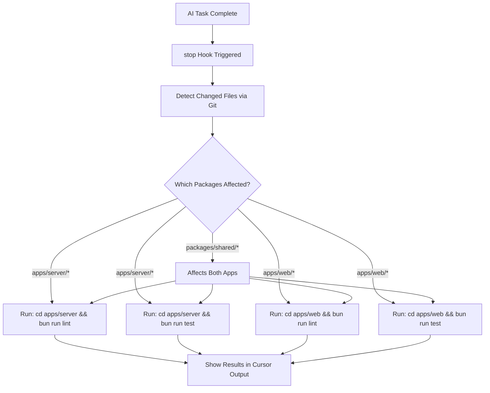

## Hook Strategy: `stop` Hook

The `stop` hook is called when the agent loop ends (task completion). This is the correct hook for running post-task validation.

### Hook Input (from Cursor docs)

```json
{
  "status": "completed" | "aborted" | "error",
  "loop_count": 0
}
```

### Hook Output

```json
{
  "followup_message": "Optional: Auto-continue message"
}
```

## Implementation Plan

### 1. Create `.cursor/hooks.json`

```json
{
  "version": 1,
  "hooks": {
    "stop": [
      {
        "command": ".cursor/hooks/post-task.sh"
      }
    ]
  }
}
```

### 2. Create `.cursor/hooks/post-task.sh`

This script will:

- Detect files changed during the agent session using `git status` or `git diff`
- Map changed files to workspace packages
- Run `bun run lint` for affected packages
- Run `bun run test` for affected packages

**Key Features:**

- Uses `git diff --name-only HEAD` to find modified files
- Maps files to packages based on path patterns
- Runs commands from project root using Bun
- Shows clear output about what is being checked

### 3. Package Detection Logic


| Changed File Path   | Affected Packages     |
| ------------------- | --------------------- |
| `apps/server/`*     | apps/server           |
| `apps/web/`*        | apps/web              |
| `packages/shared/`* | apps/server, apps/web |
| `packages/db/*`     | apps/server           |


### 4. Script Behavior

```bash
# Detect changed files
changed_files=$(git diff --name-only HEAD)

# Run turbo lint/test for affected packages
# Turbo automatically handles dependencies and caching
```

## Files to Create

1. `.cursor/hooks.json` - Hook configuration
2. `.cursor/hooks/post-task.sh` - Implementation script

## Verification

1. Restart Cursor to load hooks
2. Let AI complete a task
3. Hook should trigger and run lint/test
4. Check Cursor Settings > Hooks tab for status

## Mermaid Diagram




## Notes

- Uses `git diff` to detect only files actually modified by the agent
- Leverages Turborepo for efficient parallel execution
- Runs after task completion, not during editing
- Non-blocking: failure in lint/test won't prevent task completion

