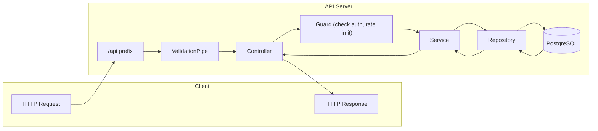
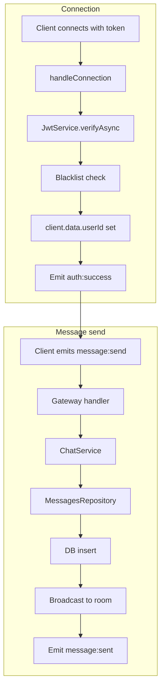
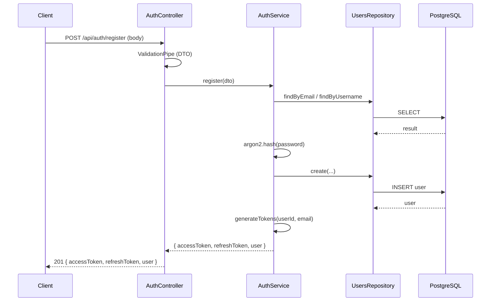

# Backend for Frontend Developers

A single guide for frontend developers (junior and senior) to understand this NestJS backend: concepts, code layout, request and WebSocket flow, and how to add features. System design and API contracts live in [docs/rfc/](../rfc/) and [docs/design-system.md](../design-system.md); this doc explains how the backend is built and where to look.

---

## 1. Introduction

**Who this is for**

- **Junior frontend:** You're comfortable with React and basic TypeScript. You may be new to REST, HTTP, WebSockets, or how a backend works. This doc explains the basics and includes a glossary.
- **Senior frontend:** You know React, TypeScript, REST, and WebSockets well. You're new to NestJS. You can skip Prerequisites and Glossary and go straight to NestJS and the auth walkthrough.

**How to use this doc**

- **New to backends?** Read [Prerequisites](#2-prerequisites-optional-for-juniors) and [Glossary](#3-glossary) first, then [NestJS in 5 minutes](#4-nestjs-in-5-minutes) and the flows.
- **Know REST, new to NestJS?** Start at [NestJS in 5 minutes](#4-nestjs-in-5-minutes), then [This backend at a glance](#5-this-backend-at-a-glance), [Request flow](#6-request-flow-rest), [WebSocket flow](#7-websocket-flow), and [How auth was built](#8-how-auth-was-built-step-by-step).

**Where else to look**

- **API contracts, errors, rate limits:** [docs/rfc/rfc-rest-api.md](../rfc/rfc-rest-api.md), [docs/rfc/rfc-authentication.md](../rfc/rfc-authentication.md)
- **Backend design (modules, gateways, write-through):** [docs/design-system.md](../design-system.md) sections 2 and 4
- **Backend commands and patterns:** [apps/server/AGENTS.md](../../apps/server/AGENTS.md)

---

## 2. Prerequisites (optional for juniors)

**What a backend does**

The backend is a server that:

- Receives **HTTP requests** (e.g. `POST /api/auth/login`) and **WebSocket connections** (e.g. connect to `/chat`).
- Talks to a **database** (PostgreSQL here) to read and write users, messages, conversations.
- Returns **JSON** in HTTP responses and sends **events** over the WebSocket (e.g. "new message").

So when the frontend calls `fetch('/api/auth/login', { body: ... })`, the backend validates the input, checks the database, and returns something like `{ accessToken, user }`.

**Basic HTTP**

- **Method:** GET (read), POST (create), PUT/PATCH (update), DELETE (remove).
- **URL:** e.g. `https://api.example.com/api/auth/login`. Here, all REST routes are under the `/api` prefix.
- **Status codes:** 200 OK, 201 Created, 400 Bad Request, 401 Unauthorized, 404 Not Found, 409 Conflict, 429 Too Many Requests. The frontend uses these to show errors or redirect (e.g. 401 → login).

**REST in one sentence**

REST here means: the frontend sends HTTP requests to URLs that represent resources (e.g. `/api/auth/login`, `/api/conversations/:id/messages`); the server responds with JSON and a status code.

**Auth in this project**

Auth means "prove who you are." After login or register, the server gives you an **access token** (JWT). You send it in the `Authorization: Bearer <token>` header (or as a query param for WebSocket). The server uses it to know which user is making the request and to protect routes.

---

## 3. Glossary

Use this when you see a term in the codebase or in this doc.

| Term | Meaning |
|------|--------|
| **Controller** | Class that defines REST routes (e.g. `POST /auth/register`). Handles the HTTP request and calls a service. See [NestJS in 5 minutes](#4-nestjs-in-5-minutes). |
| **Service** | Class that holds business logic (e.g. "hash password, create user, generate tokens"). Controllers call services; services call repositories. |
| **Guard** | Runs before a route or WebSocket handler. If it returns false or throws, the request is rejected. Example: `JwtAuthGuard` checks the Bearer token. |
| **Pipe** | Transforms or validates input (e.g. body, query) before it reaches the controller. Example: `ValidationPipe` runs class-validator on DTOs. |
| **DTO** | Data Transfer Object. A class that describes the shape of request body (or response). Used with class-validator for validation. |
| **Module** | NestJS unit that groups controllers, services, and providers. The app is built from modules (e.g. `AuthModule`, `ChatModule`). |
| **Dependency Injection (DI)** | NestJS creates and injects instances (e.g. `AuthService`) into constructors. You don't `new` them yourself. |
| **Repository** | Class that talks to the database (e.g. "find user by email", "insert user"). Uses Drizzle ORM and the shared schema from `@chat/db`. |
| **JWT** | JSON Web Token. A signed string that encodes claims (e.g. user id, email). Used as access token (short-lived) and optionally refresh token (longer-lived). |
| **Access token** | Short-lived JWT (e.g. 15 min) sent with each API or WebSocket request to prove identity. |
| **Refresh token** | Long-lived token (e.g. 7 days) used only to get a new access token when it expires. |
| **Gateway** | NestJS class that handles WebSocket connections and events (e.g. `ChatGateway` for `/chat` namespace). |
| **Strategy (Passport)** | Tells Passport how to validate a credential. Here, `JwtStrategy` validates the Bearer token and loads the user; the result is attached to `request.user`. |

---

## 4. NestJS in 5 minutes

**Modules** — The app is a tree of modules. Each feature (auth, chat, users, etc.) has a module that declares its controllers, services, and dependencies. The root is `AppModule` in `app.module.ts`.

**Dependency Injection (DI)** — Services and repositories are "providers." NestJS instantiates them and injects them into constructors. You don't create them with `new`; you declare them in a module and ask for them in the constructor.

**Controllers vs services** — Controllers define routes and handle HTTP (or WS) in/out. They should be thin: validate input, call a service, return the result. Services contain the real logic (e.g. hash password, call repository, generate tokens).

**Guards** — Run before the route handler. They can reject the request (e.g. no valid token → 401). Used for auth and rate limiting.

**Pipes** — Run on the request data (body, query, params). The global `ValidationPipe` runs class-validator on DTOs and returns 400 if validation fails.

> **Frontend analogy:** Think of **Controller** = route handler (like a React Router loader/action or API route handler), **Service** = business logic (like a hook or helper that does the real work), **Repository** = database calls (like a `fetch` to a data layer).

---

## 5. This backend at a glance

**Tech stack**

- **NestJS 11.x** — Backend framework (modules, DI, controllers, guards, pipes).
- **Drizzle ORM** — TypeScript ORM for PostgreSQL. Schema lives in `packages/db`.
- **Socket.io** — WebSocket transport. Used via `@nestjs/websockets` and a custom adapter (optional Redis).
- **JWT** — Access tokens (15 min) and refresh tokens (7 d) with in-memory blacklist for logout.
- **Argon2** — Password hashing (argon2id).
- **class-validator** — DTO validation. Zod is used in shared event schemas (`@chat/shared`).

**Where things live** (`apps/server/src/`)

| Folder | Purpose |
|--------|---------|
| `auth/` | Login, register, refresh, logout, JWT strategy, guards, token blacklist. |
| `chat/` | WebSocket gateway (connection, subscribe, message:send, typing, presence), chat service, Redis adapter. |
| `conversations/` | REST: list conversations, get one, create; conversation service and repository. |
| `users/` | User repository (find by id/email/username, create, update last seen), user search; users controller. |
| `database/` | Database module: provides Drizzle instance (`DRIZZLE`) and connects to PostgreSQL. |
| `health/` | Health check endpoints (e.g. liveness). |
| `common/` | Shared pipes (e.g. Zod validation), guards (throttler with headers). |

---

## 6. Request flow (REST)

Every REST call from the frontend (e.g. `fetch('/api/auth/login', ...)`) goes through this path:

1. **Global prefix** — All routes are under `/api` (set in `main.ts`).
2. **CORS** — Browser checks are applied; origin and credentials come from config.
3. **ValidationPipe** — Request body (and other inputs) are validated against DTOs; invalid input → 400.
4. **Route** — NestJS matches URL and method to a controller method.
5. **Guards** — If the route has guards (e.g. `JwtAuthGuard`, `ThrottlerWithHeadersGuard`), they run first. If a guard fails, the request is rejected (e.g. 401, 429).
6. **Controller** — The method runs; it typically calls a service and returns the result.
7. **Service** — Business logic runs; it may call a repository.
8. **Repository** — Database queries run via Drizzle.
9. **Response** — The return value is serialized to JSON and sent with the appropriate status code.

**REST request lifecycle (flowchart)**

> **Junior callout:** Every `fetch('/api/...')` from the frontend goes through this path. If you get 401, a guard (usually JWT) rejected the request. If you get 400, validation failed (check the response body for details).

---

## 7. WebSocket flow

WebSocket is a long-lived connection. The client connects once; then the server can push events (e.g. new message, typing) without the client polling.

**Connection**

1. Client connects to the WebSocket URL (e.g. `http://localhost:3000/chat`) with the **access token** in the query string or in the auth handshake.
2. **handleConnection** in `ChatGateway` runs:
   - Extract token (query or header).
   - Verify JWT with `JwtService.verifyAsync`.
   - Check blacklist (logout invalidates the token).
   - If valid: set `client.data.userId` and emit `auth:success` to the client.
   - If invalid: emit `auth:error` and disconnect.
3. Client can then send events (e.g. `subscribe`, `message:send`) and receive events (e.g. `message:sent`, `message:received`).

**Handling an event**

- Client emits `message:send` with `{ conversationId, content, clientMessageId }`.
- Gateway method (e.g. `handleMessage`) runs. It has access to `client.data.userId` (set at connection).
- The gateway calls `ChatService`, which persists the message to the database (write-through) and broadcasts to the right room.
- The gateway (or service) emits `message:sent` back to the sender and `message:received` to other participants in the room.

**WebSocket lifecycle (flowchart)**

> **Junior callout:** Like REST, but the connection stays open. The server can push events (e.g. new message, typing) at any time. Auth happens once at connection; after that, every event is tied to `client.data.userId`.

---

## 8. How auth was built (step-by-step)

This section walks through the auth feature in the order you’d read or implement it. Each step names the files and what they do. **Why** we do it is in italics.

**Step 1 – Route and contract**

- **File:** `apps/server/src/auth/auth.controller.ts`
- **What:** Defines REST routes:
  - `POST /api/auth/register` — create account; body: email, username, displayName, password.
  - `POST /api/auth/login` — body: email, password.
  - `POST /api/auth/refresh` — body: refreshToken.
  - `GET /api/auth/me` — current user (protected).
  - `POST /api/auth/logout` — invalidate session (protected).
- **DTOs:** `auth/dto/` — `RegisterDto`, `LoginDto`, `AuthResponseDto` (and others). They define the request/response shape and validation rules (class-validator decorators).
- *This is the "contract" the frontend uses: which URL, which method, which body.*

**Step 2 – Validation**

- **Files:** `auth/dto/register.dto.ts`, `auth/dto/login.dto.ts`; `main.ts` (global `ValidationPipe`).
- **What:** DTOs use decorators like `@IsEmail()`, `@MinLength(8)` for password. The global `ValidationPipe` runs validation before the controller method. If validation fails, NestJS returns 400 with error details.
- *So invalid input never reaches the service; the frontend gets a clear 400.*

**Step 3 – Guards**

- **Files:** `auth/guards/throttler-headers.guard.ts`, `auth/guards/jwt-auth.guard.ts`.
- **What:** 
  - `ThrottlerWithHeadersGuard` is used on register and login with `@Throttle({ short: { limit: 5, ttl: 900000 } })` (5 requests per 15 minutes). It adds rate-limit headers and returns 429 when exceeded.
  - `JwtAuthGuard` is used on `GET /auth/me` and `POST /auth/logout`. It runs the JWT strategy and rejects with 401 if the token is missing, invalid, or blacklisted.
- *Guards run before the controller. Unauthenticated or over-limit requests never reach your handler.*

**Step 4 – Strategy**

- **File:** `auth/strategies/jwt.strategy.ts`
- **What:** Passport JWT strategy: extracts the Bearer token from the `Authorization` header, verifies it with `JWT_SECRET`, checks the token is not blacklisted, loads the user from the DB, and returns `{ userId, email }`. That object is attached to `request.user` for the controller.
- *So in protected routes you get `req.user.userId` and `req.user.email` without parsing the token yourself.*

**Step 5 – Service**

- **File:** `auth/auth.service.ts`
- **What:** 
  - **register:** Check email/username not taken, hash password with Argon2id, call `UsersRepository.create`, then `generateTokens`; return `{ accessToken, refreshToken, user }`.
  - **login:** Find user by email, verify password with Argon2, update last seen, generate tokens; return same shape. Throw `UnauthorizedException` for invalid credentials.
  - **refresh:** Accept refresh token (from body in this impl), verify it, then `generateTokens(userId, email)`; return new token pair.
  - **logout:** Decode/verify the refresh token, add its `jti` to the blacklist (so that token and any access token with same jti are invalid).
  - **getMe:** Load user by id from repository, return safe user DTO.
- *All auth business logic lives here; the controller only delegates.*

**Step 6 – Tokens**

- **Files:** `auth/auth.service.ts` (method `generateTokens`), `auth/token-blacklist.service.ts`
- **What:** 
  - `generateTokens`: Build payload `{ sub: userId, email, jti }`. Sign with `JwtService` twice: access (15m, `JWT_SECRET`), refresh (7d, `JWT_REFRESH_SECRET` or `JWT_SECRET`). Return both.
  - `TokenBlacklistService`: In-memory map of `jti` → expiry. On logout, add the token’s `jti` until its natural expiry. Guards and gateway check this before accepting a token.
- *Short-lived access token limits exposure; refresh token allows getting a new access token without re-login. Blacklist makes logout effective.*

**Step 7 – Persistence**

- **File:** `users/users.repository.ts` (used by AuthModule; see `auth/auth.module.ts` providers).
- **What:** Methods: `findById`, `findByEmail`, `findByUsername`, `create`, `updateLastSeen`. Uses the shared Drizzle schema from `@chat/db` and the injected `DRIZZLE` instance from `DatabaseModule`.
- **Database module:** `database/database.module.ts` provides `DRIZZLE` (a Drizzle instance connected to PostgreSQL via a connection pool). It’s global, so any module can inject it (or inject a repository that uses it).
- *Repository is the only place that talks to the DB for users; the service stays free of SQL.*

**Step 8 – WebSocket auth**

- **File:** `chat/chat.gateway.ts` — method `handleConnection`.
- **What:** On each new WebSocket connection: get token from query or auth header; `JwtService.verifyAsync(token)`; if `jti` present, check `TokenBlacklistService.isBlacklisted(jti)`. If valid: set `client.data.userId = payload.sub`, emit `auth:success` to the client. If invalid or blacklisted: emit `auth:error` and disconnect.
- *So every WebSocket connection is tied to a user; later handlers (e.g. message:send) use `client.data.userId`.*

**Auth registration flow (sequence)**

---

## 9. Diagrams summary

- **REST lifecycle:** [Request flow (REST)](#6-request-flow-rest) — flowchart from request through prefix, ValidationPipe, controller, guard, service, repository, DB, and back.
- **Auth registration:** [How auth was built](#8-how-auth-was-built-step-by-step) — sequence diagram: Client → AuthController → AuthService → UsersRepository → DB; tokens generated and returned.
- **WebSocket:** [WebSocket flow](#7-websocket-flow) — connection (token → verify → blacklist → userId) and message:send path (gateway → ChatService → repository → DB → broadcast).

Diagram labels use readable names (e.g. "Guard (check auth)") so beginners can follow. For full write-through and error handling, see [design-system.md](../design-system.md) section 4.4.

---

## 10. How to add a new feature (checklist)

Once you’ve read [How auth was built](#8-how-auth-was-built-step-by-step), use this checklist for any new REST endpoint or WebSocket event.

> **Junior tip:** Start by adding one route that returns a fixed object (e.g. `return { message: 'ok' }`). Then add validation (DTO), then database (service + repository), then guard if the route must be protected.

**REST endpoint (e.g. GET /api/users/search)**

1. **Route and contract** — In the right controller (or create one), add the method and path. Define a DTO for query/body and response shape. Align with [design-system.md](../design-system.md) (e.g. response envelope, error shape).
2. **Validation** — Use a DTO with class-validator decorators (or a Zod pipe). The global ValidationPipe will run if you use a DTO for body/query.
3. **Guard** — If the route must be authenticated, add `@UseGuards(JwtAuthGuard)`. Optionally add throttle with `@Throttle(...)` and `ThrottlerWithHeadersGuard`.
4. **Service and repository** — Implement business logic in a service; DB access in a repository. Inject the repository (or `DRIZZLE`) in the service. Register the repository in the module if it’s not already there.
5. **Module** — Ensure the controller and service (and repository) are in the module’s `controllers` and `providers`. If the feature is in a new module, import it in `AppModule`.
6. **Optional** — Add Swagger decorators (`@ApiOperation`, `@ApiResponse`, etc.) and document the endpoint.

**WebSocket event (e.g. a new event type)**

1. **Gateway** — In the right gateway (e.g. `ChatGateway`), add a method with `@SubscribeMessage('event:name')`. The method receives `@ConnectedSocket() client` and `@MessageBody() payload`. Validate payload (e.g. with Zod from `@chat/shared`).
2. **Service** — Put business logic and DB access in a service. The gateway calls the service. Use `client.data.userId` for the current user.
3. **Emit** — Emit success/error events to the client or to a room (e.g. `this.server.to(roomId).emit('event:sent', data)`).
4. **Module** — The gateway and service should already be in the module; if you added a new provider, register it in the module.

---

## 11. Quick reference

| I want to… | Look at |
|------------|--------|
| **What does [term] mean?** | [Glossary](#3-glossary) |
| Add a REST endpoint | Controller (e.g. `auth.controller.ts`) + Service (e.g. `auth.service.ts`); register in module. |
| Add a WebSocket event | Gateway (e.g. `chat.gateway.ts`) + Service (e.g. `chat.service.ts`); `@SubscribeMessage('event:name')`. |
| Change or add a DB query | Repository (e.g. `users.repository.ts`, `messages.repository.ts`); schema in `packages/db`. |
| Protect a route with auth | Add `@UseGuards(JwtAuthGuard)` on the route; ensure JWT is sent as `Authorization: Bearer <token>`. |
| Validate request body | DTO with class-validator in `dto/`; use as `@Body() dto: MyDto`. ValidationPipe runs automatically. |
| Rate limit a route | `@UseGuards(ThrottlerWithHeadersGuard)` and `@Throttle({ short: { limit, ttl } })` (see auth controller). |

---

**Related docs**

- [docs/rfc/](rfc/) — REST API, auth, WebSocket protocol, database schema, observability.
- [docs/design-system.md](../design-system.md) — Backend design tokens (API shape, errors), module structure, gateway architecture, write-through lifecycle.
- [apps/server/AGENTS.md](../../apps/server/AGENTS.md) — Commands, tech stack, patterns, file structure.
