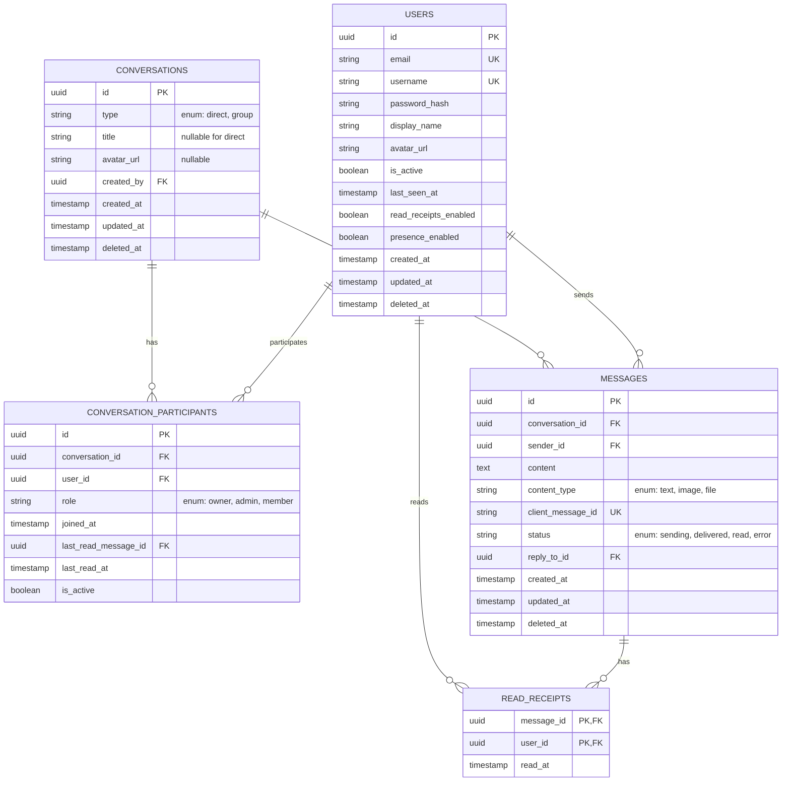
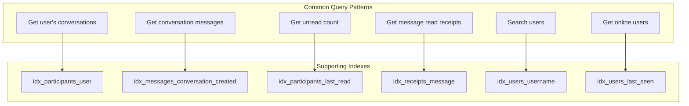
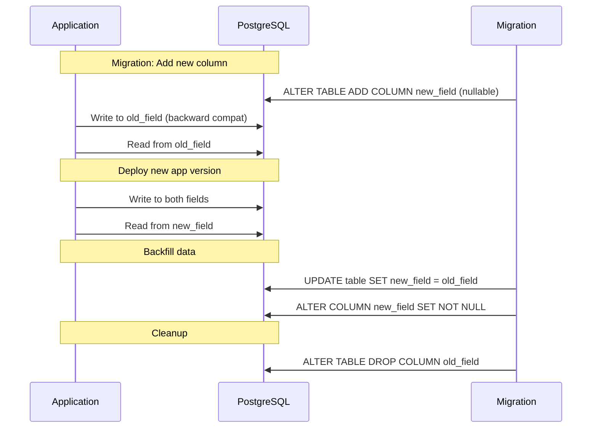

# RFC: Database Schema Design

> **Task ID:** DOC-001  
> **MVP:** Phase 1 (Basic Chat + Message Storage)  
> **Status:** Draft  
> **Tech Stack:** PostgreSQL 15+, Drizzle ORM

---

## Table of Contents

- [1. Entity Relationship Diagram](#1-entity-relationship-diagram)
- [2. Table Specifications](#2-table-specifications)
- [3. Drizzle ORM Schema](#3-drizzle-orm-schema)
- [4. Index Strategy](#4-index-strategy)
- [5. Design Decisions](#5-design-decisions)
- [6. Migration Strategy](#6-migration-strategy)
- [7. Connection Pooling](#7-connection-pooling)
- [8. NestJS Integration](#8-nestjs-integration)

---

## 1. Entity Relationship Diagram



---

## 2. Table Specifications

### 2.1 Users Table

Stores user accounts and preferences.

| Column | Type | Constraints | Description |
|--------|------|-------------|-------------|
| `id` | UUID | PRIMARY KEY | Distributed-safe identifier |
| `email` | VARCHAR(255) | UNIQUE, NOT NULL | User login |
| `username` | VARCHAR(50) | UNIQUE, NOT NULL | Display handle |
| `password_hash` | VARCHAR(255) | NOT NULL | Argon2id hash |
| `display_name` | VARCHAR(100) | NOT NULL | Friendly name |
| `avatar_url` | VARCHAR(500) | NULL | Profile image |
| `is_active` | BOOLEAN | DEFAULT true | Account status |
| `last_seen_at` | TIMESTAMP | NULL | For presence |
| `read_receipts_enabled` | BOOLEAN | DEFAULT true | Privacy setting |
| `presence_enabled` | BOOLEAN | DEFAULT true | Privacy setting |
| `created_at` | TIMESTAMP | DEFAULT NOW() | Account creation |
| `updated_at` | TIMESTAMP | DEFAULT NOW() | Last update |
| `deleted_at` | TIMESTAMP | NULL | Soft delete |

**Indexes:**
- `PRIMARY KEY (id)`
- `UNIQUE INDEX idx_users_email (email)`
- `UNIQUE INDEX idx_users_username (username)`
- `INDEX idx_users_last_seen (last_seen_at)` - For presence queries

---

### 2.2 Conversations Table

Represents chat conversations (1:1 direct or group).

| Column | Type | Constraints | Description |
|--------|------|-------------|-------------|
| `id` | UUID | PRIMARY KEY | Conversation identifier |
| `type` | ENUM | NOT NULL | `direct` or `group` |
| `title` | VARCHAR(100) | NULL | Group name (NULL for direct) |
| `avatar_url` | VARCHAR(500) | NULL | Group avatar |
| `created_by` | UUID | FOREIGN KEY → users.id | Creator |
| `created_at` | TIMESTAMP | DEFAULT NOW() | Creation time |
| `updated_at` | TIMESTAMP | DEFAULT NOW() | Last message time |
| `deleted_at` | TIMESTAMP | NULL | Soft delete |

**Indexes:**
- `PRIMARY KEY (id)`
- `INDEX idx_conversations_updated (updated_at DESC)` - For conversation list sorting
- `INDEX idx_conversations_creator (created_by)`

---

### 2.3 Conversation Participants Table

Junction table linking users to conversations with metadata.

| Column | Type | Constraints | Description |
|--------|------|-------------|-------------|
| `id` | UUID | PRIMARY KEY | Participant record ID |
| `conversation_id` | UUID | FOREIGN KEY → conversations.id | Parent conversation |
| `user_id` | UUID | FOREIGN KEY → users.id | Participant |
| `role` | ENUM | DEFAULT 'member' | `owner`, `admin`, `member` |
| `joined_at` | TIMESTAMP | DEFAULT NOW() | When joined |
| `last_read_message_id` | UUID | FOREIGN KEY → messages.id, NULL | Sync point |
| `last_read_at` | TIMESTAMP | NULL | When last read |
| `is_active` | BOOLEAN | DEFAULT true | Still in conversation |

**Indexes:**
- `PRIMARY KEY (id)`
- `UNIQUE INDEX idx_participants_conv_user (conversation_id, user_id)` - Prevent duplicates
- `INDEX idx_participants_user (user_id, joined_at DESC)` - User's conversation list
- `INDEX idx_participants_last_read (last_read_message_id)` - For receipt sync

---

### 2.4 Messages Table

Stores all chat messages with write-through durability.

| Column | Type | Constraints | Description |
|--------|------|-------------|-------------|
| `id` | UUID | PRIMARY KEY | Message identifier |
| `conversation_id` | UUID | FOREIGN KEY → conversations.id | Parent conversation |
| `sender_id` | UUID | FOREIGN KEY → users.id | Who sent it |
| `content` | TEXT | NOT NULL | Message body (max 4000 chars) |
| `content_type` | ENUM | DEFAULT 'text' | `text`, `image`, `file` |
| `client_message_id` | VARCHAR(64) | UNIQUE | Deduplication key |
| `status` | ENUM | DEFAULT 'delivered' | `sending`, `delivered`, `read`, `error` |
| `reply_to_id` | UUID | FOREIGN KEY → messages.id, NULL | Thread reply |
| `created_at` | TIMESTAMP | DEFAULT NOW() | Message time |
| `updated_at` | TIMESTAMP | DEFAULT NOW() | Edit time |
| `deleted_at` | TIMESTAMP | NULL | Soft delete |

**Indexes:**
- `PRIMARY KEY (id)`
- `UNIQUE INDEX idx_messages_client_id (client_message_id)` - Deduplication
- `INDEX idx_messages_conversation_created (conversation_id, created_at DESC)` - History queries
- `INDEX idx_messages_sender (sender_id, created_at DESC)` - User's sent messages
- `INDEX idx_messages_reply (reply_to_id)` - Thread queries

---

### 2.5 Read Receipts Table

Tracks who read which message (for 1:1 chats and flushed group receipts).

| Column | Type | Constraints | Description |
|--------|------|-------------|-------------|
| `message_id` | UUID | FOREIGN KEY → messages.id | Which message |
| `user_id` | UUID | FOREIGN KEY → users.id | Who read it |
| `read_at` | TIMESTAMP | DEFAULT NOW() | When read |

**Indexes:**
- `PRIMARY KEY (message_id, user_id)` - Composite PK
- `INDEX idx_receipts_message (message_id)` - Count queries
- `INDEX idx_receipts_user (user_id, read_at DESC)` - User's read history

---

## 3. Drizzle ORM Schema

### 3.1 Complete Schema Definition

```typescript
// src/database/schema/index.ts

import { 
  pgTable, 
  uuid, 
  varchar, 
  text, 
  timestamp, 
  boolean, 
  index,
  uniqueIndex,
  primaryKey,
  pgEnum
} from 'drizzle-orm/pg-core';

// Enums
export const conversationTypeEnum = pgEnum('conversation_type', ['direct', 'group']);
export const contentTypeEnum = pgEnum('content_type', ['text', 'image', 'file']);
export const messageStatusEnum = pgEnum('message_status', ['sending', 'delivered', 'read', 'error']);
export const participantRoleEnum = pgEnum('participant_role', ['owner', 'admin', 'member']);

// Users Table
export const users = pgTable('users', {
  id: uuid('id').defaultRandom().primaryKey(),
  email: varchar('email', { length: 255 }).notNull().unique(),
  username: varchar('username', { length: 50 }).notNull().unique(),
  passwordHash: varchar('password_hash', { length: 255 }).notNull(),
  displayName: varchar('display_name', { length: 100 }).notNull(),
  avatarUrl: varchar('avatar_url', { length: 500 }),
  isActive: boolean('is_active').default(true).notNull(),
  lastSeenAt: timestamp('last_seen_at', { withTimezone: true }),
  readReceiptsEnabled: boolean('read_receipts_enabled').default(true).notNull(),
  presenceEnabled: boolean('presence_enabled').default(true).notNull(),
  createdAt: timestamp('created_at', { withTimezone: true }).defaultNow().notNull(),
  updatedAt: timestamp('updated_at', { withTimezone: true }).defaultNow().notNull(),
  deletedAt: timestamp('deleted_at', { withTimezone: true }),
}, (table) => ({
  emailIdx: uniqueIndex('idx_users_email').on(table.email),
  usernameIdx: uniqueIndex('idx_users_username').on(table.username),
  lastSeenIdx: index('idx_users_last_seen').on(table.lastSeenAt),
}));

// Conversations Table
export const conversations = pgTable('conversations', {
  id: uuid('id').defaultRandom().primaryKey(),
  type: conversationTypeEnum('type').notNull(),
  title: varchar('title', { length: 100 }),
  avatarUrl: varchar('avatar_url', { length: 500 }),
  createdBy: uuid('created_by').references(() => users.id).notNull(),
  createdAt: timestamp('created_at', { withTimezone: true }).defaultNow().notNull(),
  updatedAt: timestamp('updated_at', { withTimezone: true }).defaultNow().notNull(),
  deletedAt: timestamp('deleted_at', { withTimezone: true }),
}, (table) => ({
  updatedIdx: index('idx_conversations_updated').on(table.updatedAt.desc()),
  creatorIdx: index('idx_conversations_creator').on(table.createdBy),
}));

// Conversation Participants Table
export const conversationParticipants = pgTable('conversation_participants', {
  id: uuid('id').defaultRandom().primaryKey(),
  conversationId: uuid('conversation_id').references(() => conversations.id).notNull(),
  userId: uuid('user_id').references(() => users.id).notNull(),
  role: participantRoleEnum('role').default('member').notNull(),
  joinedAt: timestamp('joined_at', { withTimezone: true }).defaultNow().notNull(),
  lastReadMessageId: uuid('last_read_message_id').references(() => messages.id),
  lastReadAt: timestamp('last_read_at', { withTimezone: true }),
  isActive: boolean('is_active').default(true).notNull(),
}, (table) => ({
  convUserIdx: uniqueIndex('idx_participants_conv_user').on(table.conversationId, table.userId),
  userIdx: index('idx_participants_user').on(table.userId, table.joinedAt.desc()),
  lastReadIdx: index('idx_participants_last_read').on(table.lastReadMessageId),
}));

// Messages Table
export const messages = pgTable('messages', {
  id: uuid('id').defaultRandom().primaryKey(),
  conversationId: uuid('conversation_id').references(() => conversations.id).notNull(),
  senderId: uuid('sender_id').references(() => users.id).notNull(),
  content: text('content').notNull(),
  contentType: contentTypeEnum('content_type').default('text').notNull(),
  clientMessageId: varchar('client_message_id', { length: 64 }).unique(),
  status: messageStatusEnum('status').default('delivered').notNull(),
  replyToId: uuid('reply_to_id').references(() => messages.id),
  createdAt: timestamp('created_at', { withTimezone: true }).defaultNow().notNull(),
  updatedAt: timestamp('updated_at', { withTimezone: true }).defaultNow().notNull(),
  deletedAt: timestamp('deleted_at', { withTimezone: true }),
}, (table) => ({
  clientIdIdx: uniqueIndex('idx_messages_client_id').on(table.clientMessageId),
  convCreatedIdx: index('idx_messages_conversation_created').on(table.conversationId, table.createdAt.desc()),
  senderIdx: index('idx_messages_sender').on(table.senderId, table.createdAt.desc()),
  replyIdx: index('idx_messages_reply').on(table.replyToId),
}));

// Read Receipts Table
export const readReceipts = pgTable('read_receipts', {
  messageId: uuid('message_id').references(() => messages.id).notNull(),
  userId: uuid('user_id').references(() => users.id).notNull(),
  readAt: timestamp('read_at', { withTimezone: true }).defaultNow().notNull(),
}, (table) => ({
  pk: primaryKey({ columns: [table.messageId, table.userId] }),
  messageIdx: index('idx_receipts_message').on(table.messageId),
  userIdx: index('idx_receipts_user').on(table.userId, table.readAt.desc()),
}));

// Relations
export const usersRelations = relations(users, ({ many }) => ({
  messages: many(messages),
  participants: many(conversationParticipants),
  readReceipts: many(readReceipts),
  createdConversations: many(conversations),
}));

export const conversationsRelations = relations(conversations, ({ one, many }) => ({
  createdBy: one(users, {
    fields: [conversations.createdBy],
    references: [users.id],
  }),
  participants: many(conversationParticipants),
  messages: many(messages),
}));

export const conversationParticipantsRelations = relations(conversationParticipants, ({ one }) => ({
  conversation: one(conversations, {
    fields: [conversationParticipants.conversationId],
    references: [conversations.id],
  }),
  user: one(users, {
    fields: [conversationParticipants.userId],
    references: [users.id],
  }),
  lastReadMessage: one(messages, {
    fields: [conversationParticipants.lastReadMessageId],
    references: [messages.id],
  }),
}));

export const messagesRelations = relations(messages, ({ one, many }) => ({
  conversation: one(conversations, {
    fields: [messages.conversationId],
    references: [conversations.id],
  }),
  sender: one(users, {
    fields: [messages.senderId],
    references: [users.id],
  }),
  replyTo: one(messages, {
    fields: [messages.replyToId],
    references: [messages.id],
  }),
  replies: many(messages),
  readReceipts: many(readReceipts),
}));

export const readReceiptsRelations = relations(readReceipts, ({ one }) => ({
  message: one(messages, {
    fields: [readReceipts.messageId],
    references: [messages.id],
  }),
  user: one(users, {
    fields: [readReceipts.userId],
    references: [users.id],
  }),
}));
```

---

## 4. Index Strategy

### 4.1 Query Patterns & Index Mapping



### 4.2 Index Performance Analysis

| Index | Query | Est. Improvement | Notes |
|-------|-------|------------------|-------|
| `idx_messages_conversation_created` | Message history | 100x+ | Covering index for pagination |
| `idx_participants_user` | Conversation list | 50x+ | Composite for sorting |
| `idx_messages_client_id` | Deduplication | O(1) | Unique constraint = index |
| `idx_receipts_message` | Read count | 20x+ | For "Read by N" queries |

---

## 5. Design Decisions

### 5.1 UUID vs BIGSERIAL

**Decision:** Use UUID (v4) for all primary keys

**Pros:**
- ✅ Distributed-safe (no coordination needed)
- ✅ No enumeration attacks (can't guess other IDs)
- ✅ Merge-friendly (no conflicts when combining data)
- ✅ Future-proof for sharding

**Cons:**
- ❌ 4x storage (16 bytes vs 8 bytes)
- ❌ Slightly slower index lookups
- ❌ Not sortable by creation time

**Mitigation:**
- Use `created_at` for ordering (indexed)
- PostgreSQL 13+ has optimized UUID handling
- Storage cost negligible at MVP scale

### 5.2 Soft Delete vs Hard Delete

**Decision:** Soft delete with `deleted_at` timestamp

**Pros:**
- ✅ GDPR compliance (can restore if requested)
- ✅ Audit trail preserved
- ✅ Prevents orphaned references
- ✅ Accidental deletion recovery

**Cons:**
- ❌ Queries need `WHERE deleted_at IS NULL`
- ❌ Storage grows over time

**Implementation:**
```typescript
// Repository pattern - always filter deleted
const activeUsers = await db
  .select()
  .from(users)
  .where(isNull(users.deletedAt));
```

### 5.3 created_at for Ordering vs Auto-Increment

**Decision:** Use `created_at` timestamp for message ordering

**Pros:**
- ✅ Human-meaningful
- ✅ Works across distributed systems
- ✅ Natural for time-series queries

**Cons:**
- ❌ Clock skew issues
- ❌ Not strictly monotonic

**Mitigation:**
- NTP-synchronized servers
- Include `id` in cursor for tie-breaking: `(created_at, id)`

### 5.4 Partitioning Strategy

**Current:** No partitioning (MVP)

**Future (Phase 3+):**
```sql
-- When messages table > 10M rows
CREATE TABLE messages_y2024m01 PARTITION OF messages
  FOR VALUES FROM ('2024-01-01') TO ('2024-02-01');
```

**Trigger:** When single conversation exceeds 100k messages

---

## 6. Migration Strategy

### 6.1 Drizzle Kit Configuration

```typescript
// drizzle.config.ts
import { defineConfig } from 'drizzle-kit';

export default defineConfig({
  schema: './src/database/schema/index.ts',
  out: './src/database/migrations',
  driver: 'pg',
  dbCredentials: {
    connectionString: process.env.DATABASE_URL!,
  },
  verbose: true,
  strict: true,
});
```

### 6.2 Migration Commands

```bash
# Generate migration from schema changes
npx drizzle-kit generate:pg

# Apply migrations
npx drizzle-kit migrate

# Check status
npx drizzle-kit check:pg

# Rollback (manual SQL)
# Drizzle Kit doesn't auto-rollback; write inverse migration
```

### 6.3 Zero-Downtime Migration Approach



---

## 7. Connection Pooling

### 7.1 Recommended Configuration

```typescript
// src/database/drizzle.config.ts
import { drizzle } from 'drizzle-orm/node-postgres';
import { Pool } from 'pg';

const pool = new Pool({
  connectionString: process.env.DATABASE_URL,
  
  // Pool sizing formula: (CPU cores * 2) + effective_spindle_count
  // For VPS with 2 cores: (2 * 2) + 1 = 5 (conservative)
  min: 5,           // Always keep warm connections
  max: 20,          // Max concurrent connections
  
  // Timeouts
  acquireTimeoutMillis: 30000,  // 30s to acquire connection
  idleTimeoutMillis: 10000,     // 10s before closing idle
  evictionRunIntervalMillis: 1000, // Check every 1s
  
  // Connection options
  connectionTimeoutMillis: 5000, // 5s to establish connection
  statement_timeout: 30000,      // 30s query timeout
});

export const db = drizzle(pool, { schema });
```

### 7.2 Connection Pool Sizing Guide

| VPS Size | CPU Cores | Recommended Max | Formula |
|----------|-----------|-----------------|---------|
| Small (2GB) | 1 | 5 | (1 * 2) + 1 |
| Medium (4GB) | 2 | 10 | (2 * 2) + 2 |
| Large (8GB) | 4 | 20 | (4 * 2) + 4 |

---

## 8. NestJS Integration

### 8.1 Database Module

```typescript
// src/database/database.module.ts
import { Module, Global } from '@nestjs/common';
import { Pool } from 'pg';
import { drizzle } from 'drizzle-orm/node-postgres';
import * as schema from './schema';

export const DRIZZLE = Symbol('DRIZZLE');

@Global()
@Module({
  providers: [
    {
      provide: DRIZZLE,
      useFactory: () => {
        const pool = new Pool({
          connectionString: process.env.DATABASE_URL,
          max: 20,
        });
        return drizzle(pool, { schema });
      },
    },
  ],
  exports: [DRIZZLE],
})
export class DatabaseModule {}
```

### 8.2 Repository Pattern Example

```typescript
// src/chat/repositories/message.repository.ts
import { Injectable, Inject } from '@nestjs/common';
import { DRIZZLE } from '../../database/database.module';
import { messages, users } from '../../database/schema';
import { eq, desc, and, isNull } from 'drizzle-orm';

@Injectable()
export class MessageRepository {
  constructor(@Inject(DRIZZLE) private db: any) {}

  async findByConversation(
    conversationId: string,
    cursor?: string,
    limit: number = 50
  ) {
    const query = this.db
      .select({
        message: messages,
        sender: {
          id: users.id,
          username: users.username,
          displayName: users.displayName,
          avatarUrl: users.avatarUrl,
        },
      })
      .from(messages)
      .leftJoin(users, eq(messages.senderId, users.id))
      .where(and(
        eq(messages.conversationId, conversationId),
        isNull(messages.deletedAt)
      ))
      .orderBy(desc(messages.createdAt))
      .limit(limit);

    if (cursor) {
      // Cursor-based pagination
      const decoded = JSON.parse(Buffer.from(cursor, 'base64').toString());
      query.where(and(
        eq(messages.conversationId, conversationId),
        isNull(messages.deletedAt),
        // (created_at, id) < (cursor.createdAt, cursor.id)
      ));
    }

    return query;
  }

  async create(data: typeof messages.$inferInsert) {
    const [message] = await this.db
      .insert(messages)
      .values(data)
      .returning();
    return message;
  }

  async findByClientMessageId(clientMessageId: string) {
    const [message] = await this.db
      .select()
      .from(messages)
      .where(eq(messages.clientMessageId, clientMessageId))
      .limit(1);
    return message;
  }
}
```

### 8.3 Transaction Handling

```typescript
// Using Drizzle transactions
async function transferMessageOwnership(
  messageId: string,
  newConversationId: string
) {
  return await this.db.transaction(async (tx) => {
    // Move message
    await tx
      .update(messages)
      .set({ conversationId: newConversationId })
      .where(eq(messages.id, messageId));
    
    // Update conversation timestamp
    await tx
      .update(conversations)
      .set({ updatedAt: new Date() })
      .where(eq(conversations.id, newConversationId));
    
    return { success: true };
  });
}
```

---

## Appendix: Query Examples

### Get Conversation List for User
```typescript
const conversations = await db
  .select({
    conversation: conversations,
    participant: conversationParticipants,
    lastMessage: messages,
    unreadCount: sql<number>`COUNT(DISTINCT ${messages.id})`,
  })
  .from(conversationParticipants)
  .innerJoin(conversations, eq(conversationParticipants.conversationId, conversations.id))
  .leftJoin(messages, eq(conversations.id, messages.conversationId))
  .where(and(
    eq(conversationParticipants.userId, userId),
    isNull(conversations.deletedAt),
    eq(conversationParticipants.isActive, true)
  ))
  .groupBy(conversations.id)
  .orderBy(desc(conversations.updatedAt));
```

### Get Message with Read Receipts
```typescript
const messageWithReceipts = await db
  .select({
    message: messages,
    readBy: sql<User[]>`JSON_AGG(${users}.*)`,
  })
  .from(messages)
  .leftJoin(readReceipts, eq(messages.id, readReceipts.messageId))
  .leftJoin(users, eq(readReceipts.userId, users.id))
  .where(eq(messages.id, messageId))
  .groupBy(messages.id);
```

---

**Next:** See [RFC-002: WebSocket Protocol](rfc-websocket-protocol.md) for real-time communication specification.
