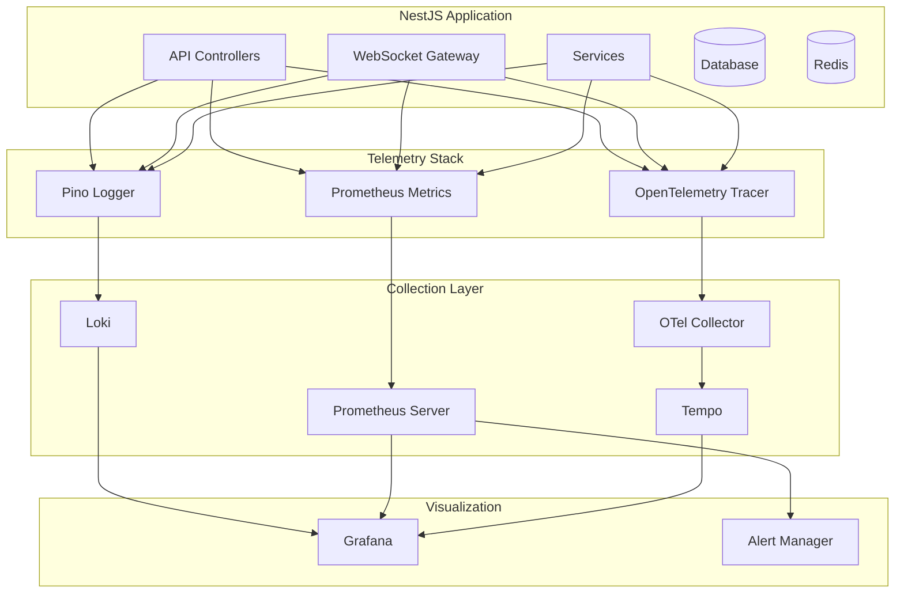
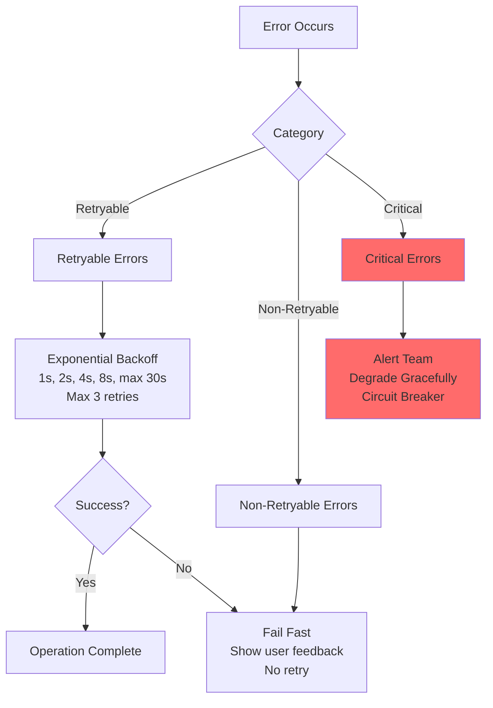
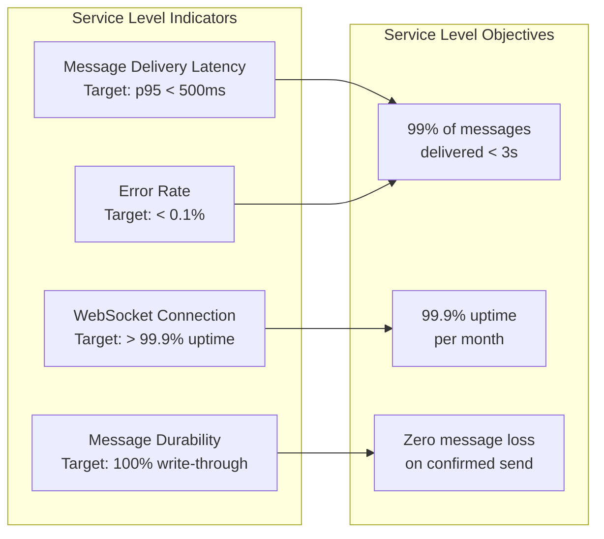
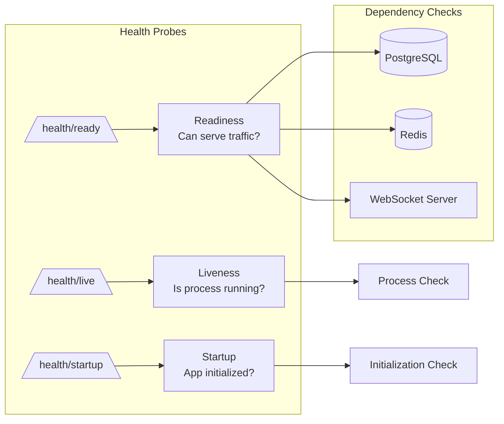
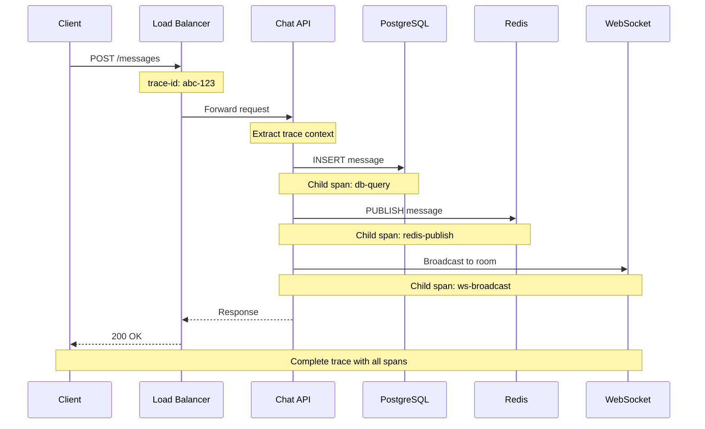
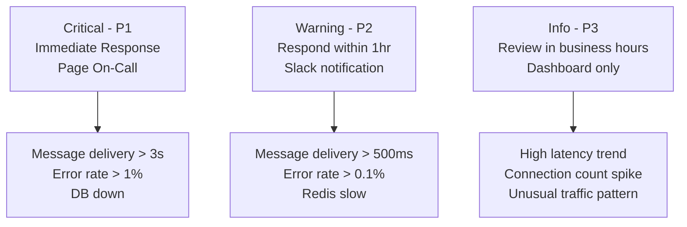

# RFC: Observability & Error Handling

> **Task ID:** DOC-008  
> **MVP:** All Phases (Cross-cutting)  
> **Status:** Draft  
> **Tech Stack:** Prometheus, Grafana, OpenTelemetry, Pino

---

## Table of Contents

- [1. Observability Overview](#1-observability-overview)
- [2. Error Handling Strategy](#2-error-handling-strategy)
- [3. Three-Second Problem Monitoring](#3-three-second-problem-monitoring)
- [4. Structured Logging](#4-structured-logging)
- [5. Health Checks](#5-health-checks)
- [6. Distributed Tracing](#6-distributed-tracing)
- [7. Alerting Rules](#7-alerting-rules)
- [8. Implementation Guide](#8-implementation-guide)

---

## 1. Observability Overview

### 1.1 Observability Architecture



### 1.2 Three Pillars of Observability

| Pillar | Tool | Purpose |
|--------|------|---------|
| **Logs** | Pino + Loki | Event records, debugging, audit trail |
| **Metrics** | Prometheus | Quantitative data, SLIs, alerts |
| **Traces** | OpenTelemetry + Tempo | Request flow, latency analysis |

---

## 2. Error Handling Strategy

### 2.1 Error Categories



### 2.2 Error Classification Matrix

| Error Code | Category | HTTP Status | Retryable | Client Action | Alert |
|------------|----------|-------------|-----------|---------------|-------|
| `VALIDATION_ERROR` | Non-Retryable | 400 | No | Show inline error | No |
| `UNAUTHORIZED` | Non-Retryable | 401 | No | Redirect to login | No |
| `FORBIDDEN` | Non-Retryable | 403 | No | Show permission error | No |
| `NOT_FOUND` | Non-Retryable | 404 | No | Remove from UI | No |
| `CONFLICT` | Non-Retryable | 409 | No | Refresh data | No |
| `RATE_LIMITED` | Retryable | 429 | Yes | Wait Retry-After | No |
| `DB_TIMEOUT` | Retryable | 503 | Yes | Retry 3x | Yes (if >5%) |
| `DB_CONNECTION_LOST` | Critical | 503 | Yes | Queue + retry | Yes |
| `REDIS_UNAVAILABLE` | Critical | 503 | Yes | Fallback to DB | Yes |
| `INTERNAL_ERROR` | Retryable | 500 | Yes (1x) | Retry once | Yes |

### 2.3 Error Response Format

```typescript
// Standard error response
interface ApiError {
  error: {
    code: string;           // Machine-readable
    message: string;        // Human-readable
    details?: Record<string, string[]>;  // Field errors
    retryable: boolean;     // Can client retry?
    retryAfter?: number;    // Seconds (rate limiting)
    traceId: string;        // For debugging
  };
}

// Example responses
const validationError: ApiError = {
  error: {
    code: 'VALIDATION_ERROR',
    message: 'Invalid message content',
    details: {
      content: ['Content must be between 1 and 4000 characters']
    },
    retryable: false,
    traceId: 'abc-123-def'
  }
};

const rateLimitError: ApiError = {
  error: {
    code: 'RATE_LIMITED',
    message: 'Too many requests',
    retryable: true,
    retryAfter: 30,
    traceId: 'abc-123-def'
  }
};
```

### 2.4 NestJS Global Exception Filter

```typescript
// src/common/filters/global-exception.filter.ts
import {
  ExceptionFilter,
  Catch,
  ArgumentsHost,
  HttpException,
  HttpStatus,
  Logger,
} from '@nestjs/common';
import { Request, Response } from 'express';
import { QueryFailedError } from 'drizzle-orm';

@Catch()
export class GlobalExceptionFilter implements ExceptionFilter {
  private readonly logger = new Logger(GlobalExceptionFilter.name);

  catch(exception: unknown, host: ArgumentsHost): void {
    const ctx = host.switchToHttp();
    const response = ctx.getResponse<Response>();
    const request = ctx.getRequest<Request>();
    const traceId = request.headers['x-trace-id'] as string || 'unknown';

    const { status, error } = this.parseException(exception, traceId);

    // Log error with context
    this.logger.error({
      traceId,
      error: error.code,
      message: error.message,
      path: request.url,
      method: request.method,
      userId: request.user?.id,
      stack: exception instanceof Error ? exception.stack : undefined,
    });

    response.status(status).json({ error });
  }

  private parseException(
    exception: unknown,
    traceId: string
  ): { status: number; error: ApiError['error'] } {
    // HTTP exceptions (NestJS built-in)
    if (exception instanceof HttpException) {
      const status = exception.getStatus();
      const response = exception.getResponse() as any;
      
      return {
        status,
        error: {
          code: this.httpStatusToCode(status),
          message: response.message || exception.message,
          details: response.details,
          retryable: this.isRetryable(status),
          traceId,
        },
      };
    }

    // Database errors
    if (exception instanceof QueryFailedError) {
      const dbError = exception as any;
      
      if (dbError.code === '23505') { // Unique violation
        return {
          status: HttpStatus.CONFLICT,
          error: {
            code: 'CONFLICT',
            message: 'Resource already exists',
            retryable: false,
            traceId,
          },
        };
      }

      if (dbError.code === '08006' || dbError.code === '08003') { // Connection errors
        return {
          status: HttpStatus.SERVICE_UNAVAILABLE,
          error: {
            code: 'DB_CONNECTION_LOST',
            message: 'Database temporarily unavailable',
            retryable: true,
            traceId,
          },
        };
      }

      return {
        status: HttpStatus.SERVICE_UNAVAILABLE,
        error: {
          code: 'DB_ERROR',
          message: 'Database error occurred',
          retryable: true,
          traceId,
        },
      };
    }

    // Unknown errors
    return {
      status: HttpStatus.INTERNAL_SERVER_ERROR,
      error: {
        code: 'INTERNAL_ERROR',
        message: 'An unexpected error occurred',
        retryable: true,
        traceId,
      },
    };
  }

  private httpStatusToCode(status: number): string {
    const codeMap: Record<number, string> = {
      400: 'VALIDATION_ERROR',
      401: 'UNAUTHORIZED',
      403: 'FORBIDDEN',
      404: 'NOT_FOUND',
      409: 'CONFLICT',
      429: 'RATE_LIMITED',
      503: 'SERVICE_UNAVAILABLE',
    };
    return codeMap[status] || 'INTERNAL_ERROR';
  }

  private isRetryable(status: number): boolean {
    return [429, 503, 500].includes(status);
  }
}
```

---

## 3. Three-Second Problem Monitoring

### 3.1 Critical Metrics



### 3.2 Prometheus Metrics

```typescript
// src/metrics/chat.metrics.ts
import { Counter, Histogram, Gauge } from 'prom-client';

// Message delivery latency
export const messageDeliveryLatency = new Histogram({
  name: 'chat_message_delivery_latency_seconds',
  help: 'Time from message:send to message:sent',
  labelNames: ['conversation_type', 'status'],
  buckets: [0.01, 0.05, 0.1, 0.25, 0.5, 1, 2, 3, 5],
});

// Message counter
export const messagesSent = new Counter({
  name: 'chat_messages_sent_total',
  help: 'Total messages sent',
  labelNames: ['conversation_type', 'content_type'],
});

// Error counter
export const messageErrors = new Counter({
  name: 'chat_message_errors_total',
  help: 'Total message send errors',
  labelNames: ['error_code', 'conversation_type'],
});

// Active WebSocket connections
export const activeConnections = new Gauge({
  name: 'chat_websocket_connections_active',
  help: 'Number of active WebSocket connections',
  labelNames: ['status'],
});

// Read receipt latency
export const readReceiptLatency = new Histogram({
  name: 'chat_read_receipt_latency_seconds',
  help: 'Time from message delivery to read receipt',
  labelNames: ['conversation_type'],
  buckets: [1, 5, 10, 30, 60, 300, 600],
});

// Presence updates
export const presenceUpdates = new Counter({
  name: 'chat_presence_updates_total',
  help: 'Total presence status updates',
  labelNames: ['status_transition'],
});

// Database query duration
export const dbQueryDuration = new Histogram({
  name: 'chat_db_query_duration_seconds',
  help: 'Database query duration',
  labelNames: ['operation', 'table'],
  buckets: [0.001, 0.005, 0.01, 0.025, 0.05, 0.1, 0.25, 0.5, 1],
});

// Redis operation duration
export const redisOperationDuration = new Histogram({
  name: 'chat_redis_operation_duration_seconds',
  help: 'Redis operation duration',
  labelNames: ['operation'],
  buckets: [0.0001, 0.0005, 0.001, 0.0025, 0.005, 0.01],
});
```

### 3.3 Three-Second Alert Rules

```yaml
# prometheus/alerts.yml
groups:
  - name: chat_three_second_problem
    rules:
      # Critical: Message delivery p95 > 3 seconds
      - alert: MessageDeliverySlow
        expr: |
          histogram_quantile(0.95, 
            sum(rate(chat_message_delivery_latency_seconds_bucket[5m])) by (le)
          ) > 3
        for: 5m
        labels:
          severity: critical
        annotations:
          summary: "Message delivery p95 > 3 seconds"
          description: "{{ $value }}s latency - users experiencing delays"
          runbook_url: "https://wiki.internal/runbooks/message-delivery-slow"

      # Warning: Message delivery p95 > 500ms
      - alert: MessageDeliveryDegraded
        expr: |
          histogram_quantile(0.95, 
            sum(rate(chat_message_delivery_latency_seconds_bucket[5m])) by (le)
          ) > 0.5
        for: 5m
        labels:
          severity: warning
        annotations:
          summary: "Message delivery p95 > 500ms"
          description: "{{ $value }}s latency - approaching SLA limit"

      # Critical: Error rate > 0.1%
      - alert: HighMessageErrorRate
        expr: |
          sum(rate(chat_message_errors_total[5m])) 
          / sum(rate(chat_messages_sent_total[5m])) > 0.001
        for: 5m
        labels:
          severity: critical
        annotations:
          summary: "Message error rate > 0.1%"
          description: "{{ $value | humanizePercentage }} error rate"

      # Critical: Database connection issues
      - alert: DatabaseConnectionErrors
        expr: |
          sum(rate(chat_message_errors_total{error_code="DB_CONNECTION_LOST"}[5m])) > 0
        for: 2m
        labels:
          severity: critical
        annotations:
          summary: "Database connection errors detected"
          description: "Database connections failing"

      # Warning: WebSocket connections dropping
      - alert: WebSocketConnectionsDropping
        expr: |
          rate(chat_websocket_connections_active[5m]) < -0.1
        for: 5m
        labels:
          severity: warning
        annotations:
          summary: "WebSocket connections dropping rapidly"
          description: "Possible connectivity issues"
```

---

## 4. Structured Logging

### 4.1 Log Format Specification

```typescript
// Standard log structure
interface LogEntry {
  // Core fields
  timestamp: string;      // ISO 8601
  level: 'debug' | 'info' | 'warn' | 'error' | 'fatal';
  service: string;        // 'chat-api'
  version: string;        // '1.0.0'
  
  // Context
  traceId: string;        // Distributed trace ID
  spanId: string;         // Current span ID
  parentSpanId?: string;  // Parent span ID
  
  // Request context
  userId?: string;
  conversationId?: string;
  messageId?: string;
  clientMessageId?: string;
  
  // Event details
  event: string;          // 'message.sent', 'websocket.connected'
  message: string;        // Human-readable
  data?: Record<string, unknown>;  // Additional context
  
  // Performance
  latencyMs?: number;
  
  // Error details
  error?: {
    code: string;
    message: string;
    stack?: string;
  };
}
```

### 4.2 Pino Logger Configuration

```typescript
// src/logger/pino.config.ts
import { LoggerOptions } from 'pino';

export const pinoConfig: LoggerOptions = {
  level: process.env.LOG_LEVEL || 'info',
  
  // Base fields added to every log
  base: {
    service: 'chat-api',
    version: process.env.APP_VERSION || '1.0.0',
    environment: process.env.NODE_ENV,
  },

  // Timestamp format
  timestamp: pino.stdTimeFunctions.isoTime,

  // Redact sensitive fields
  redact: {
    paths: [
      'req.headers.authorization',
      'req.headers.cookie',
      'password',
      'passwordHash',
      'token',
    ],
    remove: true,
  },

  // Formatting for development
  transport: process.env.NODE_ENV === 'development' 
    ? {
        target: 'pino-pretty',
        options: {
          colorize: true,
          translateTime: 'HH:MM:ss Z',
          ignore: 'pid,hostname',
        },
      }
    : undefined,

  // Hooks for trace injection
  hooks: {
    logMethod(inputArgs, method) {
      // Inject trace context if available
      const traceContext = getCurrentTraceContext();
      if (traceContext) {
        inputArgs[0] = {
          ...inputArgs[0],
          traceId: traceContext.traceId,
          spanId: traceContext.spanId,
        };
      }
      return method.apply(this, inputArgs);
    },
  },
};
```

### 4.3 NestJS Logger Integration

```typescript
// src/logger/nestjs-logger.service.ts
import { Injectable, LoggerService } from '@nestjs/common';
import pino from 'pino';
import { pinoConfig } from './pino.config';

@Injectable()
export class PinoLoggerService implements LoggerService {
  private readonly logger = pino(pinoConfig);

  log(message: string, context?: string, data?: Record<string, unknown>): void {
    this.logger.info({ context, ...data }, message);
  }

  error(
    message: string,
    trace?: string,
    context?: string,
    data?: Record<string, unknown>
  ): void {
    this.logger.error({ context, trace, ...data }, message);
  }

  warn(message: string, context?: string, data?: Record<string, unknown>): void {
    this.logger.warn({ context, ...data }, message);
  }

  debug(message: string, context?: string, data?: Record<string, unknown>): void {
    this.logger.debug({ context, ...data }, message);
  }

  verbose(message: string, context?: string, data?: Record<string, unknown>): void {
    this.logger.trace({ context, ...data }, message);
  }

  // Chat-specific logging helpers
  logMessageSent(data: {
    userId: string;
    conversationId: string;
    messageId: string;
    clientMessageId: string;
    latencyMs: number;
  }): void {
    this.logger.info({
      event: 'message.sent',
      ...data,
    }, 'Message sent successfully');
  }

  logWebSocketConnected(data: {
    userId: string;
    socketId: string;
    ip: string;
  }): void {
    this.logger.info({
      event: 'websocket.connected',
      ...data,
    }, 'WebSocket client connected');
  }

  logError(data: {
    error: Error;
    userId?: string;
    conversationId?: string;
    operation: string;
  }): void {
    this.logger.error({
      event: 'error',
      userId: data.userId,
      conversationId: data.conversationId,
      operation: data.operation,
      error: {
        code: data.error.name,
        message: data.error.message,
        stack: data.error.stack,
      },
    }, `Error in ${data.operation}`);
  }
}
```

### 4.4 Log Examples

```json
// Message sent successfully
{
  "timestamp": "2024-01-15T10:30:00.123Z",
  "level": "info",
  "service": "chat-api",
  "version": "1.0.0",
  "traceId": "abc-123-def",
  "spanId": "span-456",
  "userId": "usr_abc123",
  "conversationId": "conv_xyz789",
  "messageId": "msg_def456",
  "clientMessageId": "client_uuid_789",
  "event": "message.sent",
  "message": "Message sent successfully",
  "latencyMs": 45
}

// WebSocket connection
{
  "timestamp": "2024-01-15T10:30:00.123Z",
  "level": "info",
  "service": "chat-api",
  "traceId": "abc-123-def",
  "userId": "usr_abc123",
  "event": "websocket.connected",
  "message": "WebSocket client connected",
  "data": {
    "socketId": "socket_123",
    "ip": "192.168.1.1",
    "userAgent": "Mozilla/5.0..."
  }
}

// Database error
{
  "timestamp": "2024-01-15T10:30:00.123Z",
  "level": "error",
  "service": "chat-api",
  "traceId": "abc-123-def",
  "userId": "usr_abc123",
  "conversationId": "conv_xyz789",
  "event": "error",
  "message": "Error in sendMessage",
  "operation": "sendMessage",
  "error": {
    "code": "QueryFailedError",
    "message": "Connection terminated unexpectedly",
    "stack": "Error: Connection terminated..."
  },
  "latencyMs": 3200
}
```

---

## 5. Health Checks

### 5.1 Health Check Architecture



### 5.2 Health Check Implementation

```typescript
// src/health/health.controller.ts
import { Controller, Get } from '@nestjs/common';
import {
  HealthCheck,
  HealthCheckService,
  TypeOrmHealthIndicator,
  MemoryHealthIndicator,
} from '@nestjs/terminus';
import { RedisHealthIndicator } from './redis-health.indicator';
import { WebSocketHealthIndicator } from './websocket-health.indicator';

@Controller('health')
export class HealthController {
  constructor(
    private health: HealthCheckService,
    private db: TypeOrmHealthIndicator,
    private redis: RedisHealthIndicator,
    private ws: WebSocketHealthIndicator,
    private memory: MemoryHealthIndicator,
  ) {}

  @Get('live')
  @HealthCheck()
  liveness() {
    // Kubernetes liveness probe
    // Restart pod if this fails
    return this.health.check([
      () => this.memory.checkHeap('memory_heap', 512 * 1024 * 1024), // 512MB
    ]);
  }

  @Get('ready')
  @HealthCheck()
  readiness() {
    // Kubernetes readiness probe
    // Remove from load balancer if this fails
    return this.health.check([
      () => this.db.pingCheck('database', { timeout: 3000 }),
      () => this.redis.isHealthy('redis'),
      () => this.ws.isHealthy('websocket'),
    ]);
  }

  @Get('startup')
  @HealthCheck()
  startup() {
    // Kubernetes startup probe
    // Wait for initialization before liveness/readiness
    return this.health.check([
      () => ({
        app: {
          status: 'up',
          initialized: true,
          version: process.env.APP_VERSION,
        },
      }),
    ]);
  }
}
```

### 5.3 Custom Health Indicators

```typescript
// src/health/redis-health.indicator.ts
import { Injectable } from '@nestjs/common';
import { HealthIndicator, HealthIndicatorResult } from '@nestjs/terminus';
import { RedisService } from '../redis/redis.service';

@Injectable()
export class RedisHealthIndicator extends HealthIndicator {
  constructor(private redis: RedisService) {
    super();
  }

  async isHealthy(key: string): Promise<HealthIndicatorResult> {
    try {
      await this.redis.ping();
      return this.getStatus(key, true);
    } catch (error) {
      return this.getStatus(key, false, { message: error.message });
    }
  }
}

// src/health/websocket-health.indicator.ts
import { Injectable } from '@nestjs/common';
import { HealthIndicator, HealthIndicatorResult } from '@nestjs/terminus';
import { ChatGateway } from '../chat/chat.gateway';

@Injectable()
export class WebSocketHealthIndicator extends HealthIndicator {
  constructor(private chatGateway: ChatGateway) {
    super();
  }

  async isHealthy(key: string): Promise<HealthIndicatorResult> {
    const server = this.chatGateway.server;
    
    if (!server) {
      return this.getStatus(key, false, { message: 'WebSocket server not initialized' });
    }

    const connections = server.engine?.clientsCount || 0;
    
    return this.getStatus(key, true, {
      connections,
      uptime: process.uptime(),
    });
  }
}
```

### 5.4 Kubernetes Configuration

```yaml
# kubernetes/deployment.yml
apiVersion: apps/v1
kind: Deployment
metadata:
  name: chat-api
spec:
  template:
    spec:
      containers:
        - name: chat-api
          image: chat-api:latest
          ports:
            - containerPort: 3000
          
          # Liveness probe - restart if failing
          livenessProbe:
            httpGet:
              path: /health/live
              port: 3000
            initialDelaySeconds: 10
            periodSeconds: 10
            failureThreshold: 3
          
          # Readiness probe - remove from service if failing
          readinessProbe:
            httpGet:
              path: /health/ready
              port: 3000
            initialDelaySeconds: 5
            periodSeconds: 5
            failureThreshold: 3
          
          # Startup probe - wait for initialization
          startupProbe:
            httpGet:
              path: /health/startup
              port: 3000
            initialDelaySeconds: 5
            periodSeconds: 5
            failureThreshold: 10
```

---

## 6. Distributed Tracing

### 6.1 Trace Context Flow



### 6.2 OpenTelemetry Configuration

```typescript
// src/tracing/tracing.config.ts
import { NodeSDK } from '@opentelemetry/sdk-node';
import { getNodeAutoInstrumentations } from '@opentelemetry/auto-instrumentations-node';
import { OTLPTraceExporter } from '@opentelemetry/exporter-trace-otlp-http';
import { Resource } from '@opentelemetry/resources';
import { SemanticResourceAttributes } from '@opentelemetry/semantic-conventions';
import { BatchSpanProcessor } from '@opentelemetry/sdk-trace-node';

const sdk = new NodeSDK({
  resource: new Resource({
    [SemanticResourceAttributes.SERVICE_NAME]: 'chat-api',
    [SemanticResourceAttributes.SERVICE_VERSION]: process.env.APP_VERSION,
    [SemanticResourceAttributes.DEPLOYMENT_ENVIRONMENT]: process.env.NODE_ENV,
  }),
  
  traceExporter: new OTLPTraceExporter({
    url: process.env.OTEL_EXPORTER_OTLP_ENDPOINT,
  }),
  
  spanProcessor: new BatchSpanProcessor(
    new OTLPTraceExporter(),
    {
      maxQueueSize: 1000,
      maxExportBatchSize: 100,
      scheduledDelayMillis: 5000,
    }
  ),
  
  instrumentations: [
    getNodeAutoInstrumentations({
      '@opentelemetry/instrumentation-http': {
        enabled: true,
      },
      '@opentelemetry/instrumentation-pg': {
        enabled: true,
        enhancedDatabaseReporting: true,
      },
      '@opentelemetry/instrumentation-ioredis': {
        enabled: true,
      },
    }),
  ],
});

sdk.start();

// Graceful shutdown
process.on('SIGTERM', () => {
  sdk.shutdown()
    .then(() => console.log('Tracing terminated'))
    .catch((err) => console.error('Error terminating tracing', err))
    .finally(() => process.exit(0));
});
```

### 6.3 Custom Span Creation

```typescript
// src/tracing/span.decorator.ts
import { trace, context, SpanStatusCode } from '@opentelemetry/api';

export function TraceSpan(operationName: string) {
  return function (
    target: any,
    propertyKey: string,
    descriptor: PropertyDescriptor
  ) {
    const originalMethod = descriptor.value;
    const tracer = trace.getTracer('chat-api');

    descriptor.value = async function (...args: any[]) {
      const span = tracer.startSpan(operationName);
      
      try {
        // Add context attributes
        span.setAttribute('method', propertyKey);
        span.setAttribute('class', target.constructor.name);
        
        // Execute original method
        const result = await originalMethod.apply(this, args);
        
        span.setStatus({ code: SpanStatusCode.OK });
        return result;
      } catch (error) {
        span.setStatus({
          code: SpanStatusCode.ERROR,
          message: error.message,
        });
        span.recordException(error);
        throw error;
      } finally {
        span.end();
      }
    };

    return descriptor;
  };
}

// Usage in service
class ChatService {
  @TraceSpan('send-message')
  async sendMessage(data: SendMessageDto): Promise<Message> {
    // This entire method is traced
    const message = await this.createMessage(data);
    await this.broadcastMessage(message);
    return message;
  }
}
```

### 6.4 WebSocket Tracing

```typescript
// src/tracing/websocket-tracing.ts
import { trace, context, propagation } from '@opentelemetry/api';
import { Socket } from 'socket.io';

export function extractTraceContext(socket: Socket): context.Context {
  const headers = socket.handshake.headers;
  return propagation.extract(context.active(), headers);
}

export function traceWebSocketEvent(
  socket: Socket,
  eventName: string,
  handler: Function
): void {
  const tracer = trace.getTracer('chat-api');
  const parentContext = extractTraceContext(socket);
  
  socket.on(eventName, async (data: any, callback: Function) => {
    const span = tracer.startSpan(
      `websocket.${eventName}`,
      undefined,
      parentContext
    );
    
    // Set span attributes
    span.setAttribute('websocket.event', eventName);
    span.setAttribute('websocket.socket_id', socket.id);
    span.setAttribute('user.id', socket.data.userId);
    
    try {
      // Execute handler with trace context
      await context.with(trace.setSpan(parentContext, span), async () => {
        await handler(data, callback);
      });
      
      span.setStatus({ code: SpanStatusCode.OK });
    } catch (error) {
      span.setStatus({
        code: SpanStatusCode.ERROR,
        message: error.message,
      });
      span.recordException(error);
      throw error;
    } finally {
      span.end();
    }
  });
}
```

---

## 7. Alerting Rules

### 7.1 Alert Severity Levels



### 7.2 Complete Alert Rules

```yaml
# prometheus/alert-rules.yml
groups:
  - name: chat_critical
    rules:
      # P1: Message delivery SLA breach
      - alert: ChatMessageDeliverySLABreach
        expr: |
          histogram_quantile(0.99, 
            sum(rate(chat_message_delivery_latency_seconds_bucket[5m])) by (le)
          ) > 3
        for: 2m
        labels:
          severity: critical
          team: platform
        annotations:
          summary: "CRITICAL: Message delivery p99 > 3 seconds"
          description: "{{ $value }}s latency - SLA breach"
          runbook_url: "https://wiki.internal/runbooks/chat-sla-breach"
          dashboard_url: "https://grafana.internal/d/chat-overview"

      # P1: High error rate
      - alert: ChatHighErrorRate
        expr: |
          sum(rate(chat_message_errors_total[5m])) 
          / sum(rate(chat_messages_sent_total[5m])) > 0.01
        for: 2m
        labels:
          severity: critical
        annotations:
          summary: "CRITICAL: Error rate > 1%"
          description: "{{ $value | humanizePercentage }} of messages failing"

      # P1: Database down
      - alert: ChatDatabaseDown
        expr: |
          up{job="chat-api"} == 0
        for: 1m
        labels:
          severity: critical
        annotations:
          summary: "CRITICAL: Chat API is down"
          description: "All instances unreachable"

  - name: chat_warning
    rules:
      # P2: Degraded performance
      - alert: ChatDegradedPerformance
        expr: |
          histogram_quantile(0.95, 
            sum(rate(chat_message_delivery_latency_seconds_bucket[5m])) by (le)
          ) > 0.5
        for: 5m
        labels:
          severity: warning
        annotations:
          summary: "WARNING: Message delivery p95 > 500ms"
          description: "{{ $value }}s latency - approaching limits"

      # P2: Elevated error rate
      - alert: ChatElevatedErrorRate
        expr: |
          sum(rate(chat_message_errors_total[5m])) 
          / sum(rate(chat_messages_sent_total[5m])) > 0.001
        for: 5m
        labels:
          severity: warning
        annotations:
          summary: "WARNING: Error rate > 0.1%"
          description: "{{ $value | humanizePercentage }} error rate"

      # P2: Redis slow
      - alert: ChatRedisSlow
        expr: |
          histogram_quantile(0.99, 
            sum(rate(chat_redis_operation_duration_seconds_bucket[5m])) by (le)
          ) > 0.01
        for: 5m
        labels:
          severity: warning
        annotations:
          summary: "WARNING: Redis operations slow"
          description: "p99 latency {{ $value }}s"

  - name: chat_info
    rules:
      # P3: Connection spike
      - alert: ChatConnectionSpike
        expr: |
          (
            sum(chat_websocket_connections_active) 
            / avg_over_time(sum(chat_websocket_connections_active)[1h])
          ) > 2
        for: 10m
        labels:
          severity: info
        annotations:
          summary: "INFO: Connection count doubled"
          description: "Possible traffic spike or issue"
```

---

## 8. Implementation Guide

### 8.1 Installation

```bash
# Install observability dependencies
npm install @nestjs/terminus pino pino-http @opentelemetry/sdk-node
npm install @opentelemetry/auto-instrumentations-node
npm install @opentelemetry/exporter-trace-otlp-http
npm install prom-client @willsoto/nestjs-prometheus
```

### 8.2 Module Setup

```typescript
// src/app.module.ts
import { Module } from '@nestjs/common';
import { TerminusModule } from '@nestjs/terminus';
import { PrometheusModule } from '@willsoto/nestjs-prometheus';
import { HealthModule } from './health/health.module';
import { MetricsModule } from './metrics/metrics.module';
import { LoggerModule } from './logger/logger.module';

@Module({
  imports: [
    // Health checks
    TerminusModule,
    HealthModule,
    
    // Prometheus metrics
    PrometheusModule.register({
      defaultMetrics: {
        enabled: true,
      },
    }),
    MetricsModule,
    
    // Structured logging
    LoggerModule,
  ],
})
export class AppModule {}
```

### 8.3 Docker Compose for Observability

```yaml
# docker-compose.observability.yml
version: '3.8'

services:
  prometheus:
    image: prom/prometheus:latest
    ports:
      - "9090:9090"
    volumes:
      - ./prometheus:/etc/prometheus
      - prometheus_data:/prometheus
    command:
      - '--config.file=/etc/prometheus/prometheus.yml'
      - '--storage.tsdb.path=/prometheus'

  grafana:
    image: grafana/grafana:latest
    ports:
      - "3001:3000"
    volumes:
      - grafana_data:/var/lib/grafana
      - ./grafana/dashboards:/etc/grafana/provisioning/dashboards
      - ./grafana/datasources:/etc/grafana/provisioning/datasources
    environment:
      - GF_SECURITY_ADMIN_PASSWORD=admin

  loki:
    image: grafana/loki:latest
    ports:
      - "3100:3100"
    volumes:
      - ./loki:/etc/loki
      - loki_data:/loki

  tempo:
    image: grafana/tempo:latest
    ports:
      - "3200:3200"  # Tempo
      - "4317:4317"  # OTLP gRPC
      - "4318:4318"  # OTLP HTTP
    volumes:
      - ./tempo:/etc/tempo
      - tempo_data:/tmp/tempo

volumes:
  prometheus_data:
  grafana_data:
  loki_data:
  tempo_data:
```

---

**Related Documents:**
- [RFC-001: Database Schema](rfc-database-schema.md)
- [RFC-002: WebSocket Protocol](rfc-websocket-protocol.md)
- [Design System: Error Codes](../design-system.md#23-error-shape)
