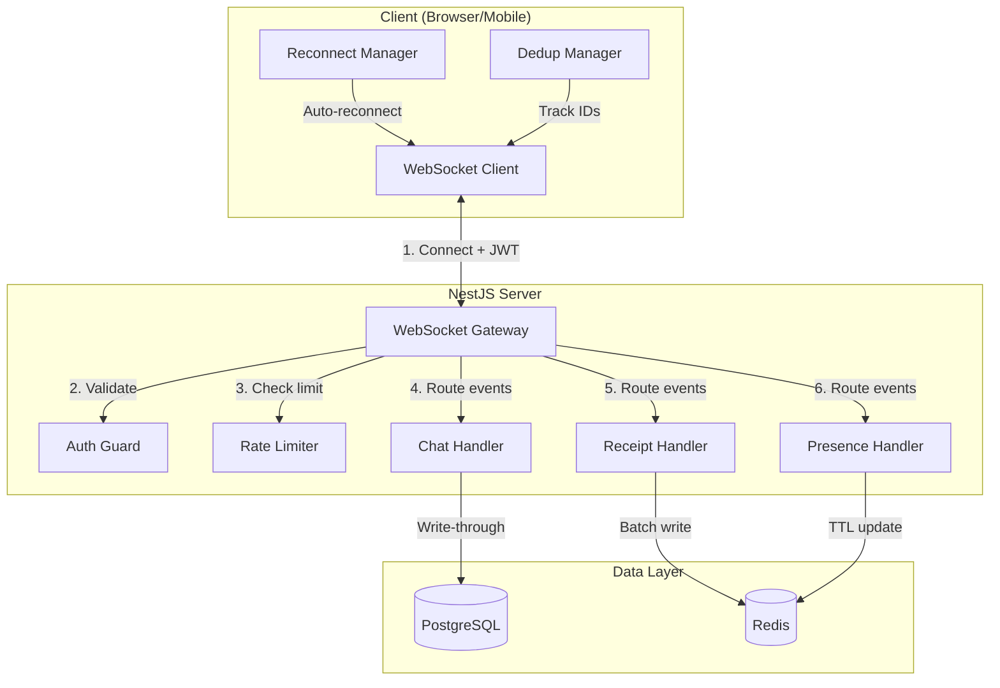
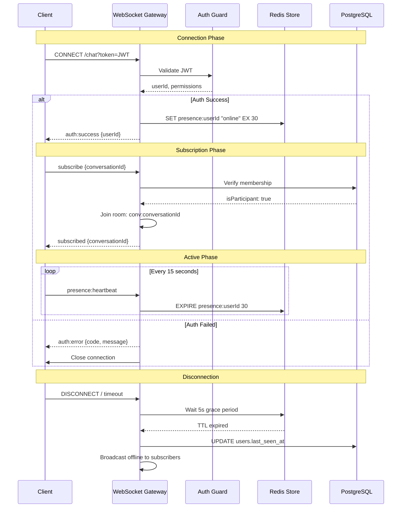
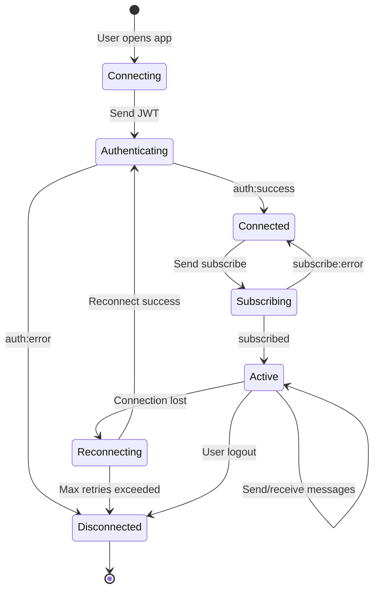
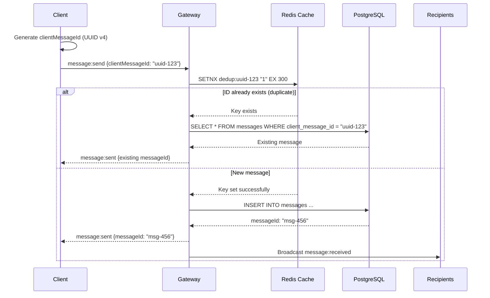
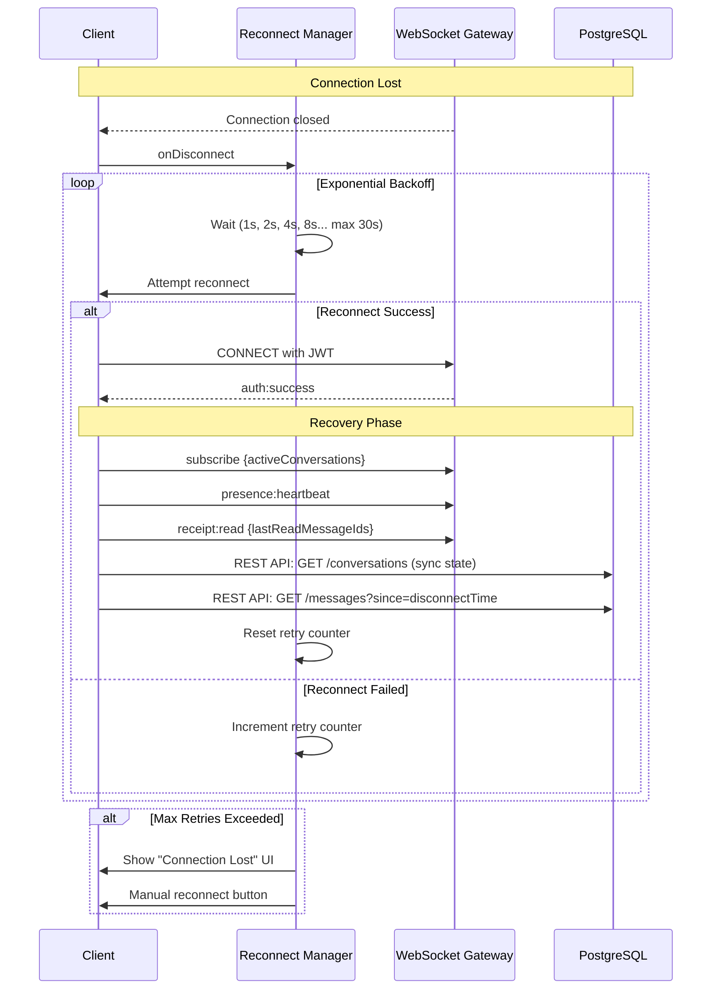

# RFC: WebSocket Protocol Specification

> **Task ID:** DOC-002  
> **MVP:** Phase 1-3 (All Phases)  
> **Status:** Draft  
> **Tech Stack:** NestJS WebSocket Gateway + Socket.io

---

## Table of Contents

- [1. Protocol Overview](#1-protocol-overview)
- [2. Connection Lifecycle](#2-connection-lifecycle)
- [3. Event Types](#3-event-types)
- [4. Message Deduplication](#4-message-deduplication)
- [5. Error Handling](#5-error-handling)
- [6. Reconnection Strategy](#6-reconnection-strategy)
- [7. Serialization Format](#7-serialization-format)
- [8. Rate Limiting](#8-rate-limiting)
- [9. NestJS Gateway Implementation](#9-nestjs-gateway-implementation)

---

## 1. Protocol Overview

### 1.1 Architecture Diagram



### 1.2 Protocol Characteristics

| Feature | Implementation |
|---------|---------------|
| Transport | WebSocket (Socket.io fallback) |
| Authentication | JWT in query param |
| Message Format | JSON (Phase 1), Binary (Phase 3+) |
| Heartbeat | 15s client → server, 30s TTL |
| Reconnection | Exponential backoff |
| Deduplication | clientMessageId (UUID v4) |

---

## 2. Connection Lifecycle

### 2.1 Connection Flow Diagram



### 2.2 Connection States



---

## 3. Event Types

### 3.1 Event Summary Table

| Direction | Event | Description | MVP |
|-----------|-------|-------------|-----|
| C → S | `auth` | Send JWT token | 1 |
| S → C | `auth:success` | Authentication confirmed | 1 |
| S → C | `auth:error` | Authentication failed | 1 |
| C → S | `subscribe` | Join conversation room | 1 |
| C → S | `unsubscribe` | Leave conversation room | 1 |
| S → C | `subscribed` | Room joined confirmation | 1 |
| S → C | `unsubscribed` | Room left confirmation | 1 |
| C → S | `message:send` | Send new message | 1 |
| S → C | `message:sent` | Delivery confirmation | 1 |
| S → C | `message:received` | New message broadcast | 1 |
| S → C | `message:error` | Send failed | 1 |
| C → S | `typing:start` | User started typing | 1 |
| C → S | `typing:stop` | User stopped typing | 1 |
| S → C | `typing:started` | Typing notification | 1 |
| S → C | `typing:stopped` | Typing ended | 1 |
| C → S | `receipt:read` | Mark messages read | 2 |
| S → C | `receipt:updated` | Read receipt (1:1) | 2 |
| S → C | `receipt:count` | Read count (group) | 2 |
| C → S | `presence:heartbeat` | Keep-alive ping | 3 |
| S → C | `presence:update` | Status change | 3 |
| S → C | `error` | Generic error | All |

### 3.2 Client → Server Events

#### Authentication
```typescript
// Event: auth
interface AuthEvent {
  token: string;  // JWT access token
}

// Sent immediately after connection
socket.emit('auth', {
  token: 'eyJhbGciOiJIUzI1NiIsInR5cCI6IkpXVCJ9...'
});
```

#### Subscribe to Conversation
```typescript
// Event: subscribe
interface SubscribeEvent {
  conversationId: string;  // UUID of conversation
}

// Client joins conversation room
socket.emit('subscribe', {
  conversationId: 'conv_abc123'
});
```

#### Send Message
```typescript
// Event: message:send
interface SendMessageEvent {
  conversationId: string;
  content: string;           // Max 4000 chars
  clientMessageId: string;   // UUID v4 for deduplication
  contentType: 'text' | 'image' | 'file';
  replyToId?: string;        // Optional: message being replied to
}

// Example
socket.emit('message:send', {
  conversationId: 'conv_abc123',
  content: 'Hello, world!',
  clientMessageId: '550e8400-e29b-41d4-a716-446655440000',
  contentType: 'text'
});
```

#### Typing Indicators
```typescript
// Event: typing:start
interface TypingStartEvent {
  conversationId: string;
}

// Event: typing:stop
interface TypingStopEvent {
  conversationId: string;
}

// Auto-stop after 5s of inactivity
socket.emit('typing:start', { conversationId: 'conv_abc123' });
// ... user types ...
socket.emit('typing:stop', { conversationId: 'conv_abc123' });
```

#### Read Receipts (MVP 2)
```typescript
// Event: receipt:read
interface ReadReceiptEvent {
  conversationId: string;
  messageIds: string[];      // Messages being marked as read
  lastReadMessageId: string; // Highest ID for sync
}

// Mark messages as read
socket.emit('receipt:read', {
  conversationId: 'conv_abc123',
  messageIds: ['msg_001', 'msg_002'],
  lastReadMessageId: 'msg_002'
});
```

#### Presence Heartbeat (MVP 3)
```typescript
// Event: presence:heartbeat
interface PresenceHeartbeatEvent {
  status: 'online' | 'away';
  timestamp: string;  // ISO 8601
}

// Sent every 15 seconds
socket.emit('presence:heartbeat', {
  status: 'online',
  timestamp: '2024-01-15T10:30:00.000Z'
});
```

### 3.3 Server → Client Events

#### Authentication Response
```typescript
// Event: auth:success
interface AuthSuccessEvent {
  userId: string;
  timestamp: string;
}

// Event: auth:error
interface AuthErrorEvent {
  code: 'TOKEN_EXPIRED' | 'TOKEN_INVALID' | 'USER_BANNED';
  message: string;
  retryable: boolean;
}
```

#### Subscription Response
```typescript
// Event: subscribed
interface SubscribedEvent {
  conversationId: string;
  timestamp: string;
}

// Event: unsubscribed
interface UnsubscribedEvent {
  conversationId: string;
  timestamp: string;
}
```

#### Message Confirmation
```typescript
// Event: message:sent (write-through confirmation)
interface MessageSentEvent {
  clientMessageId: string;   // Echo back for matching
  messageId: string;         // Server-assigned ID
  status: 'delivered';       // Always delivered after DB write
  timestamp: string;         // Server timestamp
  conversationId: string;
}

// Event: message:received (broadcast to recipients)
interface MessageReceivedEvent {
  message: {
    id: string;
    conversationId: string;
    senderId: string;
    content: string;
    contentType: string;
    createdAt: string;
    replyToId?: string;
  };
}

// Event: message:error
interface MessageErrorEvent {
  clientMessageId: string;
  code: 'VALIDATION_ERROR' | 'RATE_LIMITED' | 'NOT_IN_CONVERSATION' | 'DB_ERROR';
  message: string;
  retryable: boolean;
  retryAfter?: number;  // Seconds (for rate limiting)
}
```

#### Typing Notifications
```typescript
// Event: typing:started
interface TypingStartedEvent {
  conversationId: string;
  userId: string;
  username: string;
  timestamp: string;
}

// Event: typing:stopped
interface TypingStoppedEvent {
  conversationId: string;
  userId: string;
  timestamp: string;
}
```

#### Read Receipts (MVP 2)
```typescript
// Event: receipt:updated (1:1 chats)
interface ReceiptUpdatedEvent {
  messageId: string;
  readBy: {
    userId: string;
    username: string;
    readAt: string;
  };
}

// Event: receipt:count (group chats)
interface ReceiptCountEvent {
  messageId: string;
  readCount: number;
  totalParticipants: number;
}
```

#### Presence Updates (MVP 3)
```typescript
// Event: presence:update
interface PresenceUpdateEvent {
  userId: string;
  status: 'online' | 'away' | 'offline';
  lastSeenAt?: string;  // When status is offline
  timestamp: string;
}
```

---

## 4. Message Deduplication

### 4.1 Deduplication Strategy



### 4.2 Implementation

```typescript
// Server-side deduplication
async function handleSendMessage(
  socket: Socket,
  data: SendMessageEvent
): Promise<void> {
  const dedupKey = `dedup:${data.clientMessageId}`;
  
  // Try to set dedup key (5 minute TTL)
  const isNew = await redis.set(dedupKey, '1', 'EX', 300, 'NX');
  
  if (!isNew) {
    // Duplicate - fetch existing message
    const existing = await messageRepository.findByClientMessageId(
      data.clientMessageId
    );
    
    if (existing) {
      socket.emit('message:sent', {
        clientMessageId: data.clientMessageId,
        messageId: existing.id,
        status: 'delivered',
        timestamp: existing.createdAt,
        conversationId: existing.conversationId,
      });
      return;
    }
  }
  
  // New message - proceed with write-through
  const message = await db.transaction(async (tx) => {
    // Insert message
    const [msg] = await tx.insert(messages).values({
      conversationId: data.conversationId,
      senderId: socket.data.userId,
      content: data.content,
      contentType: data.contentType,
      clientMessageId: data.clientMessageId,
      replyToId: data.replyToId,
    }).returning();
    
    // Update conversation timestamp
    await tx.update(conversations)
      .set({ updatedAt: new Date() })
      .where(eq(conversations.id, data.conversationId));
    
    return msg;
  });
  
  // Confirm to sender
  socket.emit('message:sent', {
    clientMessageId: data.clientMessageId,
    messageId: message.id,
    status: 'delivered',
    timestamp: message.createdAt,
    conversationId: message.conversationId,
  });
  
  // Broadcast to room
  socket.to(`conv:${data.conversationId}`).emit('message:received', {
    message: {
      id: message.id,
      conversationId: message.conversationId,
      senderId: message.senderId,
      content: message.content,
      contentType: message.contentType,
      createdAt: message.createdAt,
      replyToId: message.replyToId,
    },
  });
}
```

---

## 5. Error Handling

### 5.1 Error Code Catalog

| Code | Description | Client Action | Retryable |
|------|-------------|---------------|-----------|
| `AUTH_FAILED` | Invalid/expired JWT | Redirect to login | No |
| `NOT_IN_CONVERSATION` | User removed from chat | Remove from UI | No |
| `VALIDATION_ERROR` | Content too long/empty | Show inline error | No |
| `RATE_LIMITED` | Too many messages | Wait `retryAfter` seconds | Yes |
| `DB_ERROR` | Database unavailable | Retry with backoff | Yes |
| `REDIS_UNAVAILABLE` | Cache layer down | Degrade gracefully | Yes |
| `INTERNAL_ERROR` | Unexpected failure | Retry once | Yes |

### 5.2 Error Event Structure

```typescript
interface WebSocketError {
  code: string;
  message: string;
  retryable: boolean;
  retryAfter?: number;
  context?: {
    event: string;
    timestamp: string;
  };
}

// Example errors
const rateLimitError: WebSocketError = {
  code: 'RATE_LIMITED',
  message: 'Too many messages. Please slow down.',
  retryable: true,
  retryAfter: 30,
  context: {
    event: 'message:send',
    timestamp: '2024-01-15T10:30:00.000Z',
  },
};

const authError: WebSocketError = {
  code: 'AUTH_FAILED',
  message: 'Session expired. Please log in again.',
  retryable: false,
};
```

### 5.3 Client Error Handling

```typescript
// Client-side error handler
class WebSocketErrorHandler {
  private retryAttempts: Map<string, number> = new Map();
  private maxRetries = 3;

  handleError(error: WebSocketError, originalEvent: string): void {
    console.error(`WebSocket error [${error.code}]:`, error.message);

    switch (error.code) {
      case 'RATE_LIMITED':
        // Wait and retry
        setTimeout(() => {
          this.retryEvent(originalEvent);
        }, (error.retryAfter || 30) * 1000);
        break;

      case 'DB_ERROR':
      case 'REDIS_UNAVAILABLE':
      case 'INTERNAL_ERROR':
        if (error.retryable) {
          this.retryWithBackoff(originalEvent);
        }
        break;

      case 'AUTH_FAILED':
        // Redirect to login
        window.location.href = '/login';
        break;

      case 'NOT_IN_CONVERSATION':
      case 'VALIDATION_ERROR':
        // Show user feedback, no retry
        this.showErrorToast(error.message);
        break;
    }
  }

  private retryWithBackoff(event: string): void {
    const attempts = this.retryAttempts.get(event) || 0;
    
    if (attempts >= this.maxRetries) {
      this.showErrorToast('Failed after multiple attempts. Please try again later.');
      return;
    }

    const delay = Math.pow(2, attempts) * 1000; // 1s, 2s, 4s
    
    setTimeout(() => {
      this.retryAttempts.set(event, attempts + 1);
      this.retryEvent(event);
    }, delay);
  }
}
```

---

## 6. Reconnection Strategy

### 6.1 Reconnection Flow



### 6.2 Reconnection Configuration

```typescript
// Client-side reconnection config
const RECONNECT_CONFIG = {
  initialDelay: 1000,      // 1 second
  maxDelay: 30000,         // 30 seconds
  backoffMultiplier: 2,    // Double each time
  maxRetries: 10,          // Before giving up
  randomizationFactor: 0.5, // Add jitter (0.5-1.5x)
};

// Calculate next retry delay
function getReconnectDelay(attempt: number): number {
  const baseDelay = RECONNECT_CONFIG.initialDelay * 
    Math.pow(RECONNECT_CONFIG.backoffMultiplier, attempt);
  const delay = Math.min(baseDelay, RECONNECT_CONFIG.maxDelay);
  const jitter = delay * (0.5 + Math.random());
  return Math.floor(jitter);
}

// Retry schedule: 1s, 2s, 4s, 8s, 16s, 30s, 30s, 30s...
```

### 6.3 State Recovery on Reconnect

```typescript
// Client reconnect handler
async function onReconnect(): Promise<void> {
  // 1. Re-authenticate (already done during connect)
  
  // 2. Re-subscribe to active conversations
  for (const convId of activeConversations) {
    socket.emit('subscribe', { conversationId: convId });
  }
  
  // 3. Sync read receipts
  for (const [convId, lastReadId] of lastReadMessages.entries()) {
    socket.emit('receipt:read', {
      conversationId: convId,
      messageIds: [],  // Server will calculate from lastReadId
      lastReadMessageId: lastReadId,
    });
  }
  
  // 4. Fetch missed messages via REST
  const missedMessages = await fetch(`/api/conversations/${convId}/messages?since=${disconnectTime}`);
  
  // 5. Invalidate TanStack Query caches
  queryClient.invalidateQueries(['conversations']);
  queryClient.invalidateQueries(['messages']);
  queryClient.invalidateQueries(['receipts']);
}
```

---

## 7. Serialization Format

### 7.1 Phase 1: JSON (Current)

```typescript
// Message format
{
  "event": "message:send",
  "data": {
    "conversationId": "conv_abc123",
    "content": "Hello!",
    "clientMessageId": "uuid-456",
    "contentType": "text"
  },
  "timestamp": "2024-01-15T10:30:00.000Z",
  "id": "evt_789"  // For tracing
}
```

**Pros:**
- ✅ Human-readable
- ✅ Easy debugging
- ✅ Native JavaScript support

**Cons:**
- ❌ Larger payload (text encoding)
- ❌ Slower parsing
- ❌ No schema validation

### 7.2 Phase 3: Binary Protocol (Future)

Consider migrating to binary for production scale:

**Options:**
1. **MessagePack** - JSON-like binary format
2. **Protocol Buffers** - Schema-based, highly efficient
3. **FlatBuffers** - Zero-copy deserialization

```typescript
// Protocol Buffers example (future)
syntax = "proto3";

message SendMessageEvent {
  string conversation_id = 1;
  string content = 2;
  string client_message_id = 3;
  ContentType content_type = 4;
  optional string reply_to_id = 5;
}

enum ContentType {
  TEXT = 0;
  IMAGE = 1;
  FILE = 2;
}
```

**Migration Path:**
1. Support both formats (content negotiation)
2. Default to JSON for compatibility
3. Opt-in to binary for performance-critical clients

---

## 8. Rate Limiting

### 8.1 Rate Limit Configuration

| Event | Limit | Window | Burst |
|-------|-------|--------|-------|
| `message:send` | 30 | 1 minute | 5 |
| `typing:start` | 60 | 1 minute | 10 |
| `receipt:read` | 100 | 1 minute | 20 |
| `presence:heartbeat` | 120 | 1 minute | 10 |
| Connection attempts | 10 | 1 minute | 3 |

### 8.2 Rate Limit Implementation

```typescript
// Redis-based rate limiting
@Injectable()
class WebSocketRateLimiter {
  constructor(private redis: RedisService) {}

  async checkLimit(
    userId: string,
    event: string,
    limit: number,
    windowSeconds: number
  ): Promise<{ allowed: boolean; remaining: number; resetAt: number }> {
    const key = `ratelimit:${userId}:${event}`;
    const now = Math.floor(Date.now() / 1000);
    const windowStart = now - windowSeconds;

    // Remove old entries
    await this.redis.zremrangebyscore(key, 0, windowStart);
    
    // Count current entries
    const current = await this.redis.zcard(key);
    
    if (current >= limit) {
      const oldest = await this.redis.zrange(key, 0, 0, 'WITHSCORES');
      const resetAt = parseInt(oldest[1]) + windowSeconds;
      return { allowed: false, remaining: 0, resetAt };
    }

    // Add current request
    await this.redis.zadd(key, now, `${now}-${Math.random()}`);
    await this.redis.expire(key, windowSeconds);

    return {
      allowed: true,
      remaining: limit - current - 1,
      resetAt: now + windowSeconds,
    };
  }
}
```

---

## 9. NestJS Gateway Implementation

### 9.1 Gateway Structure

```typescript
// src/chat/chat.gateway.ts
import {
  WebSocketGateway,
  WebSocketServer,
  SubscribeMessage,
  OnGatewayConnection,
  OnGatewayDisconnect,
  ConnectedSocket,
  MessageBody,
} from '@nestjs/websockets';
import { Server, Socket } from 'socket.io';
import { UseGuards } from '@nestjs/common';
import { WsJwtGuard } from '../auth/ws-jwt.guard';
import { RateLimitGuard } from '../common/guards/rate-limit.guard';

@WebSocketGateway({
  namespace: '/chat',
  cors: { origin: process.env.CLIENT_URL },
})
@UseGuards(WsJwtGuard)
export class ChatGateway implements OnGatewayConnection, OnGatewayDisconnect {
  @WebSocketServer()
  server: Server;

  constructor(
    private chatService: ChatService,
    private presenceService: PresenceService,
    private rateLimiter: WebSocketRateLimiter,
  ) {}

  async handleConnection(client: Socket): Promise<void> {
    const userId = client.data.userId;
    
    // Register socket for user (multi-device support)
    await this.presenceService.registerSocket(userId, client.id);
    
    // Set initial presence
    await this.presenceService.setOnline(userId);
    
    console.log(`Client connected: ${client.id} (user: ${userId})`);
  }

  async handleDisconnect(client: Socket): Promise<void> {
    const userId = client.data.userId;
    
    // Unregister socket
    await this.presenceService.unregisterSocket(userId, client.id);
    
    console.log(`Client disconnected: ${client.id} (user: ${userId})`);
  }

  @SubscribeMessage('subscribe')
  async handleSubscribe(
    @ConnectedSocket() client: Socket,
    @MessageBody() data: { conversationId: string },
  ): Promise<void> {
    const userId = client.data.userId;
    
    // Verify membership
    const isMember = await this.chatService.isConversationMember(
      data.conversationId,
      userId,
    );
    
    if (!isMember) {
      client.emit('error', {
        code: 'NOT_IN_CONVERSATION',
        message: 'You are not a member of this conversation',
        retryable: false,
      });
      return;
    }
    
    // Join room
    client.join(`conv:${data.conversationId}`);
    client.emit('subscribed', { conversationId: data.conversationId });
  }

  @SubscribeMessage('message:send')
  @UseGuards(RateLimitGuard) // 30/min
  async handleMessage(
    @ConnectedSocket() client: Socket,
    @MessageBody() data: SendMessageEvent,
  ): Promise<void> {
    await this.chatService.sendMessage(client, data);
  }

  @SubscribeMessage('typing:start')
  @UseGuards(RateLimitGuard) // 60/min
  async handleTypingStart(
    @ConnectedSocket() client: Socket,
    @MessageBody() data: { conversationId: string },
  ): Promise<void> {
    const userId = client.data.userId;
    const user = await this.chatService.getUser(userId);
    
    client.to(`conv:${data.conversationId}`).emit('typing:started', {
      conversationId: data.conversationId,
      userId,
      username: user.username,
      timestamp: new Date().toISOString(),
    });
  }

  @SubscribeMessage('presence:heartbeat')
  async handleHeartbeat(
    @ConnectedSocket() client: Socket,
    @MessageBody() data: PresenceHeartbeatEvent,
  ): Promise<void> {
    const userId = client.data.userId;
    await this.presenceService.updateHeartbeat(userId, data.status);
  }
}
```

### 9.2 WebSocket JWT Guard

```typescript
// src/auth/ws-jwt.guard.ts
import { CanActivate, ExecutionContext, Injectable } from '@nestjs/common';
import { JwtService } from '@nestjs/jwt';
import { Socket } from 'socket.io';

@Injectable()
export class WsJwtGuard implements CanActivate {
  constructor(private jwtService: JwtService) {}

  async canActivate(context: ExecutionContext): Promise<boolean> {
    const client: Socket = context.switchToWs().getClient();
    const token = this.extractToken(client);

    if (!token) {
      client.emit('auth:error', {
        code: 'TOKEN_MISSING',
        message: 'Authentication token required',
      });
      client.disconnect();
      return false;
    }

    try {
      const payload = await this.jwtService.verifyAsync(token);
      client.data.userId = payload.sub;
      client.data.email = payload.email;
      return true;
    } catch (error) {
      client.emit('auth:error', {
        code: 'TOKEN_INVALID',
        message: 'Invalid or expired token',
      });
      client.disconnect();
      return false;
    }
  }

  private extractToken(client: Socket): string | undefined {
    // Try query param first
    const token = client.handshake.query.token as string;
    if (token) return token;

    // Try auth header
    const authHeader = client.handshake.headers.authorization;
    if (authHeader?.startsWith('Bearer ')) {
      return authHeader.substring(7);
    }

    return undefined;
  }
}
```

---

**Next:** See [RFC-008: Observability](rfc-observability.md) for monitoring, logging, and error tracking specification.
