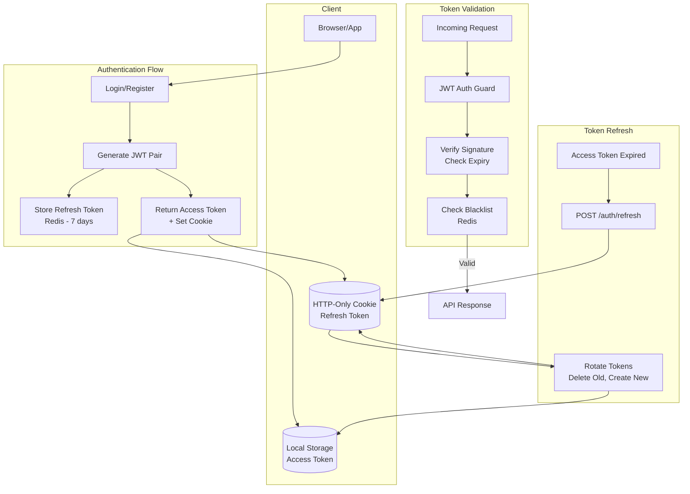
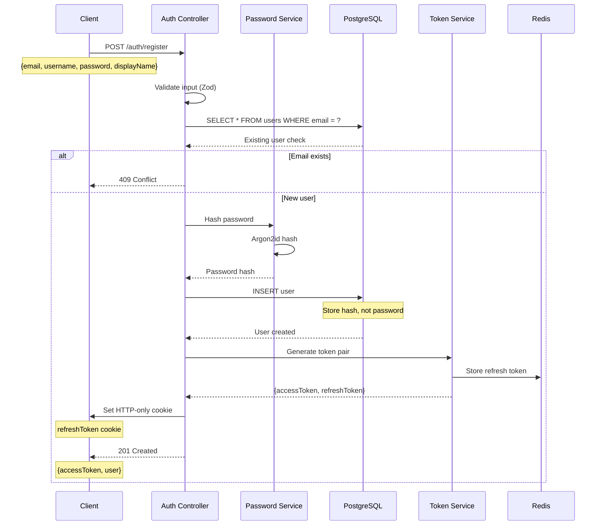
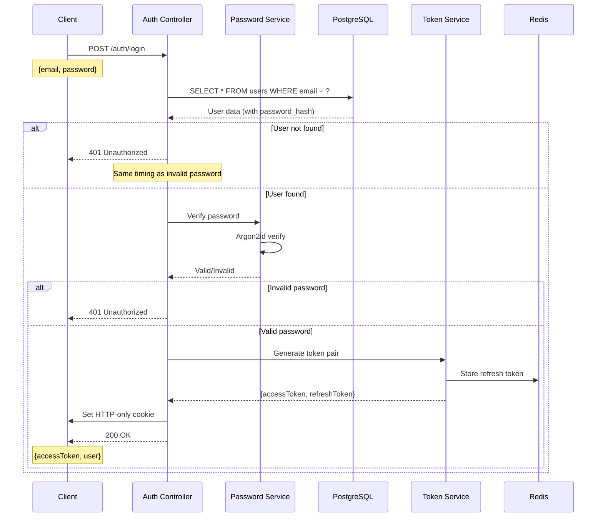
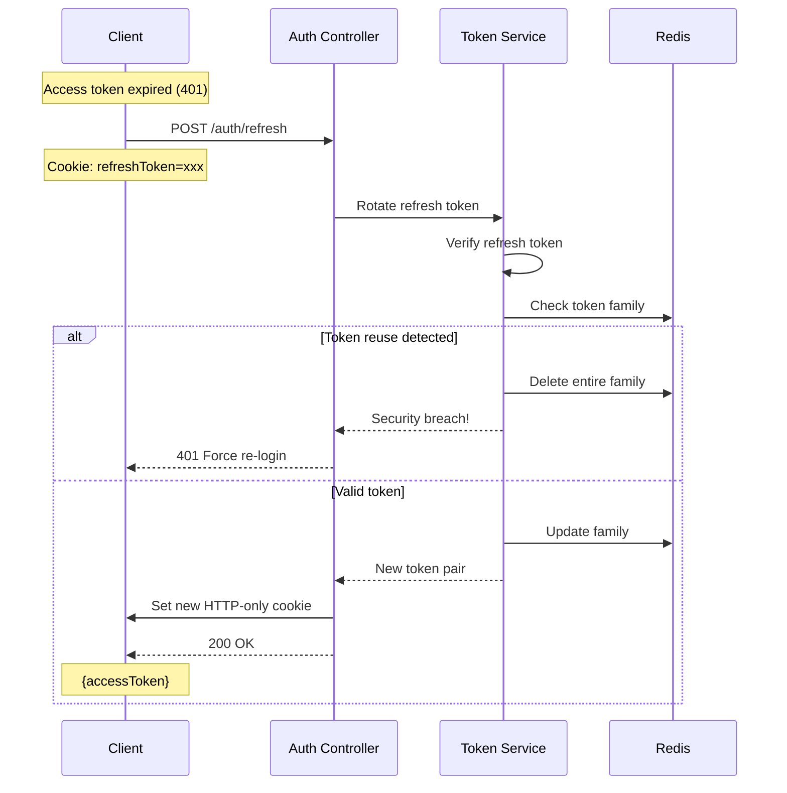
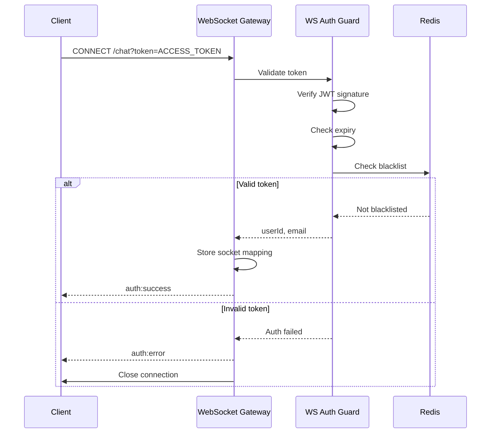

# RFC: Authentication & Authorization

> **Task ID:** DOC-003-Auth  
> **MVP:** Phase 1 (Basic Chat + Message Storage)  > **Status:** Draft  
> **Security Level:** High

---

## Table of Contents

- [1. Authentication Overview](#1-authentication-overview)
- [2. JWT Token Strategy](#2-jwt-token-strategy)
- [3. Password Security](#3-password-security)
- [4. Authentication Flows](#4-authentication-flows)
- [5. WebSocket Authentication](#5-websocket-authentication)
- [6. Authorization (RBAC)](#6-authorization-rbac)
- [7. Security Headers](#7-security-headers)
- [8. Implementation](#8-implementation)

---

## 1. Authentication Overview

### 1.1 Authentication Architecture



### 1.2 Token Strategy Summary

| Token Type | Storage | Expiry | Purpose |
|------------|---------|--------|---------|
| **Access Token** | LocalStorage/Memory | 15 minutes | API authentication |
| **Refresh Token** | HTTP-Only Cookie | 7 days | Get new access token |
| **WebSocket Token** | Query Param (initial) | Same as access | WebSocket auth |

---

## 2. JWT Token Strategy

### 2.1 Token Structure

**Access Token Payload:**
```typescript
interface AccessTokenPayload {
  sub: string;           // User ID (usr_abc123)
  email: string;         // user@example.com
  username: string;      // johndoe
  iat: number;           // Issued at (Unix timestamp)
  exp: number;           // Expires at (Unix timestamp)
  type: 'access';        // Token type
  jti: string;           // Unique token ID (for blacklist)
}
```

**Refresh Token Payload:**
```typescript
interface RefreshTokenPayload {
  sub: string;           // User ID
  jti: string;           // Unique token ID
  iat: number;           // Issued at
  exp: number;           // Expires at (7 days)
  type: 'refresh';       // Token type
  family: string;        // Token family (rotation tracking)
}
```

### 2.2 Token Configuration

```typescript
// src/auth/jwt.config.ts
export const JWT_CONFIG = {
  access: {
    secret: process.env.JWT_ACCESS_SECRET!,     // HS256 key
    expiresIn: '15m',                            // 15 minutes
    algorithm: 'HS256' as const,
    issuer: 'chat-api',
    audience: 'chat-client',
  },
  refresh: {
    secret: process.env.JWT_REFRESH_SECRET!,    // Different key!
    expiresIn: '7d',                             // 7 days
    algorithm: 'HS256' as const,
    issuer: 'chat-api',
    audience: 'chat-client',
  },
};

// Token rotation configuration
export const REFRESH_CONFIG = {
  maxRotationCount: 10,      // Max rotations per family
  reuseDetection: true,      // Detect refresh token reuse
  gracePeriod: 5000,         // 5s grace for network issues
};
```

### 2.3 Token Generation

```typescript
// src/auth/token.service.ts
import { Injectable } from '@nestjs/common';
import { JwtService } from '@nestjs/jwt';
import { randomUUID } from 'crypto';
import { RedisService } from '../redis/redis.service';
import { JWT_CONFIG, REFRESH_CONFIG } from './jwt.config';

@Injectable()
export class TokenService {
  constructor(
    private jwtService: JwtService,
    private redis: RedisService,
  ) {}

  async generateTokenPair(user: User) {
    const jti = randomUUID();
    const family = randomUUID();

    // Access token
    const accessToken = this.jwtService.sign(
      {
        sub: user.id,
        email: user.email,
        username: user.username,
        type: 'access',
      },
      {
        secret: JWT_CONFIG.access.secret,
        expiresIn: JWT_CONFIG.access.expiresIn,
        jwtid: jti,
      },
    );

    // Refresh token
    const refreshToken = this.jwtService.sign(
      {
        sub: user.id,
        type: 'refresh',
        family,
      },
      {
        secret: JWT_CONFIG.refresh.secret,
        expiresIn: JWT_CONFIG.refresh.expiresIn,
        jwtid: randomUUID(),
      },
    );

    // Store refresh token in Redis
    await this.redis.setex(
      `refresh:${user.id}:${family}`,
      7 * 24 * 60 * 60, // 7 days
      JSON.stringify({
        tokenId: this.extractJti(refreshToken),
        rotationCount: 0,
        createdAt: Date.now(),
      }),
    );

    return { accessToken, refreshToken, family };
  }

  async rotateRefreshToken(
    oldRefreshToken: string,
    userId: string,
  ): Promise<{ accessToken: string; refreshToken: string }> {
    const payload = this.jwtService.verify(oldRefreshToken, {
      secret: JWT_CONFIG.refresh.secret,
    });

    const family = payload.family;
    const key = `refresh:${userId}:${family}`;

    // Check if token family exists
    const familyData = await this.redis.get(key);
    if (!familyData) {
      throw new UnauthorizedException('Invalid refresh token');
    }

    const parsed = JSON.parse(familyData);

    // Check for token reuse (security breach)
    if (parsed.tokenId !== payload.jti) {
      // Token reuse detected! Invalidate entire family
      await this.redis.del(key);
      await this.invalidateAllUserTokens(userId);
      throw new UnauthorizedException(
        'Token reuse detected. Please log in again.',
      );
    }

    // Check rotation count
    if (parsed.rotationCount >= REFRESH_CONFIG.maxRotationCount) {
      await this.redis.del(key);
      throw new UnauthorizedException('Maximum token rotations exceeded');
    }

    // Generate new pair
    const newJti = randomUUID();
    const accessToken = this.jwtService.sign(
      { sub: userId, type: 'access' },
      { secret: JWT_CONFIG.access.secret, expiresIn: JWT_CONFIG.access.expiresIn },
    );

    const newRefreshToken = this.jwtService.sign(
      { sub: userId, type: 'refresh', family },
      { secret: JWT_CONFIG.refresh.secret, expiresIn: JWT_CONFIG.refresh.expiresIn, jwtid: newJti },
    );

    // Update family in Redis
    await this.redis.setex(
      key,
      7 * 24 * 60 * 60,
      JSON.stringify({
        tokenId: newJti,
        rotationCount: parsed.rotationCount + 1,
        createdAt: Date.now(),
      }),
    );

    return { accessToken, refreshToken: newRefreshToken };
  }

  async blacklistToken(token: string): Promise<void> {
    const payload = this.jwtService.decode(token) as any;
    const ttl = payload.exp - Math.floor(Date.now() / 1000);
    
    if (ttl > 0) {
      await this.redis.setex(`blacklist:${payload.jti}`, ttl, '1');
    }
  }

  async isTokenBlacklisted(jti: string): Promise<boolean> {
    const result = await this.redis.get(`blacklist:${jti}`);
    return result !== null;
  }

  private extractJti(token: string): string {
    const payload = this.jwtService.decode(token) as any;
    return payload.jti;
  }

  private async invalidateAllUserTokens(userId: string): Promise<void> {
    // Implement if needed - delete all refresh tokens for user
    const keys = await this.redis.keys(`refresh:${userId}:*`);
    if (keys.length > 0) {
      await this.redis.del(...keys);
    }
  }
}
```

---

## 3. Password Security

### 3.1 Password Requirements

```typescript
// src/validation/auth.schema.ts
export const passwordRequirements = {
  minLength: 8,
  maxLength: 100,
  requireUppercase: true,
  requireLowercase: true,
  requireNumbers: true,
  requireSpecialChars: false, // Optional for MVP
  preventCommonPasswords: true,
};

export const passwordSchema = z
  .string()
  .min(8, 'Password must be at least 8 characters')
  .max(100, 'Password must be at most 100 characters')
  .regex(/[A-Z]/, 'Password must contain at least one uppercase letter')
  .regex(/[a-z]/, 'Password must contain at least one lowercase letter')
  .regex(/[0-9]/, 'Password must contain at least one number')
  .refine(
    (password) => !isCommonPassword(password),
    'Password is too common. Please choose a stronger password.',
  );
```

### 3.2 Argon2id Configuration

```typescript
// src/auth/password.service.ts
import { Injectable } from '@nestjs/common';
import * as argon2 from 'argon2';

@Injectable()
export class PasswordService {
  // Argon2id configuration (OWASP recommended)
  private readonly argonConfig = {
    type: argon2.argon2id,
    memoryCost: 65536,    // 64 MB
    timeCost: 3,          // 3 iterations
    parallelism: 4,       // 4 parallel threads
    hashLength: 32,       // 32 byte output
  };

  async hash(password: string): Promise<string> {
    return argon2.hash(password, this.argonConfig);
  }

  async verify(hash: string, password: string): Promise<boolean> {
    try {
      return await argon2.verify(hash, password);
    } catch {
      return false;
    }
  }

  async needsRehash(hash: string): Promise<boolean> {
    return argon2.needsRehash(hash, this.argonConfig);
  }
}
```

### 3.3 Why Argon2id?

| Algorithm | Memory Hard | GPU Resistant | Winner of PHC |
|-----------|-------------|---------------|---------------|
| **Argon2id** | ✅ Yes | ✅ Yes | ✅ Yes (2015) |
| bcrypt | ❌ No | ⚠️ Partial | ❌ No |
| PBKDF2 | ❌ No | ❌ No | ❌ No |
| scrypt | ✅ Yes | ⚠️ Partial | ❌ Finalist |

---

## 4. Authentication Flows

### 4.1 Registration Flow



### 4.2 Login Flow



### 4.3 Token Refresh Flow



---

## 5. WebSocket Authentication

### 5.1 WebSocket Auth Flow



### 5.2 WebSocket Auth Guard

```typescript
// src/auth/ws-jwt.guard.ts
import { CanActivate, ExecutionContext, Injectable, Logger } from '@nestjs/common';
import { JwtService } from '@nestjs/jwt';
import { Socket } from 'socket.io';
import { RedisService } from '../redis/redis.service';
import { JWT_CONFIG } from './jwt.config';

@Injectable()
export class WsJwtGuard implements CanActivate {
  private readonly logger = new Logger(WsJwtGuard.name);

  constructor(
    private jwtService: JwtService,
    private redis: RedisService,
  ) {}

  async canActivate(context: ExecutionContext): Promise<boolean> {
    const client: Socket = context.switchToWs().getClient();
    
    try {
      const token = this.extractToken(client);
      
      if (!token) {
        this.sendAuthError(client, 'TOKEN_MISSING', 'Authentication token required');
        return false;
      }

      // Verify token
      const payload = await this.jwtService.verifyAsync(token, {
        secret: JWT_CONFIG.access.secret,
      });

      // Check if blacklisted
      const isBlacklisted = await this.redis.get(`blacklist:${payload.jti}`);
      if (isBlacklisted) {
        this.sendAuthError(client, 'TOKEN_REVOKED', 'Token has been revoked');
        return false;
      }

      // Attach user data to socket
      client.data.userId = payload.sub;
      client.data.email = payload.email;
      client.data.username = payload.username;

      return true;
    } catch (error) {
      if (error.name === 'TokenExpiredError') {
        this.sendAuthError(client, 'TOKEN_EXPIRED', 'Token has expired');
      } else {
        this.sendAuthError(client, 'TOKEN_INVALID', 'Invalid token');
      }
      return false;
    }
  }

  private extractToken(client: Socket): string | undefined {
    // Priority 1: Query param
    const queryToken = client.handshake.query.token as string;
    if (queryToken) return queryToken;

    // Priority 2: Auth header
    const authHeader = client.handshake.headers.authorization;
    if (authHeader?.startsWith('Bearer ')) {
      return authHeader.substring(7);
    }

    return undefined;
  }

  private sendAuthError(
    client: Socket,
    code: string,
    message: string,
  ): void {
    client.emit('auth:error', { code, message });
    
    // Disconnect after short delay to allow client to process error
    setTimeout(() => {
      client.disconnect(true);
    }, 100);
  }
}
```

### 5.3 WebSocket Token Refresh

```typescript
// Client-side WebSocket token refresh
class ChatSocket {
  private socket: Socket;
  private refreshPromise: Promise<string> | null = null;

  async connect(): Promise<void> {
    const token = localStorage.getItem('accessToken');
    
    this.socket = io('/chat', {
      query: { token },
    });

    this.socket.on('auth:error', async (error) => {
      if (error.code === 'TOKEN_EXPIRED') {
        // Refresh token
        const newToken = await this.refreshAccessToken();
        
        // Reconnect with new token
        this.socket.disconnect();
        this.socket = io('/chat', {
          query: { token: newToken },
        });
      } else {
        // Redirect to login
        window.location.href = '/login';
      }
    });
  }

  private async refreshAccessToken(): Promise<string> {
    // Prevent multiple simultaneous refresh requests
    if (this.refreshPromise) {
      return this.refreshPromise;
    }

    this.refreshPromise = fetch('/api/auth/refresh', {
      method: 'POST',
      credentials: 'include', // Send HTTP-only cookie
    })
      .then((res) => res.json())
      .then((data) => {
        localStorage.setItem('accessToken', data.data.accessToken);
        return data.data.accessToken;
      })
      .finally(() => {
        this.refreshPromise = null;
      });

    return this.refreshPromise;
  }
}
```

---

## 6. Authorization (RBAC)

### 6.1 Role-Based Access Control

```typescript
// src/auth/roles.enum.ts
export enum Role {
  USER = 'user',
  ADMIN = 'admin',
  MODERATOR = 'moderator',
}

// src/auth/decorators/roles.decorator.ts
import { SetMetadata } from '@nestjs/common';
import { Role } from '../roles.enum';

export const ROLES_KEY = 'roles';
export const Roles = (...roles: Role[]) => SetMetadata(ROLES_KEY, roles);

// src/auth/guards/roles.guard.ts
import { Injectable, CanActivate, ExecutionContext } from '@nestjs/common';
import { Reflector } from '@nestjs/core';
import { Role } from '../roles.enum';
import { ROLES_KEY } from '../decorators/roles.decorator';

@Injectable()
export class RolesGuard implements CanActivate {
  constructor(private reflector: Reflector) {}

  canActivate(context: ExecutionContext): boolean {
    const requiredRoles = this.reflector.getAllAndOverride<Role[]>(ROLES_KEY, [
      context.getHandler(),
      context.getClass(),
    ]);

    if (!requiredRoles) {
      return true;
    }

    const { user } = context.switchToHttp().getRequest();
    return requiredRoles.some((role) => user.role === role);
  }
}
```

### 6.2 Conversation Permissions

```typescript
// src/auth/guards/conversation-member.guard.ts
import { Injectable, CanActivate, ExecutionContext, ForbiddenException } from '@nestjs/common';
import { ConversationsService } from '../../conversations/conversations.service';

@Injectable()
export class ConversationMemberGuard implements CanActivate {
  constructor(private conversationsService: ConversationsService) {}

  async canActivate(context: ExecutionContext): Promise<boolean> {
    const request = context.switchToHttp().getRequest();
    const userId = request.user.id;
    const conversationId = request.params.id;

    const isMember = await this.conversationsService.isMember(
      conversationId,
      userId,
    );

    if (!isMember) {
      throw new ForbiddenException('You are not a member of this conversation');
    }

    return true;
  }
}
```

---

## 7. Security Headers

### 7.1 Helmet Configuration

```typescript
// src/main.ts
import { NestFactory } from '@nestjs/core';
import helmet from 'helmet';
import { AppModule } from './app.module';

async function bootstrap() {
  const app = await NestFactory.create(AppModule);

  // Security headers
  app.use(helmet({
    contentSecurityPolicy: {
      directives: {
        defaultSrc: ["'self'"],
        styleSrc: ["'self'", "'unsafe-inline'"],
        scriptSrc: ["'self'"],
        imgSrc: ["'self'", "data:", "https:"],
        connectSrc: ["'self'", "wss:", "https:"],
      },
    },
    crossOriginEmbedderPolicy: false, // Allow WebSocket
    hsts: {
      maxAge: 31536000,
      includeSubDomains: true,
      preload: true,
    },
  }));

  // CORS configuration
  app.enableCors({
    origin: process.env.CLIENT_URL,
    credentials: true,
    methods: ['GET', 'POST', 'PUT', 'DELETE', 'PATCH'],
    allowedHeaders: ['Content-Type', 'Authorization', 'X-Request-ID'],
  });

  await app.listen(3000);
}
```

### 7.2 Cookie Security

```typescript
// Cookie configuration for refresh token
const refreshCookieOptions = {
  httpOnly: true,        // Not accessible via JavaScript
  secure: true,          // HTTPS only in production
  sameSite: 'strict' as const,  // CSRF protection
  maxAge: 7 * 24 * 60 * 60 * 1000,  // 7 days
  path: '/auth/refresh', // Only sent to refresh endpoint
};

// Set cookie
response.cookie('refreshToken', refreshToken, refreshCookieOptions);

// Clear cookie on logout
response.clearCookie('refreshToken', { path: '/auth/refresh' });
```

---

## 8. Implementation

### 8.1 Auth Module Structure

```typescript
// src/auth/auth.module.ts
import { Module } from '@nestjs/common';
import { JwtModule } from '@nestjs/jwt';
import { PassportModule } from '@nestjs/passport';
import { AuthController } from './auth.controller';
import { AuthService } from './auth.service';
import { TokenService } from './token.service';
import { PasswordService } from './password.service';
import { JwtStrategy } from './strategies/jwt.strategy';
import { WsJwtGuard } from './ws-jwt.guard';
import { DatabaseModule } from '../database/database.module';
import { RedisModule } from '../redis/redis.module';

@Module({
  imports: [
    PassportModule.register({ defaultStrategy: 'jwt' }),
    JwtModule.register({}),
    DatabaseModule,
    RedisModule,
  ],
  controllers: [AuthController],
  providers: [
    AuthService,
    TokenService,
    PasswordService,
    JwtStrategy,
    WsJwtGuard,
  ],
  exports: [TokenService, PasswordService, WsJwtGuard],
})
export class AuthModule {}
```

### 8.2 JWT Strategy

```typescript
// src/auth/strategies/jwt.strategy.ts
import { Injectable, UnauthorizedException } from '@nestjs/common';
import { PassportStrategy } from '@nestjs/passport';
import { ExtractJwt, Strategy } from 'passport-jwt';
import { JWT_CONFIG } from '../jwt.config';
import { UsersService } from '../../users/users.service';

@Injectable()
export class JwtStrategy extends PassportStrategy(Strategy) {
  constructor(private usersService: UsersService) {
    super({
      jwtFromRequest: ExtractJwt.fromAuthHeaderAsBearerToken(),
      ignoreExpiration: false,
      secretOrKey: JWT_CONFIG.access.secret,
      issuer: JWT_CONFIG.access.issuer,
      audience: JWT_CONFIG.access.audience,
    });
  }

  async validate(payload: any) {
    const user = await this.usersService.findById(payload.sub);
    
    if (!user || !user.isActive) {
      throw new UnauthorizedException();
    }

    return {
      id: user.id,
      email: user.email,
      username: user.username,
      role: user.role,
    };
  }
}
```

### 8.3 Auth Controller

```typescript
// src/auth/auth.controller.ts
import {
  Controller,
  Post,
  Body,
  Res,
  Req,
  HttpCode,
  HttpStatus,
  UseGuards,
} from '@nestjs/common';
import { Response, Request } from 'express';
import { AuthService } from './auth.service';
import { ZodValidationPipe } from '../common/pipes/zod-validation.pipe';
import { registerSchema, loginSchema } from '../validation/auth.schema';
import { JwtAuthGuard } from './jwt-auth.guard';
import { Throttle } from '@nestjs/throttler';

@Controller('auth')
export class AuthController {
  constructor(private authService: AuthService) {}

  @Post('register')
  @Throttle(5, 900) // 5 attempts per 15 minutes
  async register(
    @Body(new ZodValidationPipe(registerSchema)) data,
    @Res({ passthrough: true }) response: Response,
  ) {
    const result = await this.authService.register(data);
    
    // Set refresh token cookie
    response.cookie('refreshToken', result.refreshToken, {
      httpOnly: true,
      secure: process.env.NODE_ENV === 'production',
      sameSite: 'strict',
      maxAge: 7 * 24 * 60 * 60 * 1000,
      path: '/auth/refresh',
    });

    return {
      data: {
        user: result.user,
        accessToken: result.accessToken,
      },
    };
  }

  @Post('login')
  @HttpCode(HttpStatus.OK)
  @Throttle(5, 900)
  async login(
    @Body(new ZodValidationPipe(loginSchema)) data,
    @Res({ passthrough: true }) response: Response,
  ) {
    const result = await this.authService.login(data);
    
    response.cookie('refreshToken', result.refreshToken, {
      httpOnly: true,
      secure: process.env.NODE_ENV === 'production',
      sameSite: 'strict',
      maxAge: 7 * 24 * 60 * 60 * 1000,
      path: '/auth/refresh',
    });

    return {
      data: {
        user: result.user,
        accessToken: result.accessToken,
      },
    };
  }

  @Post('refresh')
  @HttpCode(HttpStatus.OK)
  async refresh(
    @Req() request: Request,
    @Res({ passthrough: true }) response: Response,
  ) {
    const refreshToken = request.cookies?.refreshToken;
    
    if (!refreshToken) {
      throw new UnauthorizedException('No refresh token provided');
    }

    const result = await this.authService.refreshTokens(refreshToken);
    
    response.cookie('refreshToken', result.refreshToken, {
      httpOnly: true,
      secure: process.env.NODE_ENV === 'production',
      sameSite: 'strict',
      maxAge: 7 * 24 * 60 * 60 * 1000,
      path: '/auth/refresh',
    });

    return {
      data: {
        accessToken: result.accessToken,
      },
    };
  }

  @Post('logout')
  @UseGuards(JwtAuthGuard)
  @HttpCode(HttpStatus.OK)
  async logout(
    @Req() request: Request,
    @Res({ passthrough: true }) response: Response,
  ) {
    const refreshToken = request.cookies?.refreshToken;
    const accessToken = request.headers.authorization?.split(' ')[1];

    await this.authService.logout(accessToken, refreshToken);
    
    response.clearCookie('refreshToken', { path: '/auth/refresh' });

    return {
      data: { message: 'Logged out successfully' },
    };
  }
}
```

---

**Related Documents:**
- [REST API Specification](rfc-rest-api.md) - API endpoints
- [RFC Database Schema](rfc-database-schema.md) - User table structure
- [RFC WebSocket Protocol](rfc-websocket-protocol.md) - WS authentication
