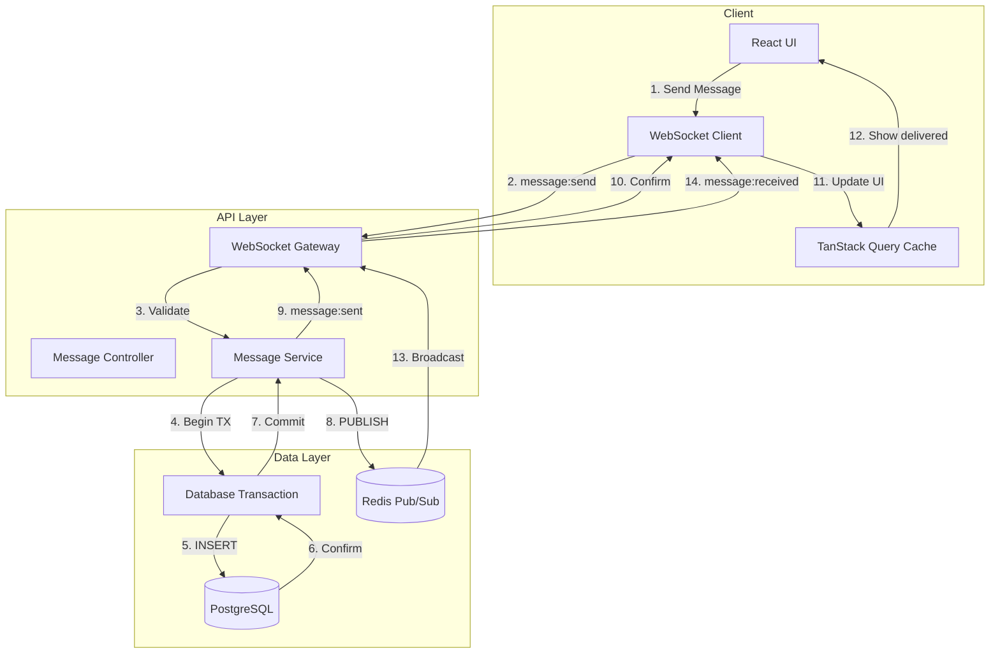
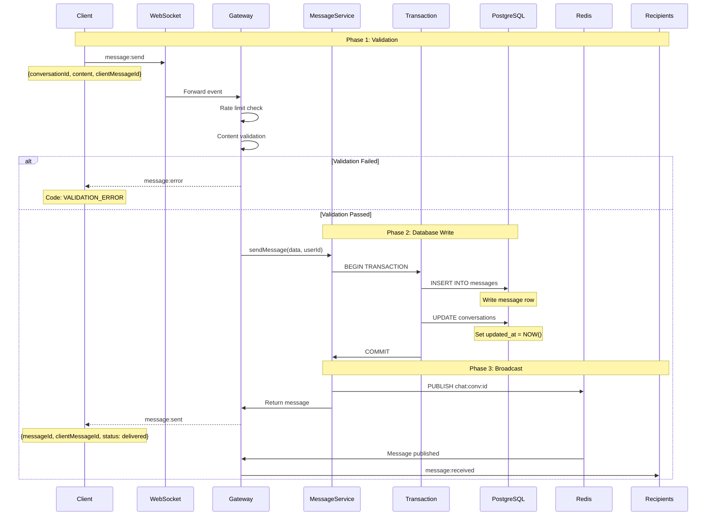
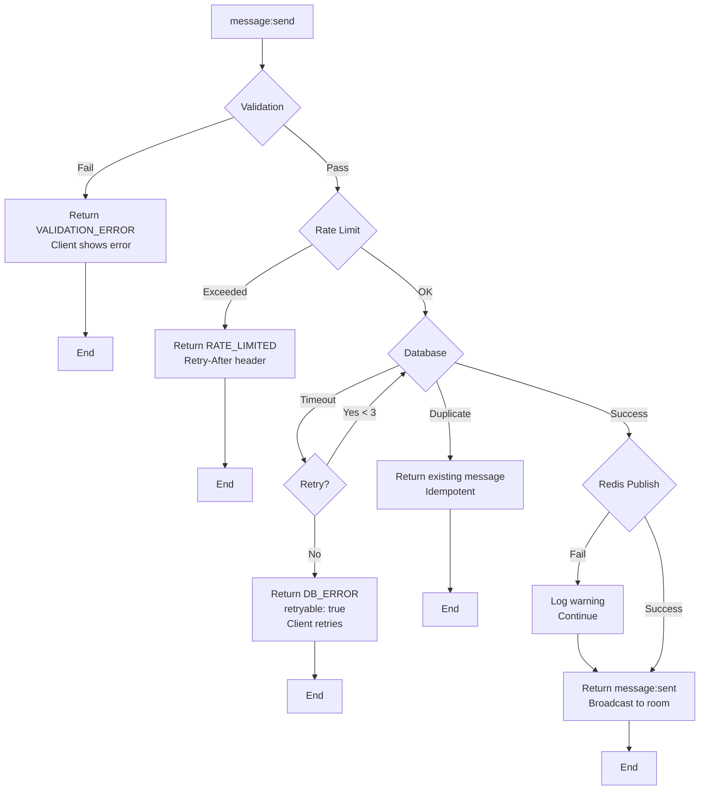
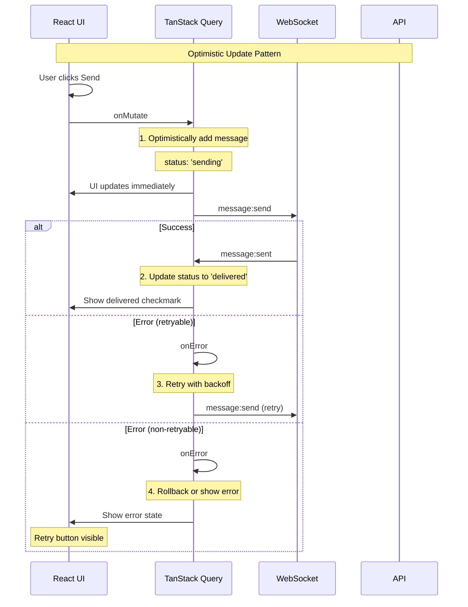
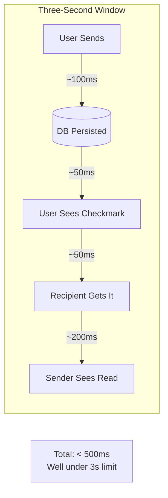

# RFC: Message Storage Architecture

> **Task ID:** DOC-004  
> **MVP:** Phase 1 (Basic Chat + Message Storage)  > **Status:** Draft  > **Pattern:** Write-Through Cache

---

## Table of Contents

- [1. Architecture Overview](#1-architecture-overview)
- [2. Write-Through Flow](#2-write-through-flow)
- [3. Failure Handling](#3-failure-handling)
- [4. Optimistic UI Pattern](#4-optimistic-ui-pattern)
- [5. Message Ordering](#5-message-ordering)
- [6. Performance Targets](#6-performance-targets)
- [7. Implementation](#7-implementation)

---

## 1. Architecture Overview

### 1.1 System Architecture



### 1.2 Write-Through vs Write-Behind

| Aspect | Write-Through (Chosen) | Write-Behind (Alternative) |
|--------|------------------------|---------------------------|
| **Durability** | ✅ Immediate persistence | ⚠️ Risk of data loss on crash |
| **Latency** | ⚠️ Higher (DB round-trip) | ✅ Lower (async queue) |
| **Complexity** | ✅ Simpler | ⚠️ Requires queue + retry logic |
| **User Trust** | ✅ "Confirmed = Saved" | ⚠️ "Confirmed = Queued" |
| **Recovery** | ✅ No recovery needed | ⚠️ Queue replay on restart |

**Decision:** Write-through for MVP 1. Durability guarantees are critical for user trust in chat.

---

## 2. Write-Through Flow

### 2.1 Detailed Sequence



### 2.2 Latency Breakdown

```
Target: p95 < 500ms total

Breakdown:
├── Client → Server (WebSocket):     ~20-50ms
├── Validation (rate limit, Zod):    ~5-10ms
├── DB Connection Acquire:           ~5-20ms
├── BEGIN TRANSACTION:               ~2-5ms
├── INSERT message:                  ~15-30ms
├── UPDATE conversation:             ~10-20ms
├── COMMIT:                          ~10-20ms
├── Redis PUBLISH:                   ~5-10ms
├── Server → Client (confirmation):  ~20-50ms
└── Total:                           ~92-215ms (well under 500ms)
```

---

## 3. Failure Handling

### 3.1 Failure Scenarios



### 3.2 Failure Response Matrix

| Failure Point | Detection | Handling | Client Action |
|--------------|-----------|----------|---------------|
| **Validation** | Zod schema | Return 400 with details | Show inline errors |
| **Rate Limit** | Redis counter | Return 429 with Retry-After | Wait and retry |
| **DB Timeout** | > 3 seconds | Return 503, retryable: true | Retry with backoff |
| **DB Connection Lost** | Connection error | Return 503, retryable: true | Retry with backoff |
| **Duplicate Message** | Unique constraint | Return existing message | Update UI with ID |
| **Redis Unavailable** | Connection error | Log warning, continue | N/A (message saved) |
| **Broadcast Fail** | Socket disconnected | Message persisted | Fetch on reconnect |

### 3.3 Retry Strategy

```typescript
// Client-side retry logic
class MessageSender {
  private maxRetries = 3;
  private baseDelay = 1000; // 1 second

  async sendMessage(message: SendMessageData): Promise<void> {
    let attempts = 0;

    while (attempts < this.maxRetries) {
      try {
        const response = await this.socket.emitWithAck('message:send', message);
        
        if (response.status === 'delivered') {
          this.updateMessageStatus(message.clientMessageId, 'delivered');
          return;
        }
        
        if (!response.retryable) {
          throw new NonRetryableError(response.error);
        }
        
        // Retryable error - continue to retry
      } catch (error) {
        if (attempts === this.maxRetries - 1) {
          this.updateMessageStatus(message.clientMessageId, 'error');
          throw error;
        }
      }

      attempts++;
      const delay = this.baseDelay * Math.pow(2, attempts); // Exponential backoff
      await this.sleep(delay);
    }
  }

  private sleep(ms: number): Promise<void> {
    return new Promise(resolve => setTimeout(resolve, ms));
  }
}
```

---

## 4. Optimistic UI Pattern

### 4.1 Optimistic Update Flow



### 4.2 TanStack Query Implementation

```typescript
// hooks/useSendMessage.ts
import { useMutation, useQueryClient } from '@tanstack/react-query';
import { socket } from '../lib/socket';

export function useSendMessage(conversationId: string) {
  const queryClient = useQueryClient();

  return useMutation({
    mutationFn: async (newMessage: {
      content: string;
      clientMessageId: string;
    }) => {
      return new Promise((resolve, reject) => {
        socket.emit(
          'message:send',
          {
            conversationId,
            ...newMessage,
            contentType: 'text',
          },
          (response: any) => {
            if (response.error) {
              reject(response.error);
            } else {
              resolve(response);
            }
          }
        );

        // Timeout after 10 seconds
        setTimeout(() => {
          reject(new Error('Request timeout'));
        }, 10000);
      });
    },

    onMutate: async (newMessage) => {
      // Cancel outgoing refetches
      await queryClient.cancelQueries({
        queryKey: ['messages', conversationId],
      });

      // Snapshot previous value
      const previousMessages = queryClient.getQueryData([
        'messages',
        conversationId,
      ]);

      // Optimistically add message
      queryClient.setQueryData(
        ['messages', conversationId],
        (old: any) => ({
          ...old,
          pages: old.pages.map((page: any, index: number) =>
            index === 0
              ? {
                  ...page,
                  messages: [
                    {
                      id: `temp-${newMessage.clientMessageId}`,
                      conversationId,
                      content: newMessage.content,
                      contentType: 'text',
                      clientMessageId: newMessage.clientMessageId,
                      status: 'sending',
                      createdAt: new Date().toISOString(),
                      sender: {
                        id: currentUser.id,
                        username: currentUser.username,
                        displayName: currentUser.displayName,
                      },
                    },
                    ...page.messages,
                  ],
                }
              : page
          ),
        })
      );

      return { previousMessages };
    },

    onSuccess: (data, variables) => {
      // Update temporary message with real data
      queryClient.setQueryData(
        ['messages', conversationId],
        (old: any) => ({
          ...old,
          pages: old.pages.map((page: any) => ({
            ...page,
            messages: page.messages.map((msg: any) =>
              msg.clientMessageId === variables.clientMessageId
                ? { ...msg, id: data.messageId, status: 'delivered' }
                : msg
            ),
          })),
        })
      );
    },

    onError: (error, variables, context) => {
      // Rollback on error
      if (context?.previousMessages) {
        queryClient.setQueryData(
          ['messages', conversationId],
          context.previousMessages
        );
      }

      // Or update status to error
      queryClient.setQueryData(
        ['messages', conversationId],
        (old: any) => ({
          ...old,
          pages: old.pages.map((page: any) => ({
            ...page,
            messages: page.messages.map((msg: any) =>
              msg.clientMessageId === variables.clientMessageId
                ? { ...msg, status: 'error', error: error.message }
                : msg
            ),
          })),
        })
      );
    },

    onSettled: () => {
      // Always refetch after error or success
      queryClient.invalidateQueries({
        queryKey: ['messages', conversationId],
      });
    },
  });
}
```

### 4.3 Message Status States

```typescript
// types/message.ts
type MessageStatus = 
  | 'sending'    // Optimistic, not yet confirmed
  | 'delivered'  // Confirmed by server
  | 'read'       // Read by recipient (Phase 2)
  | 'error';     // Failed to send

interface Message {
  id: string;
  conversationId: string;
  sender: User;
  content: string;
  contentType: 'text' | 'image' | 'file';
  clientMessageId: string;
  status: MessageStatus;
  error?: string;  // Error message if status is 'error'
  createdAt: string;
}
```

---

## 5. Message Ordering

### 5.1 Ordering Strategy

**Problem:** Clock skew, out-of-order delivery, distributed systems

**Solution:** Use `created_at` timestamp + ID for ordering

```typescript
// Database query with proper ordering
const messages = await db
  .select()
  .from(messagesTable)
  .where(eq(messagesTable.conversationId, conversationId))
  .orderBy(
    desc(messagesTable.createdAt),  // Primary sort: time
    desc(messagesTable.id)           // Secondary sort: ID (tie-breaker)
  );
```

### 5.2 Cursor-Based Pagination

```typescript
// Cursor format: base64({createdAt, id})
interface MessageCursor {
  createdAt: string;  // ISO 8601
  id: string;         // UUID
}

// Encode cursor
function encodeCursor(message: Message): string {
  return Buffer.from(
    JSON.stringify({
      createdAt: message.createdAt,
      id: message.id,
    })
  ).toString('base64url');
}

// Decode cursor
function decodeCursor(cursor: string): MessageCursor {
  return JSON.parse(
    Buffer.from(cursor, 'base64url').toString()
  );
}

// Query with cursor
async function getMessages(
  conversationId: string,
  cursor?: string,
  limit: number = 50
) {
  const query = db
    .select()
    .from(messagesTable)
    .where(eq(messagesTable.conversationId, conversationId))
    .orderBy(desc(messagesTable.createdAt), desc(messagesTable.id))
    .limit(limit);

  if (cursor) {
    const decoded = decodeCursor(cursor);
    query.where(
      or(
        lt(messagesTable.createdAt, decoded.createdAt),
        and(
          eq(messagesTable.createdAt, decoded.createdAt),
          lt(messagesTable.id, decoded.id)
        )
      )
    );
  }

  return query;
}
```

### 5.3 Clock Skew Handling

```typescript
// Server generates timestamp (source of truth)
const message = await db
  .insert(messagesTable)
  .values({
    conversationId,
    senderId,
    content,
    // Use database NOW(), not client timestamp
    createdAt: sql`NOW()`,
  })
  .returning();

// NTP synchronization on servers
// Use PostgreSQL's NOW() which uses server clock
```

---

## 6. Performance Targets

### 6.1 SLIs (Service Level Indicators)

| Metric | Target | Measurement |
|--------|--------|-------------|
| **p50 Latency** | < 100ms | message:send → message:sent |
| **p95 Latency** | < 500ms | message:send → message:sent |
| **p99 Latency** | < 1000ms | message:send → message:sent |
| **Error Rate** | < 0.1% | Failed sends / Total sends |
| **Durability** | 100% | Messages persisted before confirmation |

### 6.2 Three-Second Problem Compliance



### 6.3 Load Testing Targets

```typescript
// k6 load test script
import http from 'k6/http';
import { check } from 'k6';

export const options = {
  stages: [
    { duration: '2m', target: 100 },   // Ramp up
    { duration: '5m', target: 100 },   // Steady state
    { duration: '2m', target: 200 },   // Ramp up
    { duration: '5m', target: 200 },   // Steady state
    { duration: '2m', target: 0 },     // Ramp down
  ],
  thresholds: {
    http_req_duration: ['p(95)<500'],  // 95% under 500ms
    http_req_failed: ['rate<0.001'],    // 0.1% error rate
  },
};

export default function () {
  const res = http.post('http://localhost:3000/api/conversations/123/messages', {
    content: 'Test message',
    clientMessageId: `${__VU}-${__ITER}`,
  });

  check(res, {
    'status is 201': (r) => r.status === 201,
    'response time < 500ms': (r) => r.timings.duration < 500,
  });
}
```

---

## 7. Implementation

### 7.1 Message Service

```typescript
// src/messages/messages.service.ts
import { Injectable, Logger } from '@nestjs/common';
import { eq, and, isNull } from 'drizzle-orm';
import { DrizzleDB } from '../database/drizzle';
import { messages, conversations } from '../database/schema';
import { RedisService } from '../redis/redis.service';

@Injectable()
export class MessagesService {
  private readonly logger = new Logger(MessagesService.name);

  constructor(
    private db: DrizzleDB,
    private redis: RedisService,
  ) {}

  async sendMessage(
    conversationId: string,
    senderId: string,
    data: {
      content: string;
      clientMessageId: string;
      contentType: 'text';
      replyToId?: string;
    },
  ) {
    const startTime = Date.now();

    try {
      // Check for duplicate
      const existing = await this.findByClientMessageId(data.clientMessageId);
      if (existing) {
        this.logger.warn(`Duplicate message detected: ${data.clientMessageId}`);
        return existing;
      }

      // Write-through transaction
      const [message] = await this.db.transaction(async (tx) => {
        // Insert message
        const [msg] = await tx
          .insert(messages)
          .values({
            conversationId,
            senderId,
            content: data.content,
            contentType: data.contentType,
            clientMessageId: data.clientMessageId,
            replyToId: data.replyToId,
            status: 'delivered',
          })
          .returning();

        // Update conversation timestamp
        await tx
          .update(conversations)
          .set({ updatedAt: new Date() })
          .where(eq(conversations.id, conversationId));

        return [msg];
      });

      const latency = Date.now() - startTime;
      this.logger.log({
        event: 'message.sent',
        messageId: message.id,
        clientMessageId: data.clientMessageId,
        latencyMs: latency,
        conversationId,
        senderId,
      });

      // Publish to Redis (non-blocking)
      this.redis.publish(
        `chat:${conversationId}`,
        JSON.stringify({
          type: 'message:received',
          message: {
            id: message.id,
            conversationId: message.conversationId,
            senderId: message.senderId,
            content: message.content,
            contentType: message.contentType,
            createdAt: message.createdAt,
          },
        }),
      ).catch((err) => {
        this.logger.error('Redis publish failed', err);
      });

      return message;
    } catch (error) {
      this.logger.error({
        event: 'message.failed',
        clientMessageId: data.clientMessageId,
        error: error.message,
        latencyMs: Date.now() - startTime,
      });
      throw error;
    }
  }

  private async findByClientMessageId(clientMessageId: string) {
    const [message] = await this.db
      .select()
      .from(messages)
      .where(eq(messages.clientMessageId, clientMessageId))
      .limit(1);
    
    return message;
  }
}
```

### 7.2 Database Transaction Retry

```typescript
// src/common/utils/retry.ts
export async function withRetry<T>(
  fn: () => Promise<T>,
  options: {
    maxRetries?: number;
    baseDelay?: number;
    maxDelay?: number;
    retryableErrors?: string[];
  } = {},
): Promise<T> {
  const {
    maxRetries = 3,
    baseDelay = 100,
    maxDelay = 5000,
    retryableErrors = ['ECONNRESET', 'ETIMEDOUT', '08006', '08003'],
  } = options;

  let lastError: Error;

  for (let attempt = 0; attempt < maxRetries; attempt++) {
    try {
      return await fn();
    } catch (error) {
      lastError = error;

      const isRetryable = retryableErrors.some(
        (code) => error.message?.includes(code) || error.code === code
      );

      if (!isRetryable || attempt === maxRetries - 1) {
        throw error;
      }

      const delay = Math.min(
        baseDelay * Math.pow(2, attempt),
        maxDelay
      );

      await new Promise(resolve => setTimeout(resolve, delay));
    }
  }

  throw lastError;
}

// Usage in service
async sendMessageWithRetry(...args) {
  return withRetry(
    () => this.sendMessage(...args),
    {
      maxRetries: 3,
      baseDelay: 100,
    }
  );
}
```

---

**Related Documents:**
- [REST API Specification](rfc-rest-api.md) - API endpoints
- [RFC WebSocket Protocol](rfc-websocket-protocol.md) - Real-time events
- [RFC Database Schema](rfc-database-schema.md) - Table structure
- [RFC Observability](rfc-observability.md) - Monitoring and alerts
