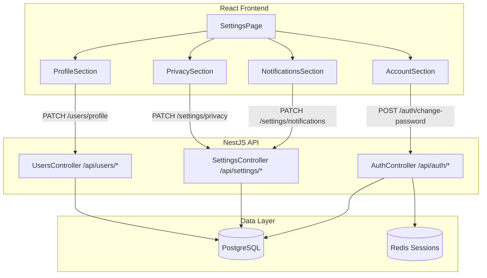
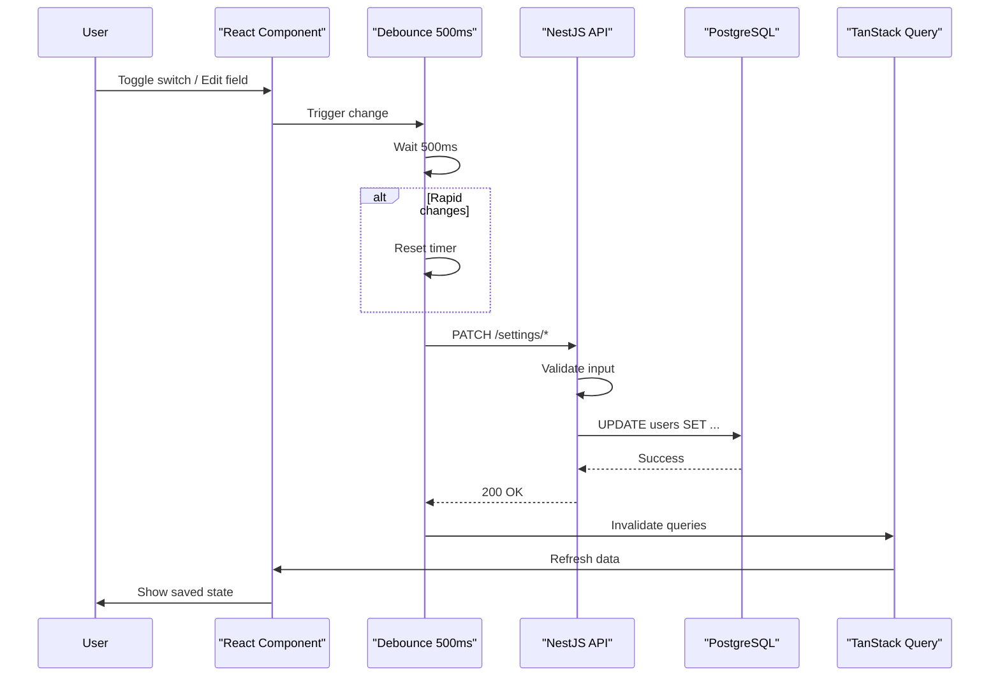
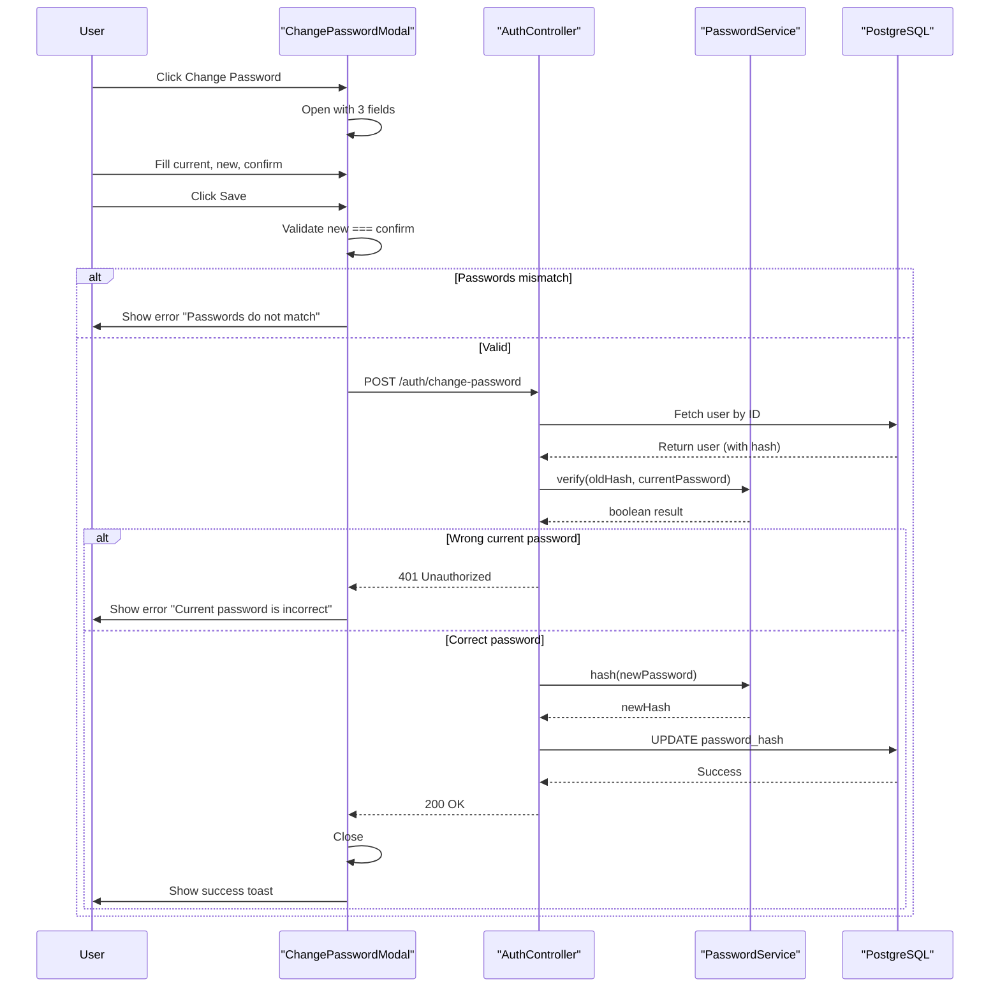
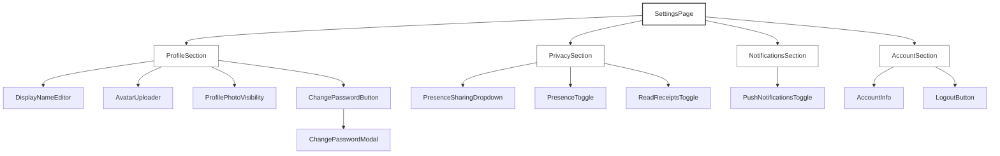
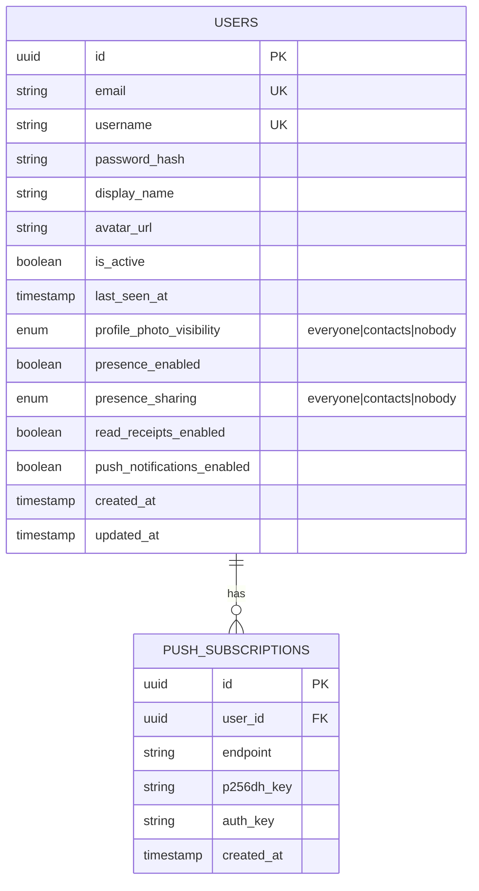
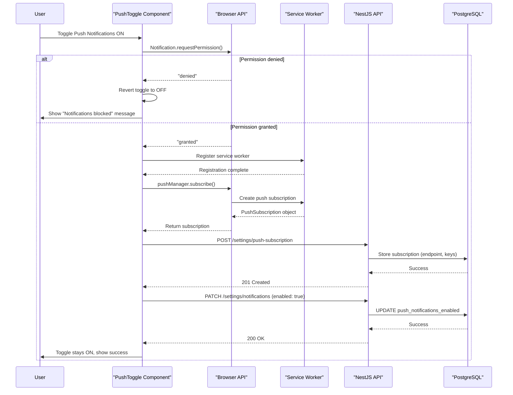

# RFC: User Settings & Profile Management

> **Task ID:** FEAT-013-Settings-RFC  
> **Status:** Draft  
> **Priority:** High  
> **Related PRD:** [Settings Menu PRD](../prd-profile.md)

---

## Table of Contents

- [1. Overview](#1-overview)
- [2. Database Schema Changes](#2-database-schema-changes)
- [3. REST API Design](#3-rest-api-design)
- [4. Frontend Architecture](#4-frontend-architecture)
- [5. WebSocket Events](#5-websocket-events)
- [6. Security Considerations](#6-security-considerations)
- [7. Push Notifications Implementation](#7-push-notifications-implementation)
- [8. Implementation Phases](#8-implementation-phases)
- [9. Edge Cases & Error Handling](#9-edge-cases--error-handling)

---

## 1. Overview

This RFC defines the technical architecture for implementing the Settings Menu feature as specified in the PRD. The Settings Menu provides users with control over their profile, privacy preferences, notification settings, and account management.

### 1.1 Settings Sections

| Section | Features |
|---------|----------|
| **Profile** | Display name, avatar URL, photo visibility, password change |
| **Privacy** | Online status sharing, presence toggle, read receipts toggle |
| **Notifications** | Push notification preferences |
| **Account** | Read-only account info (email, username), logout |

### 1.2 Key Technical Challenges

| Challenge | Solution |
|-----------|----------|
| Auto-save behavior | Immediate save on change (except password which requires confirmation) |
| Rapid toggle handling | 500ms debounce to prevent excessive API calls |
| Cross-device consistency | Database as single source of truth; fetched on page load |

### 1.3 System Architecture



### 1.4 Settings Data Flow (Auto-Save)



### 1.5 Password Change Flow



### 1.6 Component Hierarchy



---

## 2. Database Schema Changes

### 2.1 ER Diagram



### 2.2 New Columns Required

| Column | Type | Default | Section | Purpose |
|--------|------|---------|---------|---------|
| `profile_photo_visibility` | ENUM (everyone/contacts/nobody) | `everyone` | Profile | Controls who can see user's avatar |
| `push_notifications_enabled` | BOOLEAN | `false` | Notifications | User preference for push notifications |

### 2.3 Schema Notes

- Reuse existing `presenceSharingEnum` for `profile_photo_visibility`
- Migration generated via Drizzle Kit (`bunx drizzle-kit generate`)
- Push subscriptions stored in separate table supporting one-to-many relationship
- Existing columns `presence_enabled`, `presence_sharing`, `read_receipts_enabled` already in schema

---

## 3. REST API Design

### 3.1 Endpoints Overview

| Method | Endpoint | Description | Authentication |
|--------|----------|-------------|----------------|
| GET | `/api/settings` | Get all user settings | Required |
| PATCH | `/api/settings/profile` | Update profile (name, avatar) | Required |
| PATCH | `/api/settings/privacy` | Update privacy settings | Required |
| PATCH | `/api/settings/notifications` | Update notification preferences | Required |
| POST | `/api/auth/change-password` | Change password | Required |
| GET | `/api/users/me` | Get current user (extend with new fields) | Required |

### 3.2 Endpoint Specifications

#### GET /api/settings

**Response Body:**

| Field | Type | Description |
|-------|------|-------------|
| `displayName` | string | User's display name |
| `avatarUrl` | string | URL to profile photo |
| `profilePhotoVisibility` | string | "everyone", "contacts", or "nobody" |
| `presenceEnabled` | boolean | Whether user shows online status |
| `presenceSharing` | string | Who can see online status |
| `readReceiptsEnabled` | boolean | Whether to send read receipts |
| `pushNotificationsEnabled` | boolean | Whether push notifications are enabled |
| `email` | string | User's email (read-only) |
| `username` | string | User's username (read-only) |

#### PATCH /api/settings/profile

**Request Body:**

| Field | Type | Required | Validation |
|-------|------|----------|------------|
| `displayName` | string | Yes | Min 1, Max 100 chars |
| `avatarUrl` | string | No | Valid URL format, Max 500 chars |

**Response:** Updated profile object

#### PATCH /api/settings/privacy

**Request Body:**

| Field | Type | Required | Allowed Values |
|-------|------|----------|----------------|
| `presenceEnabled` | boolean | Yes | true/false |
| `presenceSharing` | string | Yes | "everyone", "contacts", "nobody" |
| `readReceiptsEnabled` | boolean | Yes | true/false |

**Response:** Updated privacy settings object

#### PATCH /api/settings/notifications

**Request Body:**

| Field | Type | Required |
|-------|------|----------|
| `pushNotificationsEnabled` | boolean | Yes |

**Response:** Updated notification preferences object

#### POST /api/auth/change-password

**Request Body:**

| Field | Type | Required | Validation |
|-------|------|----------|------------|
| `currentPassword` | string | Yes | Must match existing password |
| `newPassword` | string | Yes | Min 8 chars |
| `confirmPassword` | string | Yes | Must match `newPassword` |

**Response:** `{ "message": "Password changed successfully" }`

### 3.3 Key API Behaviors

| Behavior | Description |
|----------|-------------|
| **Auto-save** | All settings except password change save immediately on user action |
| **Debouncing** | Rapid toggles debounced at 500ms to prevent excessive API calls |
| **Optimistic UI** | Frontend shows change immediately, reverts on error with toast notification |
| **Validation** | Server validates all inputs; errors return 400 with field-level messages |

### 3.4 Error Response Format

```json
{
  "statusCode": 400,
  "message": "Validation failed",
  "errors": [
    { "field": "displayName", "message": "Name cannot be empty" }
  ]
}
```

---

## 4. Frontend Architecture

### 4.1 State Management Strategy

| Pattern | Implementation | Purpose |
|---------|----------------|---------|
| Data Fetching | TanStack Query | Cache settings data, invalidate on updates |
| Form State | React Hook Form + Zod | Client-side validation before submit |
| Optimistic Updates | TanStack Query | Show change immediately, rollback on error |
| Debouncing | Custom hook (500ms) | Prevent rapid API calls for toggles |
| Toast Notifications | Toast library | Success/error feedback |

### 4.2 Data Flow

1. **Page loads** → Fetch settings via TanStack Query
2. **User changes setting** → Optimistic UI update shown immediately
3. **Debounce period (500ms)** → Wait for rapid changes to settle
4. **API call** → PATCH to backend
5. **On success** → Invalidate cache, show success toast
6. **On error** → Revert optimistic update, show error toast

### 4.3 Component Responsibilities

| Component | Responsibilities |
|-----------|------------------|
| `SettingsPage` | Layout container, fetches initial data |
| `ProfileSection` | Display name editing, avatar URL, photo visibility, password change trigger |
| `PrivacySection` | Presence sharing dropdown, presence toggle, read receipts toggle |
| `NotificationsSection` | Push notification toggle with permission handling |
| `AccountSection` | Read-only account info display, logout button |
| `ChangePasswordModal` | Three-field form with validation, requires Save button |

---

## 5. WebSocket Events

### 5.1 Decision: No WebSocket for Settings

Settings do NOT require real-time synchronization across devices.

| Aspect | Approach |
|--------|----------|
| Data sync | Database as single source of truth |
| Cross-device | Settings fetched on page load, not pushed |
| Timing | Changes visible on next page refresh |

### 5.2 Rationale

Unlike messages and presence (which need immediate delivery), settings are:
- Changed infrequently by users
- Not time-sensitive
- Acceptable to sync on page load
- Simpler to implement via REST polling

**Example:** User changes setting on mobile, opens desktop browser - desktop reflects the saved setting on next page load. No real-time sync required.

---

## 6. Security Considerations

### 6.1 Password Change Security Flow

| Step | Validation | Error Response |
|------|------------|----------------|
| 1 | Client validates new === confirm | "Passwords do not match" (disable Save button until fixed) |
| 2 | Server fetches user by ID | 404 if user not found |
| 3 | Server verifies current password hash using Argon2id | 401 "Current password is incorrect" |
| 4 | Server validates new password length | 400 "Password must be at least 8 characters" |
| 5 | Server hashes new password with Argon2id | - |
| 6 | Server updates password_hash in database | 200 Success |

### 6.2 Additional Security Measures

| Measure | Implementation |
|---------|----------------|
| Rate limiting | 5 password change attempts per 15 minutes per user |
| Avatar validation | URL format validation, max 500 characters |
| Response filtering | No password_hash or sensitive fields in API responses |
| Authentication | All settings endpoints require valid JWT |
| Input sanitization | All user inputs validated server-side |

---

## 7. Push Notifications Implementation

### 7.1 Push Notification Flow



### 7.2 Permission Handling

| Permission State | Behavior |
|------------------|----------|
| **Granted** | Full push subscription flow executed |
| **Denied** | Toggle reverts to OFF, show inline "Notifications blocked" message |
| **Previously denied** | Skip dialog, show guide to browser settings |

### 7.3 Required Environment Variables

| Variable | Purpose |
|----------|---------|
| `VAPID_PUBLIC_KEY` | For browser subscription (client-side) |
| `VAPID_PRIVATE_KEY` | For server to send notifications |

### 7.4 Push Subscription Data Model

| Field | Description |
|-------|-------------|
| `endpoint` | Push service endpoint URL |
| `p256dh_key` | Public key for encryption |
| `auth_key` | Authentication secret |

---

## 8. Implementation Phases

| Phase | Task | Files / Areas | Est. Hours |
|-------|------|-------------|------------|
| 1 | Database migration | `packages/db/migrations/`, `packages/db/src/schema/index.ts` | 2 |
| 2 | Backend API | `apps/server/src/settings/`, `apps/server/src/users/` | 6 |
| 3 | Frontend components | `apps/web/src/pages/settings/`, `apps/web/src/components/settings/` | 8 |
| 4 | Push notifications | `apps/web/public/sw.js`, notification hooks | 4 |
| 5 | Integration testing | Manual testing, validation against PRD | 4 |

**Total Estimated Effort:** 24 hours (~3 days)

---

## 9. Edge Cases & Error Handling

### 9.1 Edge Case Matrix

| Scenario | Expected Behavior |
|----------|-------------------|
| Empty display name | Reject with error "Name cannot be empty" |
| Display name exceeds 100 characters | Block input, show red character counter |
| Invalid avatar URL | Save URL but show broken image fallback; do not block |
| User clears avatar field | Remove photo, show initials fallback |
| Wrong current password | Show error "Current password is incorrect", keep modal open |
| New password and confirm do not match | Show error "Passwords do not match", disable Save button |
| New password under 8 characters | Show inline error "Password must be at least 8 characters" |
| User closes Change Password modal mid-fill | Discard all changes, no save performed |
| Network error while saving | Show toast "Failed to save. Please try again.", revert optimistic UI |
| Privacy settings fail to load | Show skeleton loaders, error state with retry option |
| User rapidly toggles Read Receipts | Debounce - only save final state after 500ms inactivity |
| Browser does not support push notifications | Hide toggle or show "Not supported on this browser" |
| Browser denies push permission | Toggle reverts to OFF, show inline message |
| Logout fails due to network error | Show toast "Logout failed. Try again.", keep user logged in |

### 9.2 Error Handling Principles

| Principle | Implementation |
|-----------|----------------|
| Graceful degradation | Settings page works even if some sections fail to load |
| Clear feedback | All errors show user-friendly messages |
| State recovery | Optimistic updates revert on error |
| No silent failures | All API errors logged and surfaced to user |

---

## Related Documents

| Document | Purpose |
|----------|---------|
| [Settings Menu PRD](../prd-profile.md) | Product requirements and user stories |
| [RFC: Authentication](rfc-authentication.md) | JWT authentication patterns |
| [RFC: Database Schema](rfc-database-schema.md) | Existing schema patterns |
| [RFC: REST API](rfc-rest-api.md) | API design conventions |

---

## Success Criteria

- [x] All 4 settings sections from PRD are covered
- [x] Database schema changes documented via ER diagram and tables
- [x] All REST endpoints documented via specification tables
- [x] Frontend component hierarchy visualized via tree diagram
- [x] State management and data flow described via tables
- [x] Edge cases from PRD documented via matrix
- [x] Security considerations documented via tables
- [x] Implementation phases defined via phase table
