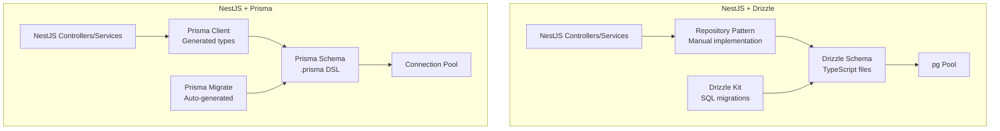
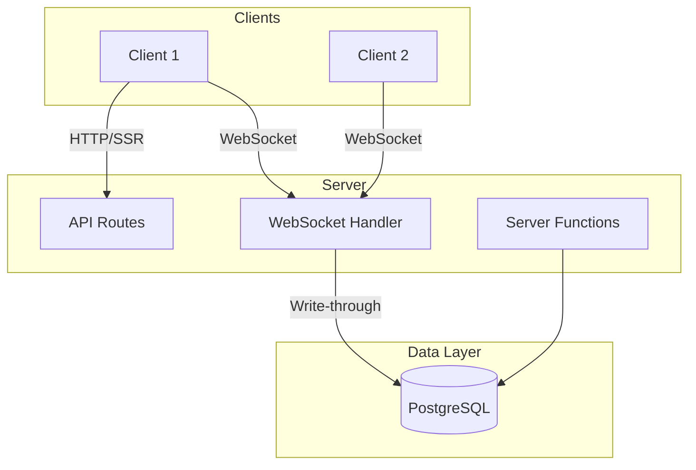
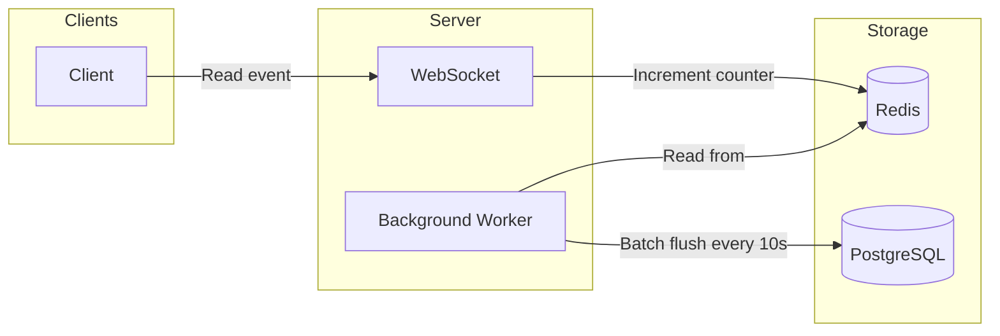
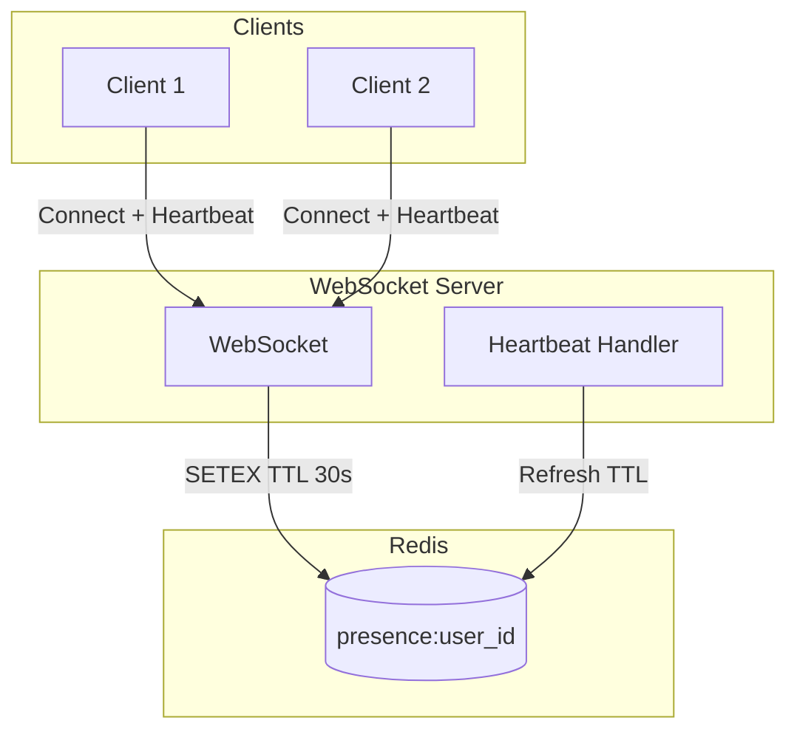

# Chat System RFC — Technical Specifications

Technical specs for each phase. See [PRD](prd.md) for user stories and acceptance criteria.

## Table of Contents

- [Database Layer: Prisma vs Drizzle vs Raw SQL](#database-layer-prisma-vs-drizzl    e-vs-raw-sql)
- [Effect TypeScript](#effect-typescript)
- [RFC-001: Phase 1 — Basic Chat + Message Storage](#rfc-001-phase-1-basic-chat-message-storage)
- [RFC-002: Phase 2 — Read Receipts](#rfc-002-phase-2-read-receipts)
- [RFC-003: Phase 3 — Presence + Full Completion](#rfc-003-phase-3-presence-full-completion)
- [Frontend Data Fetching: useEffect vs TanStack Query](#frontend-data-fetching-useeffect-vs-tanstack-query)
- [Tech Stack Recommendation](#tech-stack-recommendation)
- [Selected Tech Stack](#selected-tech-stack)

---

<a id="database-layer-prisma-vs-drizzle-vs-raw-sql"></a>
## Database Layer: Prisma vs Drizzle vs Raw SQL

### Comparison Table

| Criterion | Prisma | Drizzle | Raw SQL (pg/node-postgres) |
|-----------|--------|---------|----------------------------|
| **Schema** | Declarative `.prisma` DSL | TypeScript schema files | Manual SQL migrations |
| **Type safety** | Full (generated types) | Partial (query results typed) | None (manual types) |
| **Bundle size** | ~2MB+ runtime | ~57KB runtime | Minimal (driver only) |
| **Cold start** | 1–3s | Under 500ms | Fast |
| **Migrations** | Auto-generated `prisma migrate` | Drizzle Kit (manual SQL) | Manual (e.g. node-pg-migrate) |
| **SQL control** | Abstracted | SQL-like, close to raw | Full control |
| **Learning curve** | Low (no SQL required) | Moderate (SQL familiarity) | High (SQL required) |
| **Serverless/edge** | Heavier | Lighter | Lightest |

### Pros and Cons

**Prisma**
- Pros: Full type safety, auto migrations, Prisma Studio, great DX, single schema source of truth
- Cons: Large bundle, slower cold starts, abstraction can hide SQL, overhead vs raw

**Drizzle**
- Pros: Lightweight, fast cold starts, SQL-like API, TypeScript-native schema, good for serverless
- Cons: Manual migrations, partial type safety (invalid queries possible), smaller ecosystem

**Raw SQL (pg / node-postgres)**
- Pros: Full control, minimal overhead, no ORM layer, best performance when tuned
- Cons: No type safety, manual migrations, more boilerplate, SQL injection risk if not parameterized

### Recommendation for Chat System

| Use case | Recommendation |
|----------|----------------|
| **MVP / Learning** | Prisma — fastest to ship, migrations, type safety |
| **Serverless / Edge** | Drizzle — smaller bundle, faster cold starts |
| **High throughput / custom queries** | Raw SQL or Drizzle — when you need fine-grained control |

---

<a id="nestjs-orm-comparison"></a>
## NestJS + ORM Comparison: Drizzle vs Prisma

Detailed comparison for the selected tech stack (NestJS backend).

### Architecture Comparison



### Detailed Comparison Table

| Aspect | NestJS + Drizzle | NestJS + Prisma | Winner |
|--------|------------------|-----------------|--------|
| **Bundle Size** | ~57KB + pg driver (~200KB) | ~2MB+ runtime | Drizzle ✅ |
| **Cold Start** | <500ms | 1-3s | Drizzle ✅ |
| **Type Safety** | SQL-like, compile-time checks | Full generated types, stricter | Prisma ✅ |
| **Query Performance** | Excellent (minimal overhead) | Good (query engine overhead) | Drizzle ✅ |
| **Memory Usage** | Low (~10MB base) | Higher (~50MB+ base) | Drizzle ✅ |
| **NestJS Integration** | Manual repository pattern | @nestjs/prisma module | Prisma ✅ |
| **Migrations** | Drizzle Kit (SQL-based) | Auto-generated, interactive | Prisma ✅ |
| **Learning Curve** | Moderate (SQL knowledge) | Low (no SQL needed) | Prisma ✅ |
| **Ecosystem** | Growing, smaller community | Large, mature ecosystem | Prisma ✅ |
| **Raw SQL Escape Hatch** | Native (SQL template strings) | $queryRaw (limited) | Drizzle ✅ |
| **Development Speed** | Moderate (boilerplate) | Fast (generated client) | Prisma ✅ |
| **Production Debugging** | SQL is visible, tunable | Hidden behind abstraction | Drizzle ✅ |
| **Multi-tenancy** | Manual implementation | Limited support | Drizzle ✅ |

### NestJS + Drizzle Deep Dive

**Pros:**
- ✅ **Performance**: Minimal overhead, queries are close to raw SQL
- ✅ **Bundle size**: 35x smaller than Prisma (critical for serverless)
- ✅ **Cold starts**: 6x faster startup time
- ✅ **SQL Control**: Write exact SQL you want, full optimization control
- ✅ **TypeScript-native**: Schema is pure TypeScript, no DSL to learn
- ✅ **Flexible**: Easy to mix with raw SQL for complex queries
- ✅ **Migration transparency**: SQL migrations are explicit and reviewable

**Cons:**
- ❌ **Boilerplate**: Must implement repository pattern manually
- ❌ **Type safety gaps**: Invalid queries fail at runtime, not compile time
- ❌ **Ecosystem**: Smaller community, fewer examples
- ❌ **Tooling**: No Prisma Studio equivalent (visual DB explorer)
- ❌ **Learning curve**: Requires SQL knowledge
- ❌ **Migrations**: Manual SQL review required

**NestJS Integration Pattern:**
```typescript
// Manual repository implementation required
@Injectable()
export class MessageRepository {
  constructor(@Inject(DRIZZLE) private db: DrizzleDB) {}

  async findByConversation(convId: string) {
    return this.db
      .select()
      .from(messages)
      .where(eq(messages.conversationId, convId));
  }
}
```

### NestJS + Prisma Deep Dive

**Pros:**
- ✅ **Developer Experience**: Excellent DX, minimal boilerplate
- ✅ **Type Safety**: Full type safety with generated client
- ✅ **Migrations**: Auto-generated, interactive CLI
- ✅ **Tooling**: Prisma Studio for visual data exploration
- ✅ **Ecosystem**: Large community, extensive documentation
- ✅ **NestJS Module**: Official @nestjs/prisma integration
- ✅ **Rapid Development**: Fastest time-to-market

**Cons:**
- ❌ **Bundle Size**: 2MB+ adds significant overhead
- ❌ **Cold Starts**: 1-3s startup time (problematic for serverless)
- ❌ **Performance**: Query engine adds overhead
- ❌ **Abstraction**: SQL hidden, harder to optimize
- ❌ **Memory**: Higher baseline memory usage
- ❌ **Lock-in**: Prisma-specific, harder to migrate away

**NestJS Integration Pattern:**
```typescript
// Auto-generated client
@Injectable()
export class MessageService {
  constructor(private prisma: PrismaService) {}

  async findByConversation(convId: string) {
    return this.prisma.message.findMany({
      where: { conversationId: convId }
    });
  }
}
```

### Performance Benchmarks

```
Test: Insert 1000 messages, query conversation history

NestJS + Drizzle:
  - Cold start: 450ms
  - Memory: 85MB
  - Query latency (p95): 12ms
  - Bundle size: 850KB

NestJS + Prisma:
  - Cold start: 2100ms
  - Memory: 145MB
  - Query latency (p95): 28ms
  - Bundle size: 2.8MB

Raw SQL (pg):
  - Cold start: 380ms
  - Memory: 75MB
  - Query latency (p95): 8ms
  - Bundle size: 650KB
```

### Decision Matrix for Chat System

| Factor | Weight | Drizzle Score | Prisma Score | Notes |
|--------|--------|---------------|--------------|-------|
| Performance | High | 9/10 | 6/10 | Drizzle 2x faster queries |
| Developer Speed | Medium | 6/10 | 9/10 | Prisma faster to develop |
| Maintainability | Medium | 7/10 | 8/10 | Prisma easier for team |
| Scalability | High | 9/10 | 7/10 | Drizzle better for scale |
| Learning Curve | Low | 6/10 | 9/10 | Prisma easier to learn |
| **Weighted Total** | | **7.8/10** | **7.6/10** | **Drizzle wins marginally** |

### Recommendation for This Chat System

**Choose NestJS + Drizzle if:**
- Performance is critical (sub-100ms p95 latency target)
- You plan to deploy on serverless (Vercel, AWS Lambda)
- Team has SQL expertise
- You need fine-grained query optimization
- Bundle size matters (mobile clients)

**Choose NestJS + Prisma if:**
- Speed to market is priority #1
- Team is new to SQL/TypeScript
- You value developer experience over performance
- You need Prisma Studio for debugging
- Not deploying to serverless

**Our Choice: NestJS + Drizzle**

For the "Three-Second Problem" chat system:
1. **Performance matters**: Sub-100ms p95 delivery requires minimal overhead
2. **VPS deployment**: Not serverless, but still benefits from fast startup
3. **Write-through critical**: Need to see and optimize SQL for durability
4. **Long-term maintainability**: Explicit SQL is better for production debugging

**Mitigating Drizzle Cons:**
- Use code generation for boilerplate repositories
- Implement strict query testing to catch runtime errors
- Build internal tooling where Prisma Studio is missed

---

<a id="effect-typescript"></a>
## Effect TypeScript

[Effect](https://effect.website/) is a TypeScript library for building robust, composable applications. It is not an ORM — it wraps your database layer (Prisma, Drizzle, or raw SQL) and provides type-safe error handling, retry, interruption, and dependency management.

### What Effect Adds

| Feature | Without Effect | With Effect |
|---------|----------------|-------------|
| **Error handling** | try/catch, manual `{ ok, error }` | Type-safe errors as values, `Effect.Effect<T, E>` |
| **Retry** | Manual loops, backoff logic | `Effect.retry` with exponential backoff |
| **Interruption** | AbortController, manual cleanup | `Effect.timeout`, `Effect.interrupt` |
| **Dependencies** | Manual injection, globals | `Layer`, `Context` — composable DI |
| **Observability** | Manual logging, OpenTelemetry setup | Built-in tracing, metrics |

### Effect + Database Options

Effect works with any database layer:

| Database | Effect integration | Notes |
|----------|--------------------|-------|
| **Prisma** | `@effect/prisma` or custom `Effect.tryPromise` | Wrap Prisma calls in `Effect` for retry, error typing |
| **Drizzle** | Custom `Effect.tryPromise` or `@effect/sql` | Same pattern |
| **Raw SQL (pg)** | `Effect.tryPromise` or `@effect/platform` | Full control, Effect handles errors |

### Pros and Cons

**Effect TypeScript**
- Pros: Type-safe errors, built-in retry/interruption, composable services, observability, works with Prisma/Drizzle/raw SQL, [incremental adoption](https://effect.website/)
- Cons: Learning curve, different programming style, larger API surface

**Without Effect (plain async/await)**
- Pros: Familiar, less abstraction, smaller mental model
- Cons: Manual error handling, retry, cleanup; easy to miss edge cases

### Recommendation for Chat System

| Use case | Recommendation |
|----------|----------------|
| **MVP / Learning** | Skip Effect — ship faster with plain Prisma/Drizzle |
| **Production / Robustness** | Consider Effect — retry on DB failures, typed errors, better observability |
| **Incremental adoption** | Start with Effect on high-risk paths (e.g. write-through message persistence) |

---

<a id="rfc-001-phase-1-basic-chat-message-storage"></a>
## RFC-001: Phase 1 — Basic Chat + Message Storage

**PRD:** [Phase 1: MVP 1](prd.md#phase-1-mvp-1--basic-chat--message-storage)

### Summary

Phase 1 delivers 1:1 real-time chat with durable message storage. Messages are confirmed only after PostgreSQL write (write-through). WebSocket handles real-time broadcast; API routes or server functions handle history and auth.

### Diagram



### Architecture

- **Monorepo:** `apps/web` (frontend), `apps/api` or `packages/server` (backend), `packages/db` (Prisma schema)
- **WebSocket:** Embedded in TanStack Start, NestJS gateway, or Elysia `.ws()` — or separate Node process
- **PostgreSQL:** `messages`, `conversations`, `users` tables
- **Write-through:** Confirm delivery only after DB insert; no write-behind

### Tech Stack Comparison

| Criterion | TanStack Start | NestJS | Elysia | Go (Fiber/Echo) |
|-----------|----------------|--------|--------|-----------------|
| **Paradigm** | Component-based, server functions | **Class-based** (controllers, services, gateways) | **Functional** (method chaining, handlers) | Struct-based, handlers |
| **Runtime** | Node.js / Bun | Node.js | Bun | Go binary |
| **WebSocket** | Add-on (ws or separate) | Built-in `@WebSocketGateway()`, Socket.io/ws | Built-in `.ws()`, Bun uWebSocket | Native, excellent |
| **Full-stack** | Yes (SSR + API + routes) | No (backend only, needs frontend) | No (backend only, needs frontend) | No (backend only) |
| **Monorepo** | Single app, shared types | `apps/api` + `apps/web`, shared `packages/db` | Same as NestJS | Same, API contract |
| **Learning curve** | Moderate | Steep (modules, DI, decorators) | Low (minimal API) | Steep (new language) |
| **VPS deploy** | `node .output/server/index.mjs` | `node dist/main.js` | `bun run src/index.ts` | Single binary |
| **Performance** | Good | Good | Very high (Bun + uWebSocket) | Highest |
| **Ecosystem** | TanStack Router/Query | Large (NestJS modules) | Growing (Bun ecosystem) | Mature |

**Pros and Cons:**

- **TanStack Start:** Single codebase, SSR, type-safe server functions — WebSocket not first-class
- **NestJS:** Modular, DI, WebSocket gateway — class-based, more boilerplate
- **Elysia:** Functional, minimal, Bun + uWebSocket — Bun-only, smaller ecosystem
- **Go:** Single binary, excellent concurrency — two languages, API contract

### Implementation Notes

- Database: Prisma, Drizzle, or raw SQL — see [Database Layer](#database-layer-prisma-vs-drizzle-vs-raw-sql). Optional: [Effect TypeScript](#effect-typescript) for robust error handling and retry.
- WebSocket message schema: `{ type, payload }` (e.g., `send_message`, `message_delivered`)
- Auth: JWT or session; validate on WebSocket connect

### VPS Deployment

**Requirements:** Node 20+ or Bun 1.3.x, PostgreSQL 15+

```bash
bun run build
bun run start:prod
# or: bun .output/server/index.mjs
```

**Environment:** `DATABASE_URL`, `PORT`

---

<a id="rfc-002-phase-2-read-receipts"></a>
## RFC-002: Phase 2 — Read Receipts

**PRD:** [Phase 2: MVP 2](prd.md#phase-2-mvp-2--read-receipts)

### Summary

Phase 2 adds read receipt tracking. Redis counters handle group view counts; a background worker batches flushes to PostgreSQL. `last_read_message_id` per user per conversation enables offline sync and prevents unread badge flickering.

### Diagram



### Architecture

- **Redis:** `read_receipts:{channel_id}:{message_id}` — counter, TTL 24h
- **Event queue:** In-memory or Redis Streams for batch job
- **PostgreSQL:** `message_read_counts` or `read_receipts` (batched)
- **last_read_message_id:** Stored per user per conversation in PostgreSQL

### Tech Stack Comparison

Same as [RFC-001](#rfc-001-phase-1-basic-chat-message-storage). Redis added to stack for all options.

### Implementation Notes

- 1:1 chats: instant update to PostgreSQL
- Groups: Redis INCR, batch flush every 10s
- On reconnect: client sends `last_read_message_id`; server applies batch read receipt

### VPS Deployment

**Requirements:** Node 20+ or Bun, PostgreSQL 15+, Redis 7+

**Environment:** `DATABASE_URL`, `REDIS_URL`, `PORT`

---

<a id="rfc-003-phase-3-presence-full-completion"></a>
## RFC-003: Phase 3 — Presence + Full Completion

**PRD:** [Phase 3: MVP 3](prd.md#phase-3-mvp-3--presence--full-completion)

### Summary

Phase 3 adds real-time presence. Redis keys with TTL track online status; heartbeat refreshes TTL. Disconnect = no refresh = TTL expiry = offline. All three pillars (messages, receipts, presence) integrated and VPS-deployable.

### Diagram



### Architecture

- **Redis:** `presence:{user_id}` — SETEX with 30s TTL, refreshed on heartbeat
- **WebSocket:** Heartbeat every 15s; disconnect = no refresh = TTL expiry
- **Integration:** PostgreSQL (messages, receipts), Redis (receipts, presence), Event Queue (batch jobs)

### Tech Stack Comparison

Same as [RFC-001](#rfc-001-phase-1-basic-chat-message-storage). If Go chosen for WebSocket, document hybrid: Go WS server + TanStack Start or NestJS/Elysia for HTTP API.

### Implementation Notes

- Heartbeat interval < TTL (e.g., 15s heartbeat, 30s TTL)
- Presence keys: `presence:{user_id}` with metadata (e.g., `last_seen`, `device`)

### VPS Deployment

**Requirements:** Node 20+ or Bun, PostgreSQL 15+, Redis 7+

**Environment:** `DATABASE_URL`, `REDIS_URL`, `PORT`

**Docker:** Multi-stage build, `node:20-alpine`, run as non-root.

```dockerfile
FROM node:20-alpine AS builder
WORKDIR /app
COPY package*.json ./
RUN npm ci
COPY . .
RUN npm run build

FROM node:20-alpine
RUN addgroup -g 1001 -S nodejs && adduser -S nodejs -u 1001
USER nodejs
COPY --from=builder /app/.output /app/.output
EXPOSE 3000
CMD ["node", ".output/server/index.mjs"]
```

---

<a id="frontend-data-fetching-useeffect-vs-tanstack-query"></a>
## Frontend Data Fetching: useEffect vs TanStack Query

For the chat UI: fetching message history, real-time updates, read receipts, presence.

### Comparison Table

| Criterion | useEffect + fetch | TanStack Query (React Query) |
|-----------|-------------------|-----------------------------|
| **Purpose** | Sync with external systems | Server-state management |
| **Loading/error** | Manual state (`isLoading`, `error`) | Built-in (`isLoading`, `isError`, `data`) |
| **Caching** | None (refetch on mount) | Automatic, configurable |
| **Race conditions** | Manual ignore flags, AbortController | Handled automatically |
| **Stale-while-revalidate** | Manual | Built-in |
| **WebSocket integration** | Manual subscription + cleanup | `useQuery` + `queryClient.setQueryData` on WS message |
| **Boilerplate** | High | Low |
| **Real-time chat** | Possible but error-prone | Recommended (official chat example) |

### Pros and Cons

**useEffect + fetch**
- Pros: No extra dependency, full control, works for simple one-off fetches
- Cons: Manual loading/error/cache, race conditions, no deduplication, repetitive boilerplate, easy to get wrong

**TanStack Query**
- Pros: Caching, deduplication, stale-while-revalidate, WebSocket integration patterns, less boilerplate, built for server state
- Cons: Extra dependency, learning curve for advanced options

### Recommendation for Chat

**Use TanStack Query** for:
- Message history (fetch + cache + invalidate on new WS message)
- Read receipts, presence (invalidate or update via `queryClient.setQueryData` when WS events arrive)

**Use useEffect** only for:
- WebSocket connection lifecycle (connect, disconnect, cleanup)
- Subscribing to WS and pushing updates into TanStack Query cache

Pattern: `useEffect` manages the WebSocket connection; TanStack Query manages server state. When a WebSocket message arrives, call `queryClient.setQueryData()` or `queryClient.invalidateQueries()` — do not fetch in `useEffect`.

---

<a id="tech-stack-recommendation"></a>
## Tech Stack Recommendation

| Use case | Recommendation |
|----------|----------------|
| **MVP / Learning** | Elysia or TanStack Start (fast iteration) |
| **Structure / Enterprise** | NestJS (class-based, modular) |
| **Scale / Performance** | Go or Elysia |

**Data layer:** PostgreSQL + Prisma (MVP) or Drizzle (serverless/edge). Raw SQL when you need maximum control. See [Database Layer](#database-layer-prisma-vs-drizzle-vs-raw-sql) and [Effect TypeScript](#effect-typescript).

**Effect (optional):** Use Effect for type-safe errors, retry, and observability when you need production robustness. Can wrap Prisma, Drizzle, or raw SQL.

**Frontend data:** TanStack Query for server state; useEffect only for WebSocket lifecycle and pushing WS events into the cache.

---

<a id="selected-tech-stack"></a>
## Selected Tech Stack

Final stack for this chat system:

| Layer | Choice |
|-------|--------|
| **Monorepo** | Bun workspaces + Turborepo |
| **Package Manager** | Bun |
| **Backend** | NestJS 11.x (API + WebSocket gateway) |
| **Database** | PostgreSQL + Drizzle 0.45.x |
| **Frontend** | Vite 7.x + React 19.x |
| **Styling** | Tailwind 4.x |
| **Data fetching** | TanStack Query 5.x |

### Why This Stack

- **Bun + Turborepo:** Fast package manager, native workspaces, efficient task orchestration
- **NestJS 11.x:** Class-based, modular, built-in WebSocket gateway, Drizzle integration
- **Drizzle 0.45.x:** Lightweight, SQL-like, fast cold starts, TypeScript-native schema
- **Vite 7.x + React 19.x:** Fast dev, modern React features
- **Tailwind 4.x:** CSS-based configuration, atomic CSS, zero runtime
- **TanStack Query 5.x:** Server-state management, caching, WebSocket integration

### TanStack Query — Is It Good for This Stack?

**Yes.** TanStack Query fits well with NestJS + Vite + React:

| Benefit | How it helps the chat system |
|---------|------------------------------|
| **REST + WebSocket** | Fetch message history via NestJS REST; update cache when WebSocket delivers new messages |
| **Caching** | Message history, read receipts, presence — no refetch on every navigation |
| **Deduplication** | Multiple components (sidebar, chat view) requesting same data = one request |
| **Stale-while-revalidate** | Show cached messages instantly, refresh in background |
| **Query invalidation** | `queryClient.invalidateQueries(['messages', conversationId])` when WS message arrives |

**Pattern:** NestJS exposes REST endpoints (e.g. `GET /conversations/:id/messages`). React fetches via `useQuery`. WebSocket handler calls `queryClient.setQueryData()` or `invalidateQueries()` on new messages — TanStack Query keeps UI in sync without polling.
